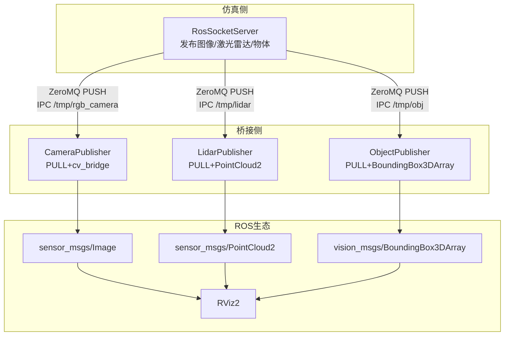
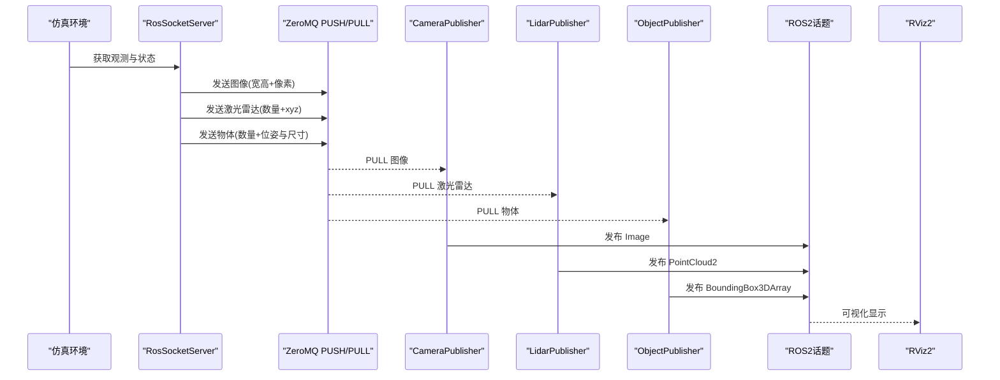
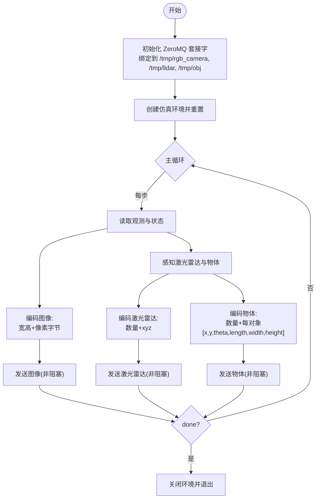
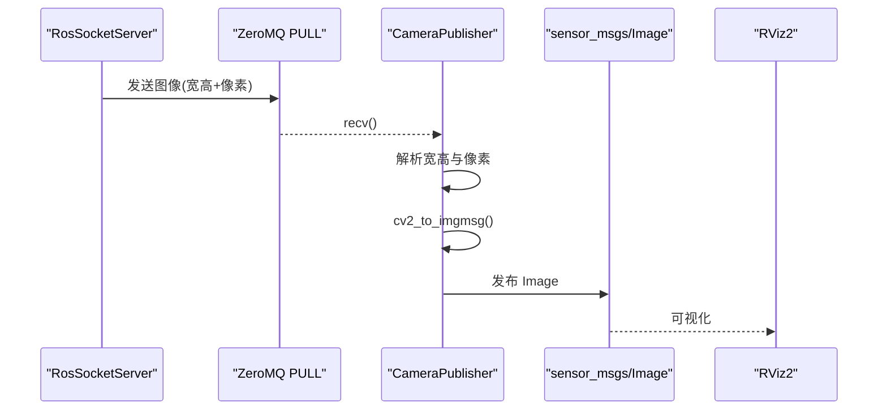
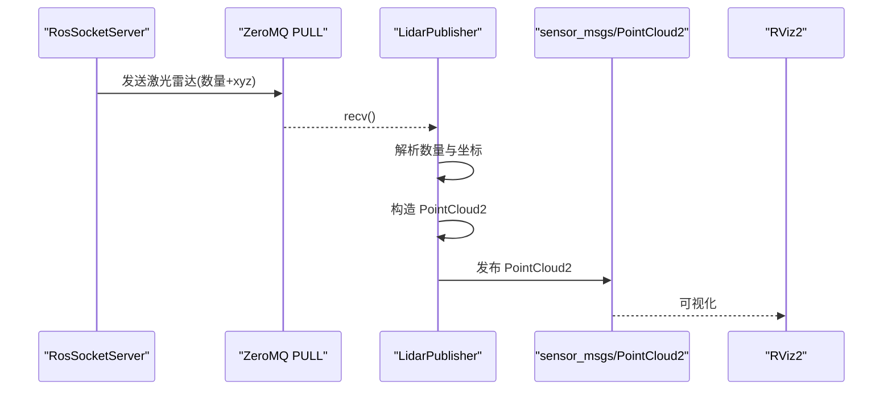
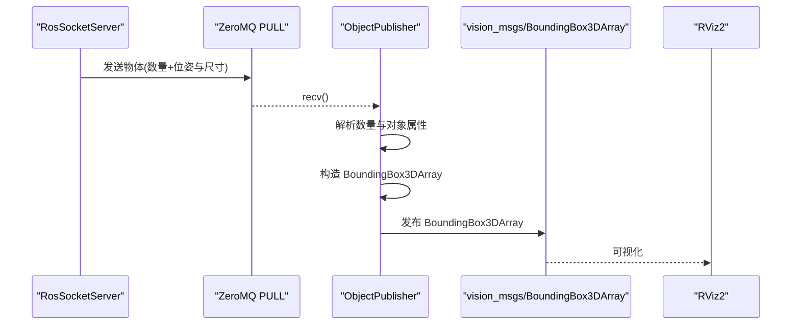
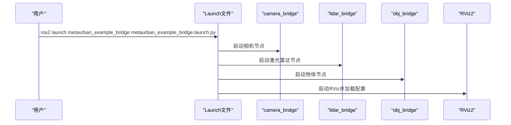
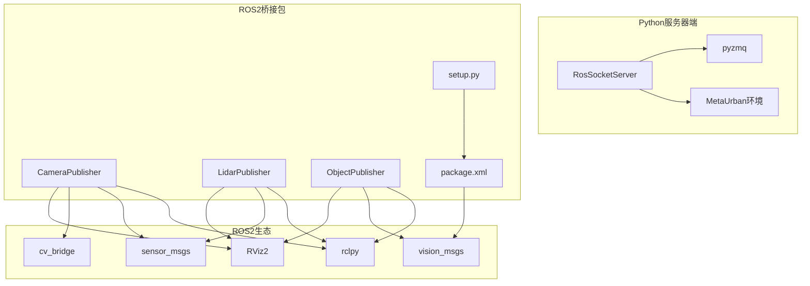

# ROS桥接系统

<cite>
**本文档引用的文件**
- [ros_socket_server.py](file://metaurban/bridges/ros_bridge/ros_socket_server.py)
- [ros_socket_interactor.py](file://metaurban/bridges/ros_bridge/ros_socket_interactor.py)
- [camera_bridge.py](file://metaurban/bridges/ros_bridge/src/metaurban_example_bridge/metaurban_example_bridge/camera_bridge.py)
- [lidar_bridge.py](file://metaurban/bridges/ros_bridge/src/metaurban_example_bridge/metaurban_example_bridge/lidar_bridge.py)
- [obj_bridge.py](file://metaurban/bridges/ros_bridge/src/metaurban_example_bridge/metaurban_example_bridge/obj_bridge.py)
- [metaurban_example_bridge.launch.py](file://metaurban/bridges/ros_bridge/src/metaurban_example_bridge/launch/metaurban_example_bridge.launch.py)
- [metaurban_image_bridge.launch.py](file://metaurban/bridges/ros_bridge/src/metaurban_example_bridge/launch/metaurban_image_bridge.launch.py)
- [package.xml](file://metaurban/bridges/ros_bridge/src/metaurban_example_bridge/package.xml)
- [setup.py](file://metaurban/bridges/ros_bridge/src/metaurban_example_bridge/setup.py)
- [default.rviz](file://metaurban/bridges/ros_bridge/src/metaurban_example_bridge/rviz/default.rviz)
- [README.md](file://metaurban/bridges/ros_bridge/README.md)
</cite>

## 目录
1. [简介](#简介)
2. [项目结构](#项目结构)
3. [核心组件](#核心组件)
4. [架构总览](#架构总览)
5. [详细组件分析](#详细组件分析)
6. [依赖关系分析](#依赖关系分析)
7. [性能考虑](#性能考虑)
8. [故障排除指南](#故障排除指南)
9. [结论](#结论)
10. [附录](#附录)

## 简介
本文件面向 RoadGen3D 与 ROS2 系统之间的桥接通信，系统采用 ZeroMQ IPC 套接字作为中间传输层，将 MetaUrban 仿真环境产生的图像、激光雷达点云与物体检测结果转换为 ROS2 消息，供 RViz 可视化与上层算法消费。同时提供反向通道：通过 ROS2 订阅/cmd_vel_mux/input/navi 速度指令，驱动仿真步进。

该桥接系统的关键特性：
- 使用 ZeroMQ PUSH/PULL 模式进行高性能、低延迟的数据传输
- 以 IPC 地址绑定/连接，避免网络开销
- 针对不同传感器类型定义统一的消息头格式（维度/长度前缀）
- 提供完整的安装、构建、启动与可视化配置

## 项目结构
桥接系统主要由以下部分组成：
- Python 服务器端：负责从仿真环境采集数据并通过 ZeroMQ 发布
- ROS2 包：包含三个独立节点，分别将 ZeroMQ 数据转为 ROS2 Image、PointCloud2、BoundingBox3DArray 消息
- 启动文件：用于一次性启动所有桥接节点与 RViz
- 可视化配置：RViz 默认布局文件，便于观察三类传感器数据

图表来源
- [ros_socket_server.py:13-30](file://metaurban/bridges/ros_bridge/ros_socket_server.py#L13-L30)
- [camera_bridge.py:14-28](file://metaurban/bridges/ros_bridge/src/metaurban_example_bridge/metaurban_example_bridge/camera_bridge.py#L14-L28)
- [lidar_bridge.py:24-36](file://metaurban/bridges/ros_bridge/src/metaurban_example_bridge/metaurban_example_bridge/lidar_bridge.py#L24-L36)
- [obj_bridge.py:13-25](file://metaurban/bridges/ros_bridge/src/metaurban_example_bridge/metaurban_example_bridge/obj_bridge.py#L13-L25)

章节来源
- [README.md:1-43](file://metaurban/bridges/ros_bridge/README.md#L1-L43)
- [metaurban_example_bridge.launch.py:8-22](file://metaurban/bridges/ros_bridge/src/metaurban_example_bridge/launch/metaurban_example_bridge.launch.py#L8-L22)
- [default.rviz:52-122](file://metaurban/bridges/ros_bridge/src/metaurban_example_bridge/rviz/default.rviz#L52-L122)

## 核心组件
本节概述桥接系统的核心模块及其职责：
- RosSocketServer：创建 ZeroMQ PUSH 套接字，绑定到 IPC 地址；从仿真环境读取图像、激光雷达与物体信息，按约定格式打包后发送
- CameraPublisher：通过 ZeroMQ PULL 接收图像数据，解析尺寸与像素，使用 cv_bridge 转换为 sensor_msgs/Image 并发布
- LidarPublisher：接收点云数据，解析长度与坐标，构造 sensor_msgs/PointCloud2 发布
- ObjectPublisher：接收物体数组，解析每个对象的位姿与尺寸，构造 vision_msgs/BoundingBox3DArray 发布
- 启动文件：一键启动三个桥接节点与 RViz，并加载默认配置
- 可执行入口：setup.py 中注册 console_scripts，便于直接运行各桥接节点

章节来源
- [ros_socket_server.py:13-30](file://metaurban/bridges/ros_bridge/ros_socket_server.py#L13-L30)
- [camera_bridge.py:14-28](file://metaurban/bridges/ros_bridge/src/metaurban_example_bridge/metaurban_example_bridge/camera_bridge.py#L14-L28)
- [lidar_bridge.py:24-36](file://metaurban/bridges/ros_bridge/src/metaurban_example_bridge/metaurban_example_bridge/lidar_bridge.py#L24-L36)
- [obj_bridge.py:13-25](file://metaurban/bridges/ros_bridge/src/metaurban_example_bridge/metaurban_example_bridge/obj_bridge.py#L13-L25)
- [setup.py:23-29](file://metaurban/bridges/ros_bridge/src/metaurban_example_bridge/setup.py#L23-L29)

## 架构总览
桥接系统采用“仿真侧发布 + ROS2侧订阅”的模式，数据流如下：

图表来源
- [ros_socket_server.py:98-104](file://metaurban/bridges/ros_bridge/ros_socket_server.py#L98-L104)
- [camera_bridge.py:29-42](file://metaurban/bridges/ros_bridge/src/metaurban_example_bridge/metaurban_example_bridge/camera_bridge.py#L29-L42)
- [lidar_bridge.py:56-93](file://metaurban/bridges/ros_bridge/src/metaurban_example_bridge/metaurban_example_bridge/lidar_bridge.py#L56-L93)
- [obj_bridge.py:27-47](file://metaurban/bridges/ros_bridge/src/metaurban_example_bridge/metaurban_example_bridge/obj_bridge.py#L27-L47)

## 详细组件分析

### RosSocketServer 实现原理
RosSocketServer 负责：
- 初始化 ZeroMQ 上下文与三个 PUSH 套接字，绑定到本地 IPC 地址
- 创建仿真环境并循环步进
- 将图像、激光雷达与物体数据编码后发送

关键实现要点：
- 套接字配置：设置发送缓冲区大小与高水位标记，避免阻塞
- 图像编码：先写入宽高两个整型，再拼接像素字节
- 激光雷达编码：先写入点数，再拼接三维坐标序列
- 物体编码：先写入数量，再拼接每条目六个浮点数（x,y,theta,length,width,height）
- 错误处理：非阻塞发送，捕获异常并根据测试模式决定抛错或打印日志
- 内存管理：显式删除中间变量以释放内存

图表来源
- [ros_socket_server.py:13-30](file://metaurban/bridges/ros_bridge/ros_socket_server.py#L13-L30)
- [ros_socket_server.py:98-104](file://metaurban/bridges/ros_bridge/ros_socket_server.py#L98-L104)
- [ros_socket_server.py:125-145](file://metaurban/bridges/ros_bridge/ros_socket_server.py#L125-L145)
- [ros_socket_server.py:165-169](file://metaurban/bridges/ros_bridge/ros_socket_server.py#L165-L169)

章节来源
- [ros_socket_server.py:13-30](file://metaurban/bridges/ros_bridge/ros_socket_server.py#L13-L30)
- [ros_socket_server.py:98-104](file://metaurban/bridges/ros_bridge/ros_socket_server.py#L98-L104)
- [ros_socket_server.py:125-145](file://metaurban/bridges/ros_bridge/ros_socket_server.py#L125-L145)
- [ros_socket_server.py:165-169](file://metaurban/bridges/ros_bridge/ros_socket_server.py#L165-L169)

### CameraPublisher 组件
CameraPublisher 负责：
- 创建 PULL 套接字并连接到图像 IPC 地址
- 定时回调从 ZeroMQ 接收完整帧，解析宽高与像素
- 使用 cv_bridge 转换为 sensor_msgs/Image 并发布
- 设置消息头时间戳与 frame_id

消息格式约定（图像）：
- 前8字节：宽(int32) + 高(int32)
- 其余：H×W×3 的 uint8 像素数据

图表来源
- [camera_bridge.py:29-42](file://metaurban/bridges/ros_bridge/src/metaurban_example_bridge/metaurban_example_bridge/camera_bridge.py#L29-L42)
- [camera_bridge.py:44-58](file://metaurban/bridges/ros_bridge/src/metaurban_example_bridge/metaurban_example_bridge/camera_bridge.py#L44-L58)

章节来源
- [camera_bridge.py:14-28](file://metaurban/bridges/ros_bridge/src/metaurban_example_bridge/metaurban_example_bridge/camera_bridge.py#L14-L28)
- [camera_bridge.py:29-42](file://metaurban/bridges/ros_bridge/src/metaurban_example_bridge/metaurban_example_bridge/camera_bridge.py#L29-L42)
- [camera_bridge.py:44-58](file://metaurban/bridges/ros_bridge/src/metaurban_example_bridge/metaurban_example_bridge/camera_bridge.py#L44-L58)

### LidarPublisher 组件
LidarPublisher 负责：
- 连接到激光雷达 IPC 地址
- 解析点数与三维坐标序列
- 构造 sensor_msgs/PointCloud2，包含 x/y/z 字段

消息格式约定（激光雷达）：
- 前4字节：点数(int32)
- 其余：3×N 的 float32 序列（x,y,z）

图表来源
- [lidar_bridge.py:56-93](file://metaurban/bridges/ros_bridge/src/metaurban_example_bridge/metaurban_example_bridge/lidar_bridge.py#L56-L93)

章节来源
- [lidar_bridge.py:24-36](file://metaurban/bridges/ros_bridge/src/metaurban_example_bridge/metaurban_example_bridge/lidar_bridge.py#L24-L36)
- [lidar_bridge.py:56-93](file://metaurban/bridges/ros_bridge/src/metaurban_example_bridge/metaurban_example_bridge/lidar_bridge.py#L56-L93)

### ObjectPublisher 组件
ObjectPublisher 负责：
- 连接到物体 IPC 地址
- 解析数量与每对象的位姿与尺寸
- 构造 vision_msgs/BoundingBox3DArray 并发布

消息格式约定（物体）：
- 前4字节：数量(int32)
- 其余：N×6 的 float32 序列（x,y,theta,length,width,height）

图表来源
- [obj_bridge.py:27-47](file://metaurban/bridges/ros_bridge/src/metaurban_example_bridge/metaurban_example_bridge/obj_bridge.py#L27-L47)

章节来源
- [obj_bridge.py:13-25](file://metaurban/bridges/ros_bridge/src/metaurban_example_bridge/metaurban_example_bridge/obj_bridge.py#L13-L25)
- [obj_bridge.py:27-47](file://metaurban/bridges/ros_bridge/src/metaurban_example_bridge/metaurban_example_bridge/obj_bridge.py#L27-L47)

### 启动流程与节点配置
- 启动文件：一次性启动三个桥接节点与 RViz，并加载默认 RViz 配置
- 可选单图像启动：仅启动相机桥接节点与 RViz
- 包配置：声明依赖与可执行入口，注册 camera_bridge、lidar_bridge、obj_bridge 三个命令

图表来源
- [metaurban_example_bridge.launch.py:8-22](file://metaurban/bridges/ros_bridge/src/metaurban_example_bridge/launch/metaurban_example_bridge.launch.py#L8-L22)
- [metaurban_image_bridge.launch.py:8-22](file://metaurban/bridges/ros_bridge/src/metaurban_example_bridge/launch/metaurban_image_bridge.launch.py#L8-L22)
- [setup.py:23-29](file://metaurban/bridges/ros_bridge/src/metaurban_example_bridge/setup.py#L23-L29)

章节来源
- [metaurban_example_bridge.launch.py:8-22](file://metaurban/bridges/ros_bridge/src/metaurban_example_bridge/launch/metaurban_example_bridge.launch.py#L8-L22)
- [metaurban_image_bridge.launch.py:8-22](file://metaurban/bridges/ros_bridge/src/metaurban_example_bridge/launch/metaurban_image_bridge.launch.py#L8-L22)
- [setup.py:23-29](file://metaurban/bridges/ros_bridge/src/metaurban_example_bridge/setup.py#L23-L29)

## 依赖关系分析
桥接系统依赖关系如下：
- Python 服务器端依赖 ZeroMQ、NumPy、MetaUrban 环境
- ROS2 侧依赖 rclpy、sensor_msgs、vision_msgs、cv_bridge、RViz2
- 启动文件依赖 Ament 构建系统与 ROS2 Launch
- 包配置声明运行时依赖与可执行入口

图表来源
- [ros_socket_server.py:1-11](file://metaurban/bridges/ros_bridge/ros_socket_server.py#L1-L11)
- [camera_bridge.py:1-12](file://metaurban/bridges/ros_bridge/src/metaurban_example_bridge/metaurban_example_bridge/camera_bridge.py#L1-L12)
- [lidar_bridge.py:1-12](file://metaurban/bridges/ros_bridge/src/metaurban_example_bridge/metaurban_example_bridge/lidar_bridge.py#L1-L12)
- [obj_bridge.py:1-11](file://metaurban/bridges/ros_bridge/src/metaurban_example_bridge/metaurban_example_bridge/obj_bridge.py#L1-L11)
- [package.xml:9-10](file://metaurban/bridges/ros_bridge/src/metaurban_example_bridge/package.xml#L9-L10)
- [setup.py:23-29](file://metaurban/bridges/ros_bridge/src/metaurban_example_bridge/setup.py#L23-L29)

章节来源
- [package.xml:1-15](file://metaurban/bridges/ros_bridge/src/metaurban_example_bridge/package.xml#L1-L15)
- [setup.py:1-31](file://metaurban/bridges/ros_bridge/src/metaurban_example_bridge/setup.py#L1-L31)

## 性能考虑
- 零拷贝与缓冲区：服务器端设置发送缓冲区大小与高水位标记，避免阻塞；客户端启用 CONFLATE 与 HWM，丢弃过期帧以保持实时性
- 编码效率：图像与点云均采用连续内存布局，减少复制；使用 struct 打包尺寸/数量，降低解析成本
- 内存管理：显式删除中间变量，及时释放内存
- 采样频率：定时器周期约 0.05 秒，兼顾带宽与实时性
- IPC 优先：使用本地 IPC 地址避免网络抖动

[本节为通用性能建议，不直接分析具体文件]

## 故障排除指南
常见问题与排查步骤：
- 无法找到 ZeroMQ 模块：确保使用与 ROS2 二进制兼容的系统 Python 解释器安装 pyzmq
- IPC 地址冲突：确认 /tmp/rgb_camera、/tmp/lidar、/tmp/obj 未被其他进程占用
- 速度控制无效：检查 /cmd_vel_mux/input/navi 话题是否正确发布 Twist 消息
- RViz 显示异常：确认 RViz 配置文件路径正确，且已加载 default.rviz
- 仿真结束自动退出：当仿真 done 标志为真时节点会正常退出，可通过调整仿真参数延长运行时间

章节来源
- [README.md:41-43](file://metaurban/bridges/ros_bridge/README.md#L41-L43)
- [ros_socket_interactor.py:96-128](file://metaurban/bridges/ros_bridge/ros_socket_interactor.py#L96-L128)

## 结论
本桥接系统通过 ZeroMQ 将 MetaUrban 仿真与 ROS2 生态无缝连接，实现了图像、激光雷达与物体检测数据的高效传输与可视化。其设计具备良好的扩展性与可维护性，适合在自动驾驶仿真与机器人开发场景中复用与定制。

[本节为总结性内容，不直接分析具体文件]

## 附录

### 安装与配置
- 安装 ROS2（以 Humble 为例），初始化并更新依赖
- 在系统 Python 环境安装 pyzmq
- 在 ROS2 工作空间中编译桥接包
- 激活安装环境

章节来源
- [README.md:6-26](file://metaurban/bridges/ros_bridge/README.md#L6-L26)

### 启动与使用示例
- 启动桥接节点与 RViz
- 启动仿真服务器
- 在 RViz 中查看 /metaurban/image、/metaurban/lidar、/metaurban/object
- 通过 /cmd_vel_mux/input/navi 发布速度指令控制仿真

章节来源
- [README.md:28-38](file://metaurban/bridges/ros_bridge/README.md#L28-L38)
- [metaurban_example_bridge.launch.py:8-22](file://metaurban/bridges/ros_bridge/src/metaurban_example_bridge/launch/metaurban_example_bridge.launch.py#L8-L22)

### 数据格式规范
- 图像：前8字节为宽高(int32,int32)，其余为 H×W×3 像素
- 激光雷达：前4字节为点数(int32)，其余为 3×N float32
- 物体：前4字节为数量(int32)，其余为 N×6 float32（x,y,theta,length,width,height）

章节来源
- [camera_bridge.py:30-36](file://metaurban/bridges/ros_bridge/src/metaurban_example_bridge/metaurban_example_bridge/camera_bridge.py#L30-L36)
- [lidar_bridge.py:56-65](file://metaurban/bridges/ros_bridge/src/metaurban_example_bridge/metaurban_example_bridge/lidar_bridge.py#L56-L65)
- [obj_bridge.py:27-34](file://metaurban/bridges/ros_bridge/src/metaurban_example_bridge/metaurban_example_bridge/obj_bridge.py#L27-L34)