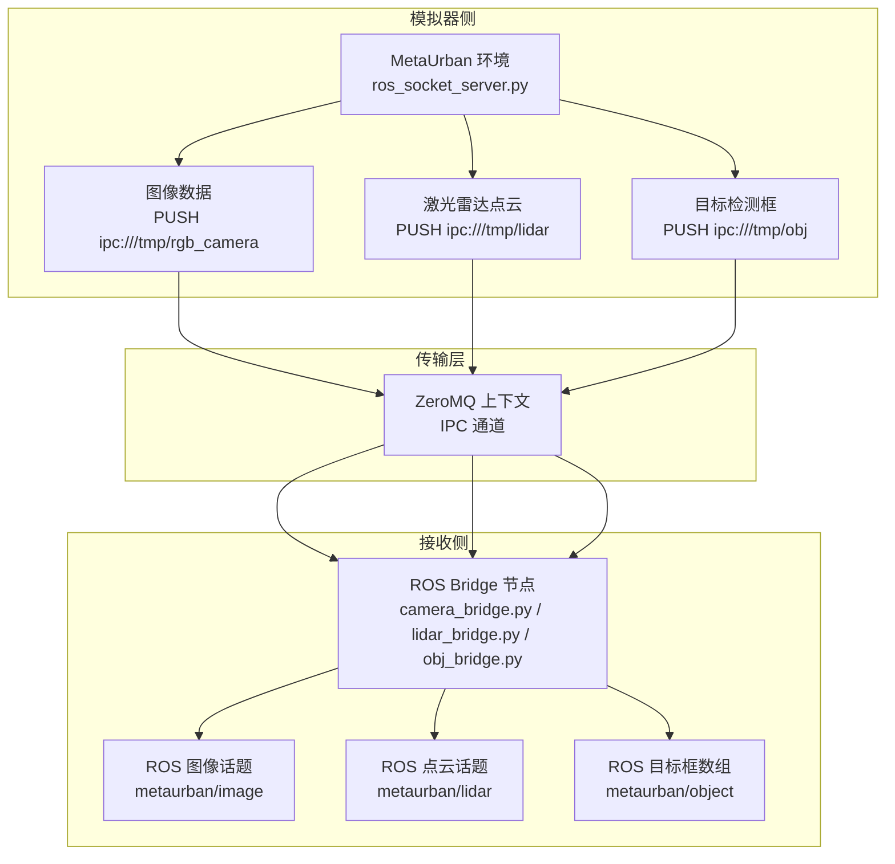
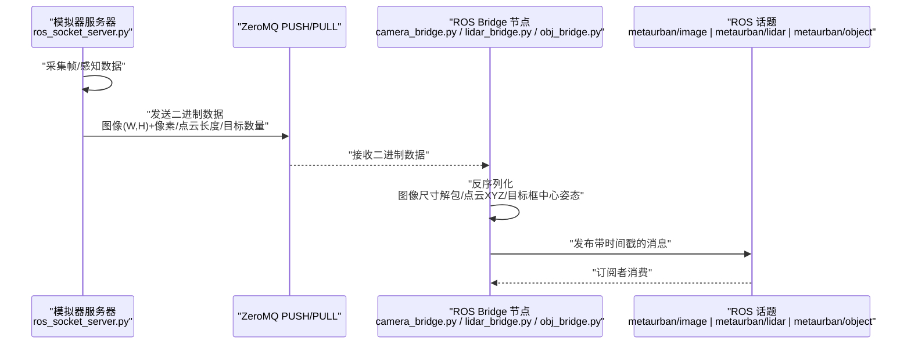
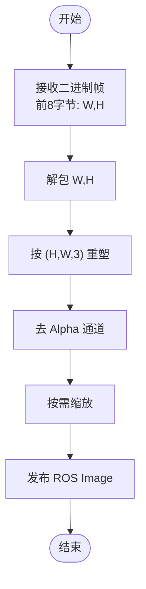
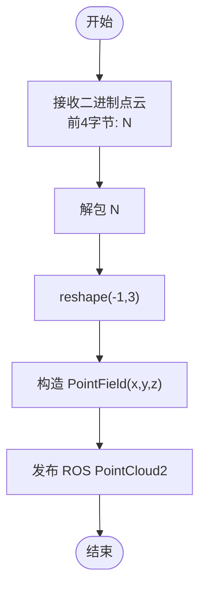
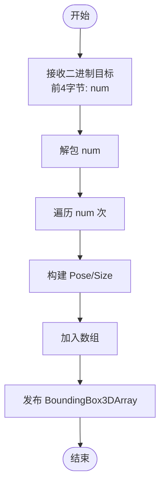
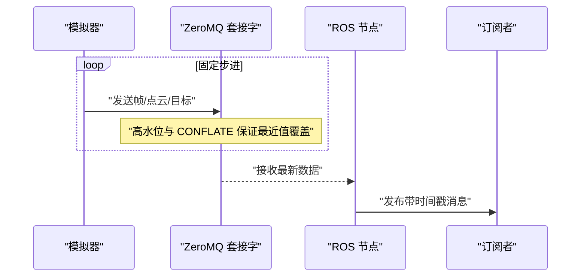
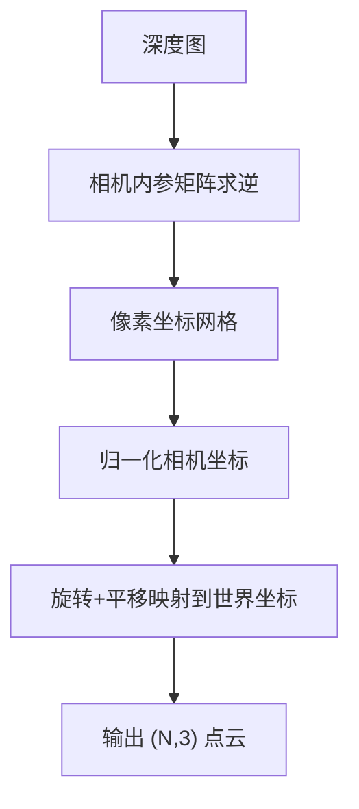
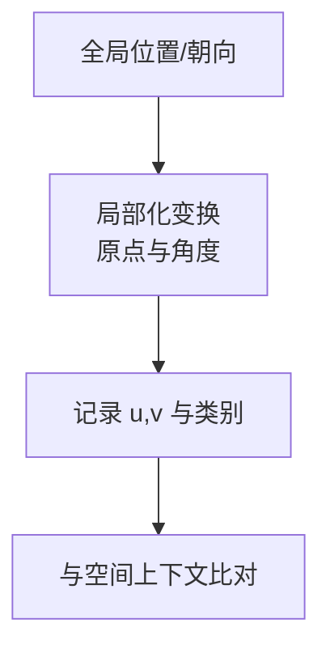
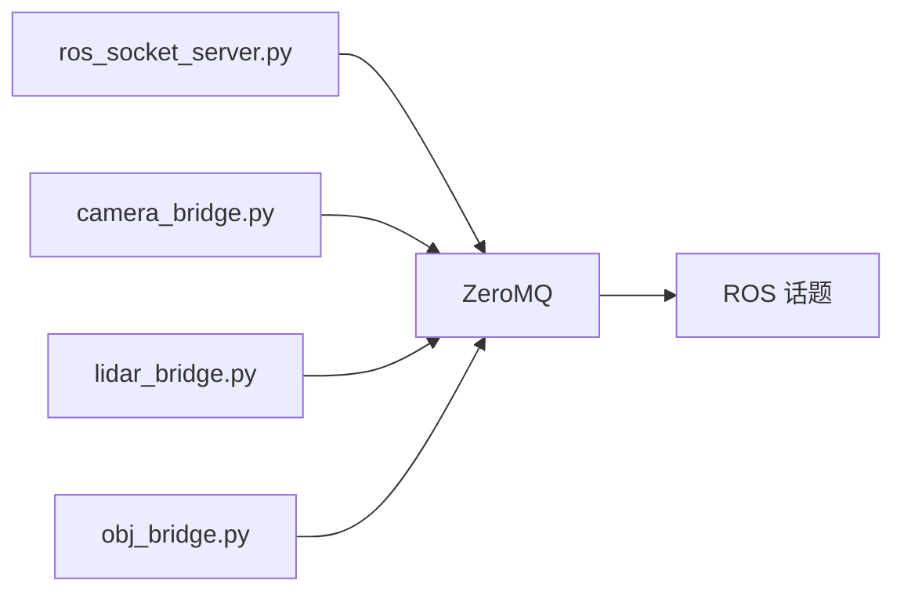

# 数据同步与一致性

<cite>
**本文引用的文件**   
- [ros_socket_server.py](file://metaurban/bridges/ros_bridge/ros_socket_server.py)
- [ros_socket_interactor.py](file://metaurban/bridges/ros_bridge/ros_socket_interactor.py)
- [camera_bridge.py](file://metaurban/bridges/ros_bridge/src/metaurban_example_bridge/metaurban_example_bridge/camera_bridge.py)
- [lidar_bridge.py](file://metaurban/bridges/ros_bridge/src/metaurban_example_bridge/metaurban_example_bridge/lidar_bridge.py)
- [obj_bridge.py](file://metaurban/bridges/ros_bridge/src/metaurban_example_bridge/metaurban_example_bridge/obj_bridge.py)
- [point_cloud_lidar.py](file://metaurban/metaurban/component/sensors/point_cloud_lidar.py)
- [street_layout.py](file://src/roadgen3d/street_layout.py)
- [beauty.py](file://src/roadgen3d/beauty.py)
- [layout_solver.py](file://src/roadgen3d/layout_solver.py)
- [solver_diagnostics_viz.py](file://src/roadgen3d/solver_diagnostics_viz.py)
- [api.ts](file://web/workbench/src/api.ts)
</cite>

## 目录
1. [引言](#引言)
2. [项目结构](#项目结构)
3. [核心组件](#核心组件)
4. [架构总览](#架构总览)
5. [详细组件分析](#详细组件分析)
6. [依赖分析](#依赖分析)
7. [性能考虑](#性能考虑)
8. [故障排查指南](#故障排查指南)
9. [结论](#结论)
10. [附录](#附录)

## 引言
本技术文档聚焦 RoadGen3D 与外部系统（MetaUrban 环境与 ROS 生态）之间的数据同步与一致性保障机制。内容涵盖：
- 时间戳同步：基于 ROS Header 时间戳与系统时钟的对齐策略
- 状态一致性：通过固定步进、缓冲上限与丢弃策略维持发送端与接收端的状态对齐
- 冲突解决：ZeroMQ 高水位与 CONFLATE 选项在高频数据流中的“最近值”覆盖策略
- 序列化与反序列化：图像尺寸前缀、点云 XYZ 三元组、目标框中心姿态与尺寸的二进制打包与解析
- 可靠性保障：非阻塞发送与错误告警、缓冲区大小与线程数配置
- 多线程与内存管理：ZeroMQ 上下文线程、显式内存释放与资源关闭
- 性能优化与监控：缓冲区大小、高水位阈值、吞吐评估与可视化

## 项目结构
RoadGen3D 的数据同步主要由两部分组成：
- 模拟器侧（MetaUrban 环境）：通过 ZeroMQ PUSH 套接字向本地 IPC 地址推送传感器数据
- 接收侧（ROS Bridge 节点）：通过 ZeroMQ PULL 套接字从 IPC 接收，并发布为 ROS 消息

**图表来源**
- [ros_socket_server.py:13-30](file://metaurban/bridges/ros_bridge/ros_socket_server.py#L13-L30)
- [camera_bridge.py:14-27](file://metaurban/bridges/ros_bridge/src/metaurban_example_bridge/metaurban_example_bridge/camera_bridge.py#L14-L27)
- [lidar_bridge.py:24-36](file://metaurban/bridges/ros_bridge/src/metaurban_example_bridge/metaurban_example_bridge/lidar_bridge.py#L24-L36)
- [obj_bridge.py:13-25](file://metaurban/bridges/ros_bridge/src/metaurban_example_bridge/metaurban_example_bridge/obj_bridge.py#L13-L25)

**章节来源**
- [ros_socket_server.py:13-30](file://metaurban/bridges/ros_bridge/ros_socket_server.py#L13-L30)
- [ros_socket_interactor.py:12-41](file://metaurban/bridges/ros_bridge/ros_socket_interactor.py#L12-L41)

## 核心组件
- 模拟器服务器：负责渲染与感知，使用 ZeroMQ PUSH 套接字以二进制形式发送图像、点云与目标框数据
- ROS Bridge 节点：使用 ZeroMQ PULL 套接字接收二进制数据，进行反序列化并发布为 ROS 消息
- 时间戳：所有 ROS 消息头包含当前系统时间戳，用于跨系统时间对齐
- 缓冲与限速：通过高水位阈值与 CONFLATE 选项实现“最近值”覆盖，避免积压导致的过期数据传播

**章节来源**
- [ros_socket_server.py:31-189](file://metaurban/bridges/ros_bridge/ros_socket_server.py#L31-L189)
- [camera_bridge.py:29-42](file://metaurban/bridges/ros_bridge/src/metaurban_example_bridge/metaurban_example_bridge/camera_bridge.py#L29-L42)
- [lidar_bridge.py:56-93](file://metaurban/bridges/ros_bridge/src/metaurban_example_bridge/metaurban_example_bridge/lidar_bridge.py#L56-L93)
- [obj_bridge.py:27-47](file://metaurban/bridges/ros_bridge/src/metaurban_example_bridge/metaurban_example_bridge/obj_bridge.py#L27-L47)

## 架构总览
下图展示了从模拟器到 ROS 话题的完整数据流，以及关键的同步点（时间戳、缓冲与丢弃策略）。

**图表来源**
- [ros_socket_server.py:90-177](file://metaurban/bridges/ros_bridge/ros_socket_server.py#L90-L177)
- [camera_bridge.py:29-42](file://metaurban/bridges/ros_bridge/src/metaurban_example_bridge/metaurban_example_bridge/camera_bridge.py#L29-L42)
- [lidar_bridge.py:56-93](file://metaurban/bridges/ros_bridge/src/metaurban_example_bridge/metaurban_example_bridge/lidar_bridge.py#L56-L93)
- [obj_bridge.py:27-47](file://metaurban/bridges/ros_bridge/src/metaurban_example_bridge/metaurban_example_bridge/obj_bridge.py#L27-L47)

## 详细组件分析

### 组件一：图像数据桥接（camera_bridge）
- 发送端（模拟器）：将图像宽高作为两个 32 位整型前缀，后跟按行存储的 RGB 字节流
- 接收端（Bridge）：先解析前缀得到 W/H，再按 (H, W, 3) 重塑，去除 Alpha 通道并发布为 ROS Image
- 时间戳：每帧消息头包含当前系统时间戳

**图表来源**
- [ros_socket_server.py:98-102](file://metaurban/bridges/ros_bridge/ros_socket_server.py#L98-L102)
- [camera_bridge.py:30-41](file://metaurban/bridges/ros_bridge/src/metaurban_example_bridge/metaurban_example_bridge/camera_bridge.py#L30-L41)

**章节来源**
- [ros_socket_server.py:90-111](file://metaurban/bridges/ros_bridge/ros_socket_server.py#L90-L111)
- [camera_bridge.py:29-42](file://metaurban/bridges/ros_bridge/src/metaurban_example_bridge/metaurban_example_bridge/camera_bridge.py#L29-L42)

### 组件二：激光雷达点云桥接（lidar_bridge）
- 发送端（模拟器）：点云长度作为 32 位整型前缀，后跟连续的浮点 XYZ 序列
- 接收端（Bridge）：解析长度，将浮点序列 reshape 为 (N, 3)，构造 PointCloud2 字段并发布
- 坐标系：点云来自模拟器感知，接收端直接发布为 ROS 点云；坐标系一致性由上层系统对齐

**图表来源**
- [ros_socket_server.py:164-168](file://metaurban/bridges/ros_bridge/ros_socket_server.py#L164-L168)
- [lidar_bridge.py:56-93](file://metaurban/bridges/ros_bridge/src/metaurban_example_bridge/metaurban_example_bridge/lidar_bridge.py#L56-L93)

**章节来源**
- [ros_socket_server.py:155-177](file://metaurban/bridges/ros_bridge/ros_socket_server.py#L155-L177)
- [lidar_bridge.py:56-93](file://metaurban/bridges/ros_bridge/src/metaurban_example_bridge/metaurban_example_bridge/lidar_bridge.py#L56-L93)

### 组件三：目标检测框桥接（obj_bridge）
- 发送端（模拟器）：目标数量作为 32 位整型前缀，后跟每条目标的 [x, y, yaw, length, width, height] 共 6N 浮点数
- 接收端（Bridge）：解析数量，逐个构建 BoundingBox3D，包含 Pose（位置+四元数）与 Size
- 坐标系：位置与朝向已转换为自车坐标系（相对位姿），接收端保持不变发布

**图表来源**
- [ros_socket_server.py:125-145](file://metaurban/bridges/ros_bridge/ros_socket_server.py#L125-L145)
- [obj_bridge.py:27-47](file://metaurban/bridges/ros_bridge/src/metaurban_example_bridge/metaurban_example_bridge/obj_bridge.py#L27-L47)

**章节来源**
- [ros_socket_server.py:113-154](file://metaurban/bridges/ros_bridge/ros_socket_server.py#L113-L154)
- [obj_bridge.py:27-47](file://metaurban/bridges/ros_bridge/src/metaurban_example_bridge/metaurban_example_bridge/obj_bridge.py#L27-L47)

### 组件四：时间戳与状态一致性
- 时间戳：所有 ROS 消息头包含当前系统时间戳，确保跨系统时间对齐
- 步进与速率：模拟器以固定周期步进环境并发送数据，接收端以定时器回调拉取数据，避免乱序
- 丢弃策略：发送端设置高水位阈值与 CONFLATE 选项，接收端同样设置高水位，保证只保留最新数据

**图表来源**
- [ros_socket_server.py:18-29](file://metaurban/bridges/ros_bridge/ros_socket_server.py#L18-L29)
- [camera_bridge.py:22-25](file://metaurban/bridges/ros_bridge/src/metaurban_example_bridge/metaurban_example_bridge/camera_bridge.py#L22-L25)
- [lidar_bridge.py:31-34](file://metaurban/bridges/ros_bridge/src/metaurban_example_bridge/metaurban_example_bridge/lidar_bridge.py#L31-L34)
- [obj_bridge.py:20-23](file://metaurban/bridges/ros_bridge/src/metaurban_example_bridge/metaurban_example_bridge/obj_bridge.py#L20-L23)

**章节来源**
- [ros_socket_server.py:18-29](file://metaurban/bridges/ros_bridge/ros_socket_server.py#L18-L29)
- [camera_bridge.py:44-58](file://metaurban/bridges/ros_bridge/src/metaurban_example_bridge/metaurban_example_bridge/camera_bridge.py#L44-L58)
- [lidar_bridge.py:95-109](file://metaurban/bridges/ros_bridge/src/metaurban_example_bridge/metaurban_example_bridge/lidar_bridge.py#L95-L109)
- [obj_bridge.py:49-63](file://metaurban/bridges/ros_bridge/src/metaurban_example_bridge/metaurban_example_bridge/obj_bridge.py#L49-L63)

### 组件五：点云坐标变换与空间对齐（引擎侧）
- 引擎侧点云生成：从深度图反投影到世界坐标系，涉及相机内参、旋转矩阵与平移向量
- 坐标系约定：相机坐标系与世界坐标系的转换，确保与 ROS 点云字段一致

**图表来源**
- [point_cloud_lidar.py:51-79](file://metaurban/metaurban/component/sensors/point_cloud_lidar.py#L51-L79)

**章节来源**
- [point_cloud_lidar.py:24-49](file://metaurban/metaurban/component/sensors/point_cloud_lidar.py#L24-L49)
- [point_cloud_lidar.py:51-79](file://metaurban/metaurban/component/sensors/point_cloud_lidar.py#L51-L79)

### 组件六：布局与空间一致性（RoadGen3D 场景层）
- 街区布局：在场景层面维护对象放置状态、评分与约束满足度，用于后续一致性校验
- 局部化坐标：将全局坐标转换为局部坐标系，便于与空间上下文对齐

**图表来源**
- [beauty.py:1840-1856](file://src/roadgen3d/beauty.py#L1840-L1856)
- [street_layout.py:6055-6085](file://src/roadgen3d/street_layout.py#L6055-L6085)

**章节来源**
- [beauty.py:1840-1856](file://src/roadgen3d/beauty.py#L1840-L1856)
- [street_layout.py:6055-6085](file://src/roadgen3d/street_layout.py#L6055-L6085)

## 依赖分析
- 模块耦合
  - 模拟器服务器与 ZeroMQ：强耦合，依赖 IPC 地址与套接字类型
  - Bridge 节点与 ZeroMQ：强耦合，依赖 CONFLATE 与高水位阈值
  - Bridge 节点与 ROS：弱耦合，仅通过消息类型与话题名约定交互
- 外部依赖
  - ZeroMQ：提供高性能 IPC 传输与队列控制
  - NumPy：用于二进制数据的快速解析与重塑
  - OpenCV：图像预处理（Bridge 节点中使用 cv_bridge）

**图表来源**
- [ros_socket_server.py:13-30](file://metaurban/bridges/ros_bridge/ros_socket_server.py#L13-L30)
- [camera_bridge.py:14-27](file://metaurban/bridges/ros_bridge/src/metaurban_example_bridge/metaurban_example_bridge/camera_bridge.py#L14-L27)
- [lidar_bridge.py:24-36](file://metaurban/bridges/ros_bridge/src/metaurban_example_bridge/metaurban_example_bridge/lidar_bridge.py#L24-L36)
- [obj_bridge.py:13-25](file://metaurban/bridges/ros_bridge/src/metaurban_example_bridge/metaurban_example_bridge/obj_bridge.py#L13-L25)

**章节来源**
- [ros_socket_server.py:13-30](file://metaurban/bridges/ros_bridge/ros_socket_server.py#L13-L30)
- [camera_bridge.py:14-27](file://metaurban/bridges/ros_bridge/src/metaurban_example_bridge/metaurban_example_bridge/camera_bridge.py#L14-L27)
- [lidar_bridge.py:24-36](file://metaurban/bridges/ros_bridge/src/metaurban_example_bridge/metaurban_example_bridge/lidar_bridge.py#L24-L36)
- [obj_bridge.py:13-25](file://metaurban/bridges/ros_bridge/src/metaurban_example_bridge/metaurban_example_bridge/obj_bridge.py#L13-L25)

## 性能考虑
- 缓冲区与高水位
  - 发送端与接收端均设置 SNDBUF 与高水位阈值，避免内存膨胀
  - CONFLATE 选项使接收端仅保留最新数据，降低延迟但可能丢弃旧帧
- 线程与并发
  - ZeroMQ 上下文设置 IO_THREADS，提升多线程吞吐
- 内存管理
  - 显式删除大对象以释放内存，减少 GC 压力
- 监控与可视化
  - 吞吐评估：计算各模式所需与实际值，判断是否满足
  - 可视化：使用条形图展示满足状态与数值

**章节来源**
- [ros_socket_server.py:18-29](file://metaurban/bridges/ros_bridge/ros_socket_server.py#L18-L29)
- [ros_socket_interactor.py:18-22](file://metaurban/bridges/ros_bridge/ros_socket_interactor.py#L18-L22)
- [layout_solver.py:331-348](file://src/roadgen3d/layout_solver.py#L331-L348)
- [solver_diagnostics_viz.py:541-577](file://src/roadgen3d/solver_diagnostics_viz.py#L541-L577)

## 故障排查指南
- 发送失败与告警
  - 发送端捕获 zmq.error.Again 并记录警告，必要时抛出异常
  - 接收端同样采用非阻塞发送并在异常时打印信息
- 资源释放
  - 服务节点在 finally 中关闭环境与销毁节点，防止资源泄漏
- 网络中断与数据丢失
  - 使用高水位与 CONFLATE 实现“最近值”覆盖，避免过期数据堆积
  - 若出现持续丢包，检查 ZeroMQ 缓冲区大小与 IO 线程数配置
- 系统异常
  - 捕获异常并打印堆栈，便于定位问题

**章节来源**
- [ros_socket_server.py:103-111](file://metaurban/bridges/ros_bridge/ros_socket_server.py#L103-L111)
- [ros_socket_server.py:146-154](file://metaurban/bridges/ros_bridge/ros_socket_server.py#L146-L154)
- [ros_socket_server.py:170-177](file://metaurban/bridges/ros_bridge/ros_socket_server.py#L170-L177)
- [ros_socket_interactor.py:120-124](file://metaurban/bridges/ros_bridge/ros_socket_interactor.py#L120-L124)
- [ros_socket_server.py:182-189](file://metaurban/bridges/ros_bridge/ros_socket_server.py#L182-L189)

## 结论
RoadGen3D 通过 ZeroMQ 在模拟器与 ROS 生态之间实现了高效、低延迟的数据同步。发送端采用固定步进与高水位策略，接收端通过 CONFLATE 与定时器回调确保“最近值”覆盖与时间戳对齐。图像、点云与目标框的二进制序列化方案简洁明确，配合严格的内存与资源管理，能够在多线程环境下稳定运行。结合吞吐评估与可视化工具，可进一步优化性能并保障系统一致性。

## 附录

### 数据格式规范（二进制结构）
- 图像数据
  - 前缀：两个 32 位整型（宽度 W、高度 H）
  - 数据体：按行存储的 RGB 字节流（H×W×3）
- 激光雷达点云
  - 前缀：32 位整型（点数 N）
  - 数据体：连续的 3N 个 32 位浮点数（x, y, z 交替）
- 目标检测框
  - 前缀：32 位整型（目标数量 num）
  - 数据体：共 6×num 个 32 位浮点数（x, y, yaw, length, width, height 依次）

**章节来源**
- [ros_socket_server.py:98-102](file://metaurban/bridges/ros_bridge/ros_socket_server.py#L98-L102)
- [ros_socket_server.py:164-168](file://metaurban/bridges/ros_bridge/ros_socket_server.py#L164-L168)
- [ros_socket_server.py:125-145](file://metaurban/bridges/ros_bridge/ros_socket_server.py#L125-L145)

### 网络字节序与边界处理
- 所有二进制前缀使用标准 32 位整型编码，遵循系统默认字节序
- 图像与点云数据体为连续字节流，无需额外对齐
- 目标框数据体按顺序解析，注意浮点精度与数组边界

**章节来源**
- [ros_socket_server.py:98-102](file://metaurban/bridges/ros_bridge/ros_socket_server.py#L98-L102)
- [ros_socket_server.py:164-168](file://metaurban/bridges/ros_bridge/ros_socket_server.py#L164-L168)
- [ros_socket_server.py:125-145](file://metaurban/bridges/ros_bridge/ros_socket_server.py#L125-L145)

### 多线程与内存管理
- ZeroMQ 上下文线程数配置，提升并发能力
- 显式删除大对象，及时释放内存
- 资源关闭与节点销毁，防止泄漏

**章节来源**
- [ros_socket_server.py:18-29](file://metaurban/bridges/ros_bridge/ros_socket_server.py#L18-L29)
- [ros_socket_interactor.py:18-22](file://metaurban/bridges/ros_bridge/ros_socket_interactor.py#L18-L22)
- [ros_socket_server.py:111](file://metaurban/bridges/ros_bridge/ros_socket_server.py#L111)
- [ros_socket_server.py:177](file://metaurban/bridges/ros_bridge/ros_socket_server.py#L177)
- [ros_socket_server.py:188](file://metaurban/bridges/ros_bridge/ros_socket_server.py#L188)

### Web API 与前端集成（参考）
- 前端通过统一 API 工具发起 JSON 请求，错误时抛出异常
- 适用于与后端服务的接口对接与调试

**章节来源**
- [api.ts:11-38](file://web/workbench/src/api.ts#L11-L38)