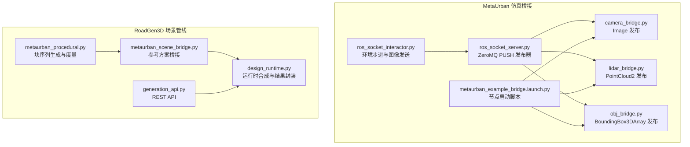
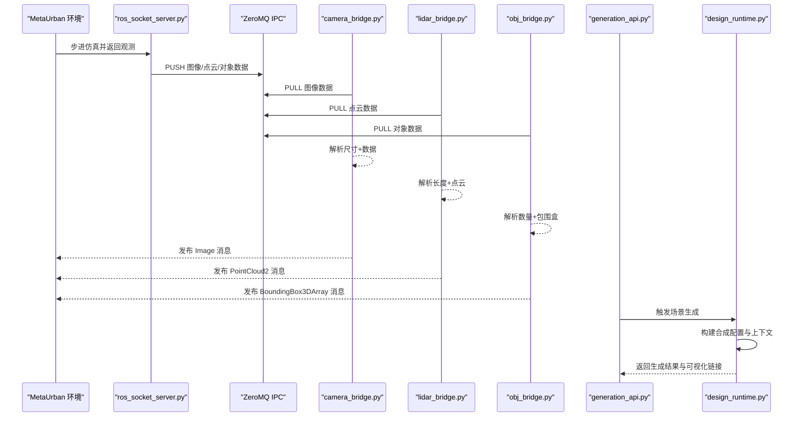
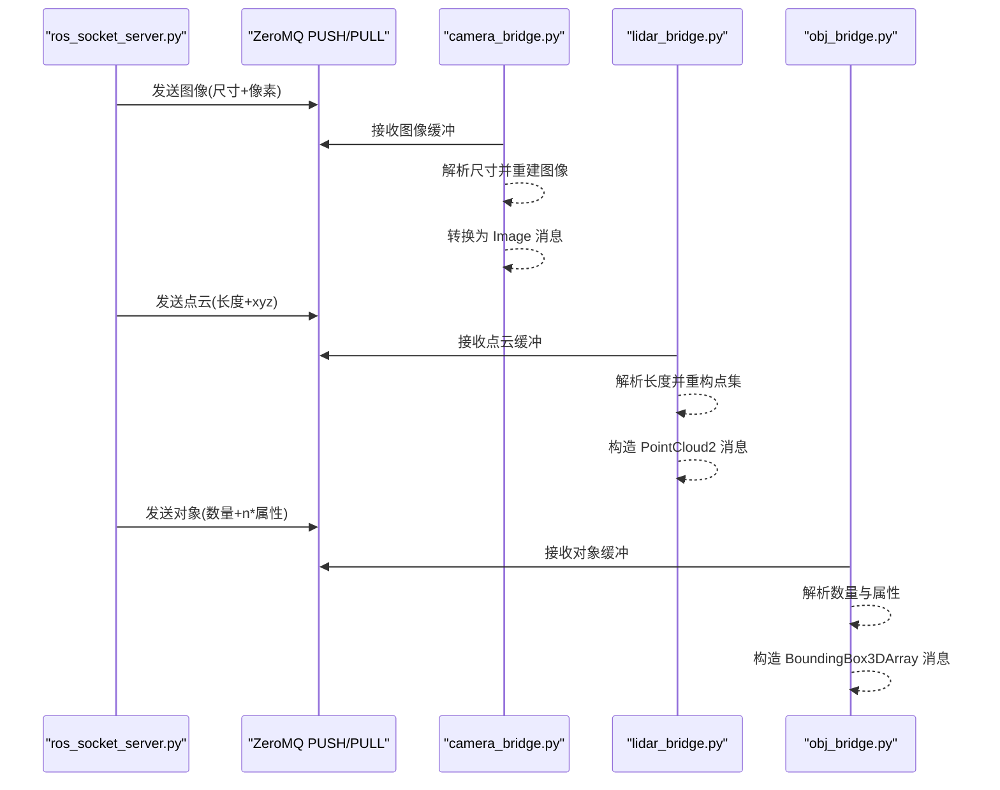
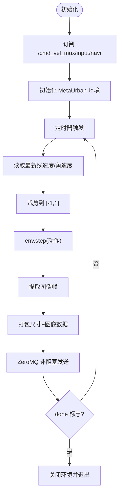
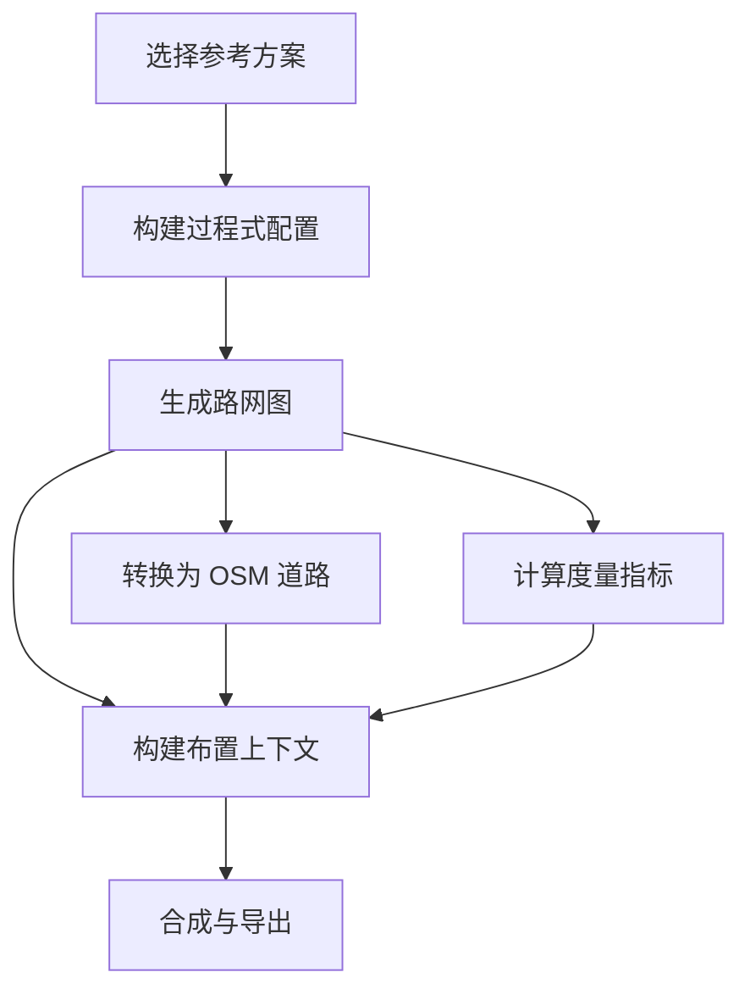
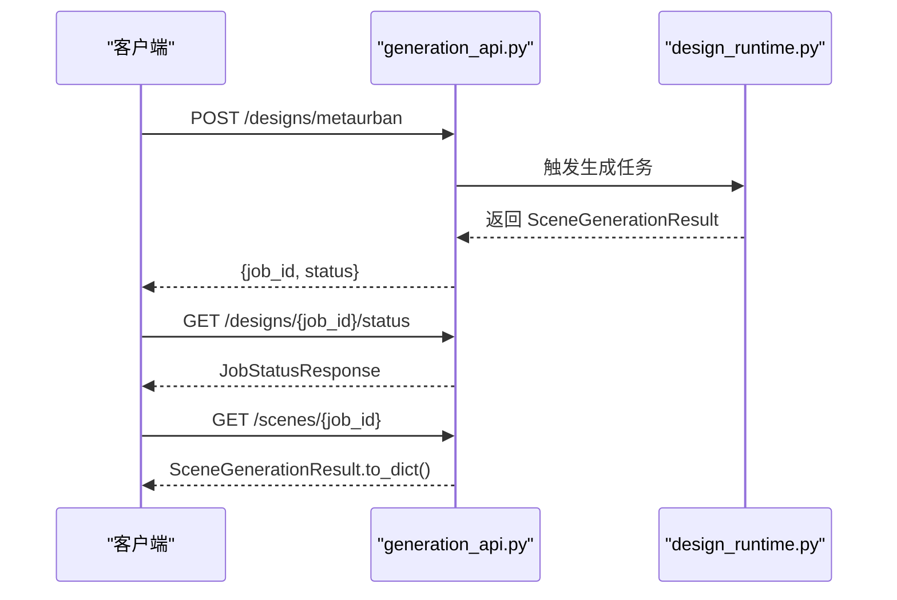
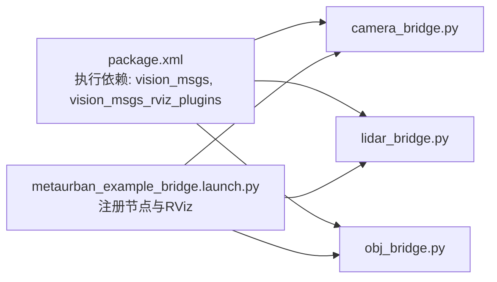

# 系统集成

<cite>
**本文引用的文件**
- [README.md](file://metaurban/bridges/ros_bridge/README.md)
- [ros_socket_interactor.py](file://metaurban/bridges/ros_bridge/ros_socket_interactor.py)
- [ros_socket_server.py](file://metaurban/bridges/ros_bridge/ros_socket_server.py)
- [camera_bridge.py](file://metaurban/bridges/ros_bridge/src/metaurban_example_bridge/metaurban_example_bridge/camera_bridge.py)
- [lidar_bridge.py](file://metaurban/bridges/ros_bridge/src/metaurban_example_bridge/metaurban_example_bridge/lidar_bridge.py)
- [obj_bridge.py](file://metaurban/bridges/ros_bridge/src/metaurban_example_bridge/metaurban_example_bridge/obj_bridge.py)
- [metaurban_example_bridge.launch.py](file://metaurban/bridges/ros_bridge/src/metaurban_example_bridge/launch/metaurban_example_bridge.launch.py)
- [package.xml](file://metaurban/bridges/ros_bridge/src/metaurban_example_bridge/package.xml)
- [metaurban_scene_bridge.py](file://src/roadgen3d/metaurban_scene_bridge.py)
- [metaurban_procedural.py](file://src/roadgen3d/metaurban_procedural.py)
- [generation_api.py](file://src/roadgen3d/services/generation_api.py)
- [design_runtime.py](file://src/roadgen3d/services/design_runtime.py)
</cite>

## 目录
1. [简介](#简介)
2. [项目结构](#项目结构)
3. [核心组件](#核心组件)
4. [架构总览](#架构总览)
5. [详细组件分析](#详细组件分析)
6. [依赖分析](#依赖分析)
7. [性能考虑](#性能考虑)
8. [故障排查指南](#故障排查指南)
9. [结论](#结论)
10. [附录](#附录)

## 简介
本文件面向 RoadGen3D 与 MetaUrban 仿真平台的系统集成，聚焦于 ROS2 桥接机制、消息协议与状态同步、socket 通信模式、数据传输格式与错误处理策略，并覆盖 MetaUrban 环境的启动流程、参数配置与场景加载。同时提供 ROS 桥接的传感器数据传输、控制指令下发与实时反馈机制，说明系统间数据一致性与同步策略，并给出集成测试方法、故障诊断与性能监控建议，以及在不同环境中的部署与运行指导。

## 项目结构
RoadGen3D 的系统集成主要由以下部分组成：
- MetaUrban 仿真桥接层（ROS2 + ZeroMQ）：负责将 MetaUrban 环境的传感器观测与对象信息通过 ZeroMQ 推送至本地 IPC 套接字，再由 ROS2 节点拉取并发布为标准消息类型。
- RoadGen3D 场景生成管线：负责将 MetaUrban 参考方案转换为可导出的路网与布置上下文，支撑后续场景合成与可视化。
- Web Viewer 与 API：提供 REST 接口触发场景生成与状态查询，支持元数据缓存与浏览器端可视化链接生成。

图表来源
- [ros_socket_server.py:13-201](file://metaurban/bridges/ros_bridge/ros_socket_server.py#L13-L201)
- [ros_socket_interactor.py:12-150](file://metaurban/bridges/ros_bridge/ros_socket_interactor.py#L12-L150)
- [camera_bridge.py:14-77](file://metaurban/bridges/ros_bridge/src/metaurban_example_bridge/metaurban_example_bridge/camera_bridge.py#L14-L77)
- [lidar_bridge.py:24-128](file://metaurban/bridges/ros_bridge/src/metaurban_example_bridge/metaurban_example_bridge/lidar_bridge.py#L24-L128)
- [obj_bridge.py:13-82](file://metaurban/bridges/ros_bridge/src/metaurban_example_bridge/metaurban_example_bridge/obj_bridge.py#L13-L82)
- [metaurban_example_bridge.launch.py:8-27](file://metaurban/bridges/ros_bridge/src/metaurban_example_bridge/launch/metaurban_example_bridge.launch.py#L8-L27)
- [metaurban_scene_bridge.py:163-242](file://src/roadgen3d/metaurban_scene_bridge.py#L163-L242)
- [metaurban_procedural.py:545-762](file://src/roadgen3d/metaurban_procedural.py#L545-L762)
- [generation_api.py:131-294](file://src/roadgen3d/services/generation_api.py#L131-L294)
- [design_runtime.py:246-397](file://src/roadgen3d/services/design_runtime.py#L246-L397)

章节来源
- [README.md:1-43](file://metaurban/bridges/ros_bridge/README.md#L1-L43)
- [metaurban_example_bridge.launch.py:8-27](file://metaurban/bridges/ros_bridge/src/metaurban_example_bridge/launch/metaurban_example_bridge.launch.py#L8-L27)

## 核心组件
- ZeroMQ Socket 发布器（ros_socket_server.py）
  - 初始化多个 PUSH 套接字，绑定到本地 IPC 地址，分别用于发布相机图像、LiDAR 点云与对象包围盒信息。
  - 在每步仿真中采集观测，打包尺寸与数据，非阻塞发送，异常时记录日志或抛出异常（取决于测试模式）。
- ROS2 桥接节点（camera_bridge.py、lidar_bridge.py、obj_bridge.py）
  - 使用 PULL 套接字从 IPC 接收数据，解析尺寸/长度前缀，转换为 ROS2 标准消息类型并发布。
  - 提供时间戳与坐标系头信息，确保与 RViz 等工具兼容。
- 控制交互器（ros_socket_interactor.py）
  - 订阅 /cmd_vel_mux/input/navi 速度指令，将其映射为动作输入到 MetaUrban 环境，定时步进仿真并发送图像帧。
- MetaUrban 场景桥接（metaurban_scene_bridge.py、metaurban_procedural.py）
  - 将参考方案转换为路网图与投影要素，构建布置上下文与评估指标，供后续合成使用。
- 场景生成 API 与运行时（generation_api.py、design_runtime.py）
  - 提供 REST 接口触发生成任务，封装结果并生成浏览器可视化链接；运行时根据设计草稿与场景上下文合成场景。

章节来源
- [ros_socket_server.py:13-201](file://metaurban/bridges/ros_bridge/ros_socket_server.py#L13-L201)
- [camera_bridge.py:14-77](file://metaurban/bridges/ros_bridge/src/metaurban_example_bridge/metaurban_example_bridge/camera_bridge.py#L14-L77)
- [lidar_bridge.py:24-128](file://metaurban/bridges/ros_bridge/src/metaurban_example_bridge/metaurban_example_bridge/lidar_bridge.py#L24-L128)
- [obj_bridge.py:13-82](file://metaurban/bridges/ros_bridge/src/metaurban_example_bridge/metaurban_example_bridge/obj_bridge.py#L13-L82)
- [ros_socket_interactor.py:12-150](file://metaurban/bridges/ros_bridge/ros_socket_interactor.py#L12-L150)
- [metaurban_scene_bridge.py:163-242](file://src/roadgen3d/metaurban_scene_bridge.py#L163-L242)
- [metaurban_procedural.py:545-762](file://src/roadgen3d/metaurban_procedural.py#L545-L762)
- [generation_api.py:131-294](file://src/roadgen3d/services/generation_api.py#L131-L294)
- [design_runtime.py:246-397](file://src/roadgen3d/services/design_runtime.py#L246-L397)

## 架构总览
下图展示从 MetaUrban 仿真到 ROS2 消息的完整链路，以及与 RoadGen3D 场景管线的衔接。

图表来源
- [ros_socket_server.py:83-189](file://metaurban/bridges/ros_bridge/ros_socket_server.py#L83-L189)
- [camera_bridge.py:29-42](file://metaurban/bridges/ros_bridge/src/metaurban_example_bridge/metaurban_example_bridge/camera_bridge.py#L29-L42)
- [lidar_bridge.py:56-93](file://metaurban/bridges/ros_bridge/src/metaurban_example_bridge/metaurban_example_bridge/lidar_bridge.py#L56-L93)
- [obj_bridge.py:27-47](file://metaurban/bridges/ros_bridge/src/metaurban_example_bridge/metaurban_example_bridge/obj_bridge.py#L27-L47)
- [generation_api.py:131-179](file://src/roadgen3d/services/generation_api.py#L131-L179)
- [design_runtime.py:246-288](file://src/roadgen3d/services/design_runtime.py#L246-L288)

## 详细组件分析

### 组件 A：ROS2 桥接节点（相机/激光雷达/对象）
- 相机桥接（camera_bridge.py）
  - 使用 PULL 套接字连接到 IPC 地址，按固定周期接收图像缓冲区，解析宽高前缀后重建图像，转换为 ROS2 Image 并填充 Header 时间戳与 frame_id。
- LiDAR 桥接（lidar_bridge.py）
  - 从 IPC 接收点云长度前缀与浮点数组，重构成三维点集，构造 PointCloud2 消息字段并发布。
- 对象桥接（obj_bridge.py）
  - 从 IPC 接收对象数量与属性数组，解析每个对象的位姿与尺寸，封装为 BoundingBox3DArray 并发布。

图表来源
- [ros_socket_server.py:90-189](file://metaurban/bridges/ros_bridge/ros_socket_server.py#L90-L189)
- [camera_bridge.py:29-42](file://metaurban/bridges/ros_bridge/src/metaurban_example_bridge/metaurban_example_bridge/camera_bridge.py#L29-L42)
- [lidar_bridge.py:56-93](file://metaurban/bridges/ros_bridge/src/metaurban_example_bridge/metaurban_example_bridge/lidar_bridge.py#L56-L93)
- [obj_bridge.py:27-47](file://metaurban/bridges/ros_bridge/src/metaurban_example_bridge/metaurban_example_bridge/obj_bridge.py#L27-L47)

章节来源
- [camera_bridge.py:14-77](file://metaurban/bridges/ros_bridge/src/metaurban_example_bridge/metaurban_example_bridge/camera_bridge.py#L14-L77)
- [lidar_bridge.py:24-128](file://metaurban/bridges/ros_bridge/src/metaurban_example_bridge/metaurban_example_bridge/lidar_bridge.py#L24-L128)
- [obj_bridge.py:13-82](file://metaurban/bridges/ros_bridge/src/metaurban_example_bridge/metaurban_example_bridge/obj_bridge.py#L13-L82)

### 组件 B：控制交互器与仿真步进（ros_socket_interactor.py）
- 订阅 /cmd_vel_mux/input/navi 速度指令，映射为动作输入到 MetaUrban 环境。
- 定时器以固定频率步进仿真，读取最新速度命令，裁剪到 [-1, 1] 区间，执行一步并发送图像帧。
- 使用 ZeroMQ PUSH 套接字向 IPC 发送图像数据，采用非阻塞发送并在失败时记录告警。

图表来源
- [ros_socket_interactor.py:96-129](file://metaurban/bridges/ros_bridge/ros_socket_interactor.py#L96-L129)

章节来源
- [ros_socket_interactor.py:12-150](file://metaurban/bridges/ros_bridge/ros_socket_interactor.py#L12-L150)

### 组件 C：MetaUrban 场景桥接与生成（metaurban_scene_bridge.py、metaurban_procedural.py）
- 元参考方案桥接（metaurban_scene_bridge.py）
  - 依据参考方案构建过程式路网图，生成合成所需的投影要素、布置上下文与评估指标，输出汇总元数据。
- 过程式生成（metaurban_procedural.py）
  - 将块序列（S/C/X/T/O）转换为路网段落，计算交叉断面条带与资产提示，支持多种几何与拓扑组合。

图表来源
- [metaurban_scene_bridge.py:163-242](file://src/roadgen3d/metaurban_scene_bridge.py#L163-L242)
- [metaurban_procedural.py:545-762](file://src/roadgen3d/metaurban_procedural.py#L545-L762)

章节来源
- [metaurban_scene_bridge.py:163-242](file://src/roadgen3d/metaurban_scene_bridge.py#L163-L242)
- [metaurban_procedural.py:545-762](file://src/roadgen3d/metaurban_procedural.py#L545-L762)

### 组件 D：Web API 与运行时（generation_api.py、design_runtime.py）
- REST API（generation_api.py）
  - 提供 /designs/metaurban 与 /designs/template 端点，异步触发生成任务并返回 job_id；GET /designs/{job_id}/status 查询状态；GET /scenes/{job_id} 获取结果。
- 运行时（design_runtime.py）
  - 将设计草稿合并为合成配置，构建对象/地面/天空资源后端，调用 compose_street_scene 执行合成，缓存布局并生成浏览器可视化链接。

图表来源
- [generation_api.py:131-294](file://src/roadgen3d/services/generation_api.py#L131-L294)
- [design_runtime.py:336-397](file://src/roadgen3d/services/design_runtime.py#L336-L397)

章节来源
- [generation_api.py:131-294](file://src/roadgen3d/services/generation_api.py#L131-L294)
- [design_runtime.py:246-397](file://src/roadgen3d/services/design_runtime.py#L246-L397)

## 依赖分析
- ROS2 包与依赖
  - 包定义（package.xml）声明 vision_msgs 与 vision_msgs_rviz_plugins 作为执行依赖，确保 RViz 可视化与消息类型可用。
- 启动与节点组织
  - 启动脚本（metaurban_example_bridge.launch.py）统一注册相机、LiDAR、对象三个桥接节点，并启动 RViz2 显示。
- ZeroMQ 与消息格式
  - 服务器端与桥接节点均使用 ZeroMQ 的 PUSH/PULL 模式进行 IPC 通信，消息前缀携带尺寸或长度信息，便于跨语言/跨进程稳定解析。

图表来源
- [package.xml:9-11](file://metaurban/bridges/ros_bridge/src/metaurban_example_bridge/package.xml#L9-L11)
- [metaurban_example_bridge.launch.py:8-27](file://metaurban/bridges/ros_bridge/src/metaurban_example_bridge/launch/metaurban_example_bridge.launch.py#L8-L27)

章节来源
- [package.xml:1-15](file://metaurban/bridges/ros_bridge/src/metaurban_example_bridge/package.xml#L1-L15)
- [metaurban_example_bridge.launch.py:8-27](file://metaurban/bridges/ros_bridge/src/metaurban_example_bridge/launch/metaurban_example_bridge.launch.py#L8-L27)

## 性能考虑
- ZeroMQ 缓冲与背压
  - PUSH 套接字设置 SNDBUF 与高水位（HWM），桥接节点启用 CONFLATE 与 HWM，避免消息堆积导致延迟累积。
- 非阻塞发送与降采样
  - 服务器端与交互器均采用非阻塞发送，必要时丢弃过期帧，保持实时性；桥接节点以固定周期回调，避免过度占用 CPU。
- 数据压缩与内存管理
  - 发送前将图像/点云转为 uint8/float32 并显式删除中间变量，减少内存压力。
- 仿真步进频率
  - 交互器定时器设定为固定频率步进仿真，平衡渲染与控制响应；可根据硬件能力调整。

章节来源
- [ros_socket_server.py:16-30](file://metaurban/bridges/ros_bridge/ros_socket_server.py#L16-L30)
- [camera_bridge.py:21-26](file://metaurban/bridges/ros_bridge/src/metaurban_example_bridge/metaurban_example_bridge/camera_bridge.py#L21-L26)
- [lidar_bridge.py:30-35](file://metaurban/bridges/ros_bridge/src/metaurban_example_bridge/metaurban_example_bridge/lidar_bridge.py#L30-L35)
- [obj_bridge.py:20-25](file://metaurban/bridges/ros_bridge/src/metaurban_example_bridge/metaurban_example_bridge/obj_bridge.py#L20-L25)
- [ros_socket_interactor.py:18-22](file://metaurban/bridges/ros_bridge/ros_socket_interactor.py#L18-L22)

## 故障排查指南
- 安装与依赖问题
  - 若使用 conda，请确保系统解释器与 ROS2 二进制兼容；安装 pyzmq 并完成 rosdep 初始化与安装。
- ZeroMQ 发送失败
  - 服务器端与交互器在非阻塞发送失败时会记录告警或抛出异常（测试模式），检查套接字绑定/连接地址与 IPC 权限。
- 消息解析异常
  - 相机/激光雷达/对象桥接节点依赖固定前缀（尺寸/长度），若消息格式不匹配会导致解析错误；确认服务器端打包顺序与字节序一致。
- 仿真结束与节点退出
  - 当仿真 done 标志为真时，交互器会关闭环境并退出；检查环境配置与终止条件。
- API 任务状态
  - 使用 GET /designs/{job_id}/status 查询任务状态；若失败，查看错误字段定位问题。

章节来源
- [README.md:41-43](file://metaurban/bridges/ros_bridge/README.md#L41-L43)
- [ros_socket_server.py:103-111](file://metaurban/bridges/ros_bridge/ros_socket_server.py#L103-L111)
- [ros_socket_interactor.py:120-129](file://metaurban/bridges/ros_bridge/ros_socket_interactor.py#L120-L129)
- [camera_bridge.py:33-36](file://metaurban/bridges/ros_bridge/src/metaurban_example_bridge/metaurban_example_bridge/camera_bridge.py#L33-L36)
- [lidar_bridge.py:60-65](file://metaurban/bridges/ros_bridge/src/metaurban_example_bridge/metaurban_example_bridge/lidar_bridge.py#L60-L65)
- [obj_bridge.py:31-34](file://metaurban/bridges/ros_bridge/src/metaurban_example_bridge/metaurban_example_bridge/obj_bridge.py#L31-L34)
- [generation_api.py:251-285](file://src/roadgen3d/services/generation_api.py#L251-L285)

## 结论
本集成方案通过 ZeroMQ 实现 MetaUrban 仿真与 ROS2 生态的高效桥接，提供相机、LiDAR 与对象三类传感器数据的实时发布，并支持控制指令的下发与仿真状态的同步。结合 RoadGen3D 的场景桥接与生成管线，可实现从参考方案到可导出场景的完整工作流。通过合理的缓冲策略、非阻塞发送与固定周期回调，系统在不同硬件环境下具备良好的实时性与稳定性。建议在生产环境中引入持久化任务队列与更完善的错误恢复机制，进一步提升可靠性与可观测性。

## 附录
- 集成测试方法
  - 启动顺序：先运行 ros_socket_server.py，再启动 ROS2 节点（camera_bridge、lidar_bridge、obj_bridge），最后可选启动 RViz2 查看。
  - 功能验证：检查各主题是否正常发布，图像分辨率与点云密度是否符合预期，对象包围盒是否正确。
- 部署与运行
  - 环境要求：ROS2（humble）、pyzmq、系统 Python 解释器与 ROS2 二进制兼容。
  - 构建与安装：按照 README 中的步骤完成依赖安装与 colcon 构建，激活环境后运行。
- 性能监控
  - 关注 ZeroMQ 套接字的发送速率与丢包率，监控桥接节点的 CPU 占用与消息延迟；在高负载场景下适当降低发布频率或提高缓冲参数。

章节来源
- [README.md:6-38](file://metaurban/bridges/ros_bridge/README.md#L6-L38)
- [metaurban_example_bridge.launch.py:8-27](file://metaurban/bridges/ros_bridge/src/metaurban_example_bridge/launch/metaurban_example_bridge.launch.py#L8-L27)