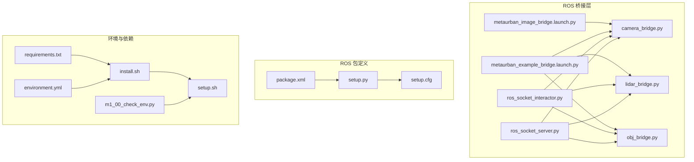
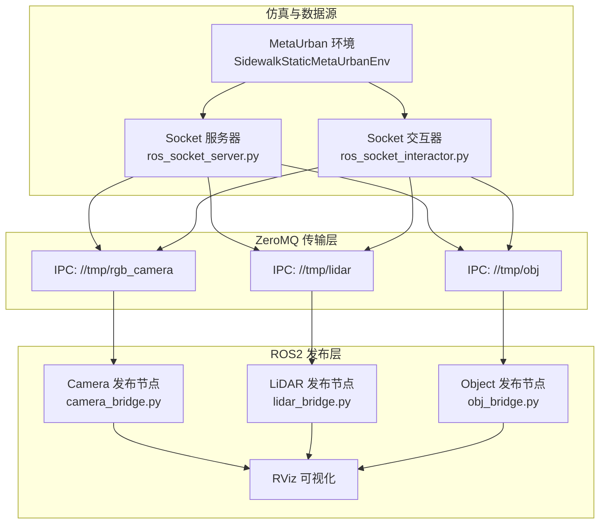
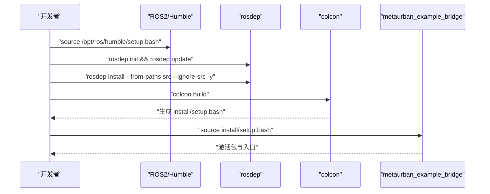
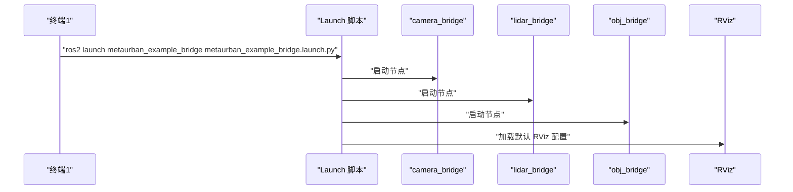
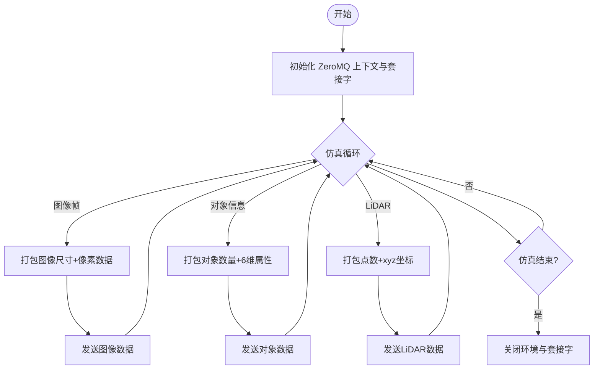
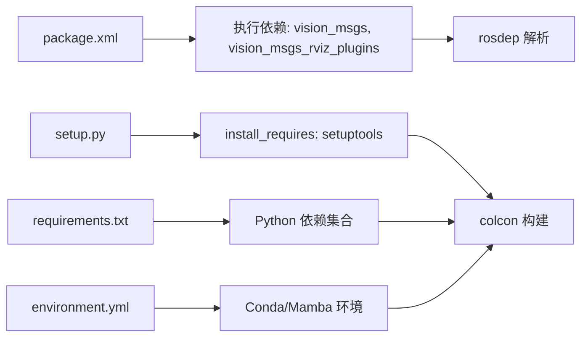

# 部署环境配置

<cite>
**本文档引用的文件**
- [README.md](file://metaurban/bridges/ros_bridge/README.md)
- [package.xml](file://metaurban/bridges/ros_bridge/src/metaurban_example_bridge/package.xml)
- [setup.py](file://metaurban/bridges/ros_bridge/src/metaurban_example_bridge/setup.py)
- [setup.cfg](file://metaurban/bridges/ros_bridge/src/metaurban_example_bridge/setup.cfg)
- [metaurban_example_bridge.launch.py](file://metaurban/bridges/ros_bridge/src/metaurban_example_bridge/launch/metaurban_example_bridge.launch.py)
- [metaurban_image_bridge.launch.py](file://metaurban/bridges/ros_bridge/src/metaurban_example_bridge/launch/metaurban_image_bridge.launch.py)
- [ros_socket_server.py](file://metaurban/bridges/ros_bridge/ros_socket_server.py)
- [ros_socket_interactor.py](file://metaurban/bridges/ros_bridge/ros_socket_interactor.py)
- [camera_bridge.py](file://metaurban/bridges/ros_bridge/src/metaurban_example_bridge/metaurban_example_bridge/camera_bridge.py)
- [lidar_bridge.py](file://metaurban/bridges/ros_bridge/src/metaurban_example_bridge/metaurban_example_bridge/lidar_bridge.py)
- [obj_bridge.py](file://metaurban/bridges/ros_bridge/src/metaurban_example_bridge/metaurban_example_bridge/obj_bridge.py)
- [requirements.txt](file://metaurban/requirements.txt)
- [environment.yml](file://metaurban/environment.yml)
- [install.sh](file://metaurban/install.sh)
- [setup.sh](file://metaurban/setup.sh)
- [m1_00_check_env.py](file://scripts/m1_00_check_env.py)
</cite>

## 目录
1. [简介](#简介)
2. [项目结构](#项目结构)
3. [核心组件](#核心组件)
4. [架构总览](#架构总览)
5. [详细组件分析](#详细组件分析)
6. [依赖关系分析](#依赖关系分析)
7. [性能考虑](#性能考虑)
8. [故障排除指南](#故障排除指南)
9. [结论](#结论)
10. [附录](#附录)

## 简介
本指南面向 RoadGen3D 系统的部署与运维人员，提供从零开始的环境准备、ROS 桥接包编译安装、跨平台部署差异、环境变量配置、网络与权限管理、部署验证与健康检查、以及常见问题排查的完整实践手册。内容基于仓库中的 ROS 桥接模块与相关脚本，确保可操作性与可重复性。

## 项目结构
RoadGen3D 的部署相关能力主要集中在 metaurban 子模块及其 bridges/ros_bridge 桥接层中。核心路径如下：
- ROS 桥接包：metaurban/bridges/ros_bridge
- ROS 包定义与构建：package.xml、setup.py、setup.cfg
- 启动文件：launch 目录下的 .launch.py 文件
- Socket 服务器与交互器：ros_socket_server.py、ros_socket_interactor.py
- ROS 发布节点：camera_bridge.py、lidar_bridge.py、obj_bridge.py
- 全局依赖与环境：requirements.txt、environment.yml、install.sh、setup.sh
- 环境检测脚本：scripts/m1_00_check_env.py

图表来源
- [ros_socket_server.py:1-201](file://metaurban/bridges/ros_bridge/ros_socket_server.py#L1-L201)
- [ros_socket_interactor.py:1-150](file://metaurban/bridges/ros_bridge/ros_socket_interactor.py#L1-L150)
- [camera_bridge.py:1-77](file://metaurban/bridges/ros_bridge/src/metaurban_example_bridge/metaurban_example_bridge/camera_bridge.py#L1-L77)
- [lidar_bridge.py:1-128](file://metaurban/bridges/ros_bridge/src/metaurban_example_bridge/metaurban_example_bridge/lidar_bridge.py#L1-L128)
- [obj_bridge.py:1-82](file://metaurban/bridges/ros_bridge/src/metaurban_example_bridge/metaurban_example_bridge/obj_bridge.py#L1-L82)
- [metaurban_example_bridge.launch.py:1-27](file://metaurban/bridges/ros_bridge/src/metaurban_example_bridge/launch/metaurban_example_bridge.launch.py#L1-L27)
- [metaurban_image_bridge.launch.py:1-27](file://metaurban/bridges/ros_bridge/src/metaurban_example_bridge/launch/metaurban_image_bridge.launch.py#L1-L27)
- [package.xml:1-15](file://metaurban/bridges/ros_bridge/src/metaurban_example_bridge/package.xml#L1-L15)
- [setup.py:1-31](file://metaurban/bridges/ros_bridge/src/metaurban_example_bridge/setup.py#L1-L31)
- [setup.cfg:1-5](file://metaurban/bridges/ros_bridge/src/metaurban_example_bridge/setup.cfg#L1-L5)
- [requirements.txt](file://metaurban/requirements.txt)
- [environment.yml](file://metaurban/environment.yml)
- [install.sh](file://metaurban/install.sh)
- [setup.sh](file://metaurban/setup.sh)
- [m1_00_check_env.py](file://scripts/m1_00_check_env.py)

章节来源
- [README.md:1-43](file://metaurban/bridges/ros_bridge/README.md#L1-L43)
- [package.xml:1-15](file://metaurban/bridges/ros_bridge/src/metaurban_example_bridge/package.xml#L1-L15)
- [setup.py:1-31](file://metaurban/bridges/ros_bridge/src/metaurban_example_bridge/setup.py#L1-L31)
- [setup.cfg:1-5](file://metaurban/bridges/ros_bridge/src/metaurban_example_bridge/setup.cfg#L1-L5)
- [metaurban_example_bridge.launch.py:1-27](file://metaurban/bridges/ros_bridge/src/metaurban_example_bridge/launch/metaurban_example_bridge.launch.py#L1-L27)
- [metaurban_image_bridge.launch.py:1-27](file://metaurban/bridges/ros_bridge/src/metaurban_example_bridge/launch/metaurban_image_bridge.launch.py#L1-L27)
- [ros_socket_server.py:1-201](file://metaurban/bridges/ros_bridge/ros_socket_server.py#L1-L201)
- [ros_socket_interactor.py:1-150](file://metaurban/bridges/ros_bridge/ros_socket_interactor.py#L1-L150)
- [camera_bridge.py:1-77](file://metaurban/bridges/ros_bridge/src/metaurban_example_bridge/metaurban_example_bridge/camera_bridge.py#L1-L77)
- [lidar_bridge.py:1-128](file://metaurban/bridges/ros_bridge/src/metaurban_example_bridge/metaurban_example_bridge/lidar_bridge.py#L1-L128)
- [obj_bridge.py:1-82](file://metaurban/bridges/ros_bridge/src/metaurban_example_bridge/metaurban_example_bridge/obj_bridge.py#L1-L82)
- [requirements.txt](file://metaurban/requirements.txt)
- [environment.yml](file://metaurban/environment.yml)
- [install.sh](file://metaurban/install.sh)
- [setup.sh](file://metaurban/setup.sh)
- [m1_00_check_env.py](file://scripts/m1_00_check_env.py)

## 核心组件
- ROS 桥接包（metaurban_example_bridge）：提供 camera、lidar、object 三类传感器数据的 ROS 发布节点，并通过 ZeroMQ IPC 在 Python 进程间传输。
- Socket 服务器与交互器：分别负责生成仿真数据并通过 ZeroMQ 推送至本地 IPC 套接字，或接收 ROS 的速度指令驱动仿真步进。
- 启动文件：使用 launch 脚本统一启动多个发布节点与 RViz 可视化。
- 依赖与环境：通过 requirements.txt、environment.yml 提供 Python 依赖；install.sh、setup.sh 完成系统级依赖与工作空间初始化。

章节来源
- [package.xml:1-15](file://metaurban/bridges/ros_bridge/src/metaurban_example_bridge/package.xml#L1-L15)
- [setup.py:1-31](file://metaurban/bridges/ros_bridge/src/metaurban_example_bridge/setup.py#L1-L31)
- [metaurban_example_bridge.launch.py:1-27](file://metaurban/bridges/ros_bridge/src/metaurban_example_bridge/launch/metaurban_example_bridge.launch.py#L1-L27)
- [ros_socket_server.py:1-201](file://metaurban/bridges/ros_bridge/ros_socket_server.py#L1-L201)
- [ros_socket_interactor.py:1-150](file://metaurban/bridges/ros_bridge/ros_socket_interactor.py#L1-L150)

## 架构总览
下图展示了 RoadGen3D 部署与运行时的整体架构：ROS2 节点通过 ZeroMQ 与仿真环境交互，形成“Socket 服务器/交互器 → ZeroMQ IPC → ROS 发布节点”的数据通路。

图表来源
- [ros_socket_server.py:1-201](file://metaurban/bridges/ros_bridge/ros_socket_server.py#L1-L201)
- [ros_socket_interactor.py:1-150](file://metaurban/bridges/ros_bridge/ros_socket_interactor.py#L1-L150)
- [camera_bridge.py:1-77](file://metaurban/bridges/ros_bridge/src/metaurban_example_bridge/metaurban_example_bridge/camera_bridge.py#L1-L77)
- [lidar_bridge.py:1-128](file://metaurban/bridges/ros_bridge/src/metaurban_example_bridge/metaurban_example_bridge/lidar_bridge.py#L1-L128)
- [obj_bridge.py:1-82](file://metaurban/bridges/ros_bridge/src/metaurban_example_bridge/metaurban_example_bridge/obj_bridge.py#L1-L82)

## 详细组件分析

### ROS 桥接包编译与安装
- catkin/colcon 工作空间：在 bridges/ros_bridge 目录下执行构建与安装流程，依赖系统已安装的 ROS2（示例为 humble）。
- 依赖安装：使用 rosdep 安装 src 下的依赖，确保 vision_msgs、vision_msgs_rviz_plugins 等执行期依赖可用。
- 构建与源码激活：使用 colcon build 编译，随后 source install/setup.bash 激活工作空间。
- 包元数据与入口：package.xml 声明包名、版本、许可证与执行依赖；setup.py 定义 console_scripts 入口，注册 camera_bridge、lidar_bridge、obj_bridge 三个可执行脚本。

图表来源
- [README.md:8-26](file://metaurban/bridges/ros_bridge/README.md#L8-L26)
- [package.xml:1-15](file://metaurban/bridges/ros_bridge/src/metaurban_example_bridge/package.xml#L1-L15)
- [setup.py:1-31](file://metaurban/bridges/ros_bridge/src/metaurban_example_bridge/setup.py#L1-L31)

章节来源
- [README.md:6-26](file://metaurban/bridges/ros_bridge/README.md#L6-L26)
- [package.xml:1-15](file://metaurban/bridges/ros_bridge/src/metaurban_example_bridge/package.xml#L1-L15)
- [setup.py:1-31](file://metaurban/bridges/ros_bridge/src/metaurban_example_bridge/setup.py#L1-L31)
- [setup.cfg:1-5](file://metaurban/bridges/ros_bridge/src/metaurban_example_bridge/setup.cfg#L1-L5)

### 启动与可视化
- 启动文件：通过 launch 脚本一次性启动 camera、lidar、object 发布节点，并加载 RViz 配置文件进行可视化。
- 单相机模式：提供仅启动 camera 的独立启动文件，便于轻量化测试。

图表来源
- [metaurban_example_bridge.launch.py:1-27](file://metaurban/bridges/ros_bridge/src/metaurban_example_bridge/launch/metaurban_example_bridge.launch.py#L1-L27)
- [metaurban_image_bridge.launch.py:1-27](file://metaurban/bridges/ros_bridge/src/metaurban_example_bridge/launch/metaurban_image_bridge.launch.py#L1-L27)

章节来源
- [metaurban_example_bridge.launch.py:1-27](file://metaurban/bridges/ros_bridge/src/metaurban_example_bridge/launch/metaurban_example_bridge.launch.py#L1-L27)
- [metaurban_image_bridge.launch.py:1-27](file://metaurban/bridges/ros_bridge/src/metaurban_example_bridge/launch/metaurban_image_bridge.launch.py#L1-L27)

### 数据流与处理逻辑
- Socket 服务器：初始化 ZeroMQ PUSH 套接字，绑定到本地 IPC 地址；循环推进仿真，打包图像、对象与 LiDAR 数据并通过套接字发送。
- ROS 发布节点：各节点通过 ZeroMQ PULL 连接到对应 IPC 地址，解析二进制消息，转换为 ROS 消息类型后发布。
- 交互器：订阅 /cmd_vel_mux/input/navi 速度指令，驱动仿真步进并将图像回传至 ZeroMQ。

图表来源
- [ros_socket_server.py:1-201](file://metaurban/bridges/ros_bridge/ros_socket_server.py#L1-L201)
- [camera_bridge.py:1-77](file://metaurban/bridges/ros_bridge/src/metaurban_example_bridge/metaurban_example_bridge/camera_bridge.py#L1-L77)
- [lidar_bridge.py:1-128](file://metaurban/bridges/ros_bridge/src/metaurban_example_bridge/metaurban_example_bridge/lidar_bridge.py#L1-L128)
- [obj_bridge.py:1-82](file://metaurban/bridges/ros_bridge/src/metaurban_example_bridge/metaurban_example_bridge/obj_bridge.py#L1-L82)

章节来源
- [ros_socket_server.py:1-201](file://metaurban/bridges/ros_bridge/ros_socket_server.py#L1-L201)
- [camera_bridge.py:1-77](file://metaurban/bridges/ros_bridge/src/metaurban_example_bridge/metaurban_example_bridge/camera_bridge.py#L1-L77)
- [lidar_bridge.py:1-128](file://metaurban/bridges/ros_bridge/src/metaurban_example_bridge/metaurban_example_bridge/lidar_bridge.py#L1-L128)
- [obj_bridge.py:1-82](file://metaurban/bridges/ros_bridge/src/metaurban_example_bridge/metaurban_example_bridge/obj_bridge.py#L1-L82)
- [ros_socket_interactor.py:1-150](file://metaurban/bridges/ros_bridge/ros_socket_interactor.py#L1-L150)

### 跨平台部署差异
- Ubuntu（推荐）：官方 ROS2 安装与包管理器支持最佳，建议使用 ROS2 humble 并遵循 README 中的安装与依赖流程。
- Windows/macOS：仓库未提供官方安装脚本与依赖包清单。若需在非 Ubuntu 环境部署，需自行评估：
  - ROS2 安装与版本匹配
  - ZeroMQ 与 Python 绑定的兼容性
  - IPC 套接字在不同平台的行为差异
  - CUDA/图形驱动对渲染的影响
- Conda 用户注意：README 明确指出使用 conda 可能导致解释器与 ROS2 二进制不兼容的问题，建议优先使用系统 Python 或 venv。

章节来源
- [README.md:8-26](file://metaurban/bridges/ros_bridge/README.md#L8-L26)
- [README.md:42-43](file://metaurban/bridges/ros_bridge/README.md#L42-L43)

## 依赖关系分析
- 执行依赖：vision_msgs、vision_msgs_rviz_plugins（由 package.xml 声明）
- 构建与安装：ament_python（由 package.xml export/build_type 指定）
- Python 依赖：requirements.txt、environment.yml 提供全局依赖与环境配置
- 系统依赖：rosdep install 会根据 package.xml 与 setup.py 中的 install_requires 自动解析

图表来源
- [package.xml:1-15](file://metaurban/bridges/ros_bridge/src/metaurban_example_bridge/package.xml#L1-L15)
- [setup.py:1-31](file://metaurban/bridges/ros_bridge/src/metaurban_example_bridge/setup.py#L1-L31)
- [requirements.txt](file://metaurban/requirements.txt)
- [environment.yml](file://metaurban/environment.yml)

章节来源
- [package.xml:1-15](file://metaurban/bridges/ros_bridge/src/metaurban_example_bridge/package.xml#L1-L15)
- [setup.py:1-31](file://metaurban/bridges/ros_bridge/src/metaurban_example_bridge/setup.py#L1-L31)
- [requirements.txt](file://metaurban/requirements.txt)
- [environment.yml](file://metaurban/environment.yml)

## 性能考虑
- ZeroMQ 高水位与缓冲区：桥接节点与服务器均设置了 SNDBUF 与高水位阈值，避免内存暴涨与丢帧。
- 异步与定时器：发布节点使用定时器回调拉取 IPC 数据，控制发布频率以平衡带宽与延迟。
- 内存释放：在数据打包与发送后显式删除大对象，减少峰值内存占用。
- IPC 通道：使用本地 IPC 套接字降低网络开销，适合本机进程通信场景。

章节来源
- [ros_socket_server.py:18-29](file://metaurban/bridges/ros_bridge/ros_socket_server.py#L18-L29)
- [camera_bridge.py:23-26](file://metaurban/bridges/ros_bridge/src/metaurban_example_bridge/metaurban_example_bridge/camera_bridge.py#L23-L26)
- [lidar_bridge.py:32-35](file://metaurban/bridges/ros_bridge/src/metaurban_example_bridge/metaurban_example_bridge/lidar_bridge.py#L32-L35)
- [obj_bridge.py:22-25](file://metaurban/bridges/ros_bridge/src/metaurban_example_bridge/metaurban_example_bridge/obj_bridge.py#L22-L25)

## 故障排除指南
- 依赖冲突与版本不兼容
  - 症状：rosdep install 失败、colcon 构建报错、Python 模块导入失败
  - 排查：确认 ROS2 版本与 package.xml 声明一致；使用 requirements.txt 或 environment.yml 安装 Python 依赖；避免 conda 与 ROS2 二进制混用
- 权限不足
  - 症状：无法创建/访问 /tmp/rgb_camera、/tmp/lidar、/tmp/obj 等 IPC 套接字
  - 排查：检查当前用户对 /tmp 目录的写权限；必要时调整系统 IPC 限制或使用非特权路径
- 网络与防火墙
  - 症状：远程连接或容器内通信异常
  - 排查：本项目使用本地 IPC，无需开放网络端口；如需远程接入，需自定义传输层并配置防火墙策略
- 启动失败
  - 症状：ros2 launch 报找不到节点或入口
  - 排查：确保已执行 source install/setup.bash；检查 setup.py 的 console_scripts 是否正确注册
- 性能问题
  - 症状：帧率低、丢帧严重
  - 排查：降低发布频率、减小图像分辨率、检查 SNDBUF 与 HWM 设置；确认无其他高负载进程

章节来源
- [README.md:42-43](file://metaurban/bridges/ros_bridge/README.md#L42-L43)
- [ros_socket_server.py:18-29](file://metaurban/bridges/ros_bridge/ros_socket_server.py#L18-L29)
- [camera_bridge.py:23-26](file://metaurban/bridges/ros_bridge/src/metaurban_example_bridge/metaurban_example_bridge/camera_bridge.py#L23-L26)
- [lidar_bridge.py:32-35](file://metaurban/bridges/ros_bridge/src/metaurban_example_bridge/metaurban_example_bridge/lidar_bridge.py#L32-L35)
- [obj_bridge.py:22-25](file://metaurban/bridges/ros_bridge/src/metaurban_example_bridge/metaurban_example_bridge/obj_bridge.py#L22-L25)

## 结论
通过本指南，您可以在 Ubuntu 环境中快速完成 RoadGen3D 的 ROS 桥接部署，理解数据流与组件职责，并具备跨平台部署的注意事项与故障排除能力。建议在生产环境中结合日志监控与健康检查脚本，持续保障系统稳定性。

## 附录

### 环境变量设置指南
- ROS 主机与工作空间
  - ROS_MASTER_URI：用于多主机场景下的 ROS 主机发现（本项目使用本地 IPC，通常无需修改）
  - ROS_PACKAGE_PATH：指向 ROS 包源码目录（如 bridges/ros_bridge/src）
  - ROS_PYTHON_VERSION：确保与 Python 环境一致
- Python 路径
  - PYTHONPATH：添加 ROS 安装目录与自定义包路径，确保 import 正常
- 动态库路径
  - LD_LIBRARY_PATH：添加 ZeroMQ、CUDA 等库路径（如使用 GPU 渲染）

章节来源
- [README.md:14-19](file://metaurban/bridges/ros_bridge/README.md#L14-L19)
- [setup.py:10-16](file://metaurban/bridges/ros_bridge/src/metaurban_example_bridge/setup.py#L10-L16)

### 部署验证与健康检查
- 环境检测脚本：使用 scripts/m1_00_check_env.py 检查依赖与环境变量状态
- 启动顺序验证：先启动 ros_socket_server.py，再启动 ros2 launch，最后观察 RViz 中的图像与点云
- 日志分析：关注 ZeroMQ 发送异常（zmq.error.Again）与仿真结束标志

章节来源
- [m1_00_check_env.py](file://scripts/m1_00_check_env.py)
- [ros_socket_server.py:104-110](file://metaurban/bridges/ros_bridge/ros_socket_server.py#L104-L110)
- [ros_socket_interactor.py:121-123](file://metaurban/bridges/ros_bridge/ros_socket_interactor.py#L121-L123)