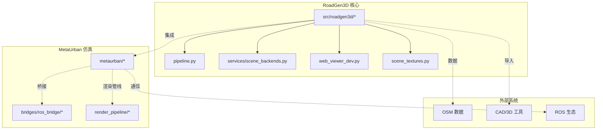
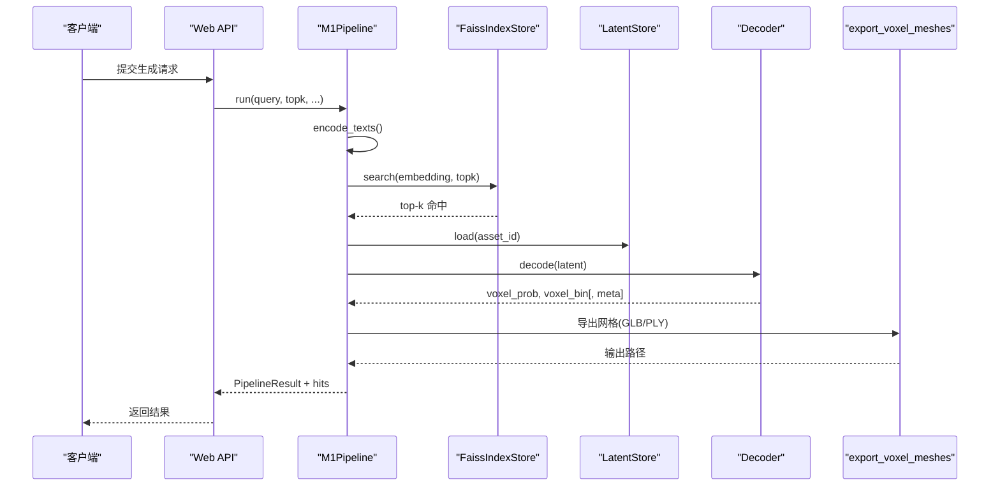
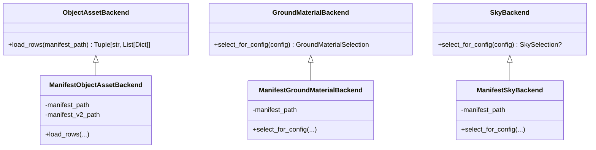
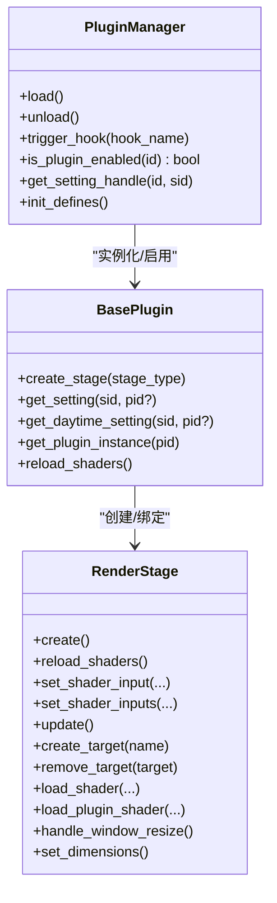
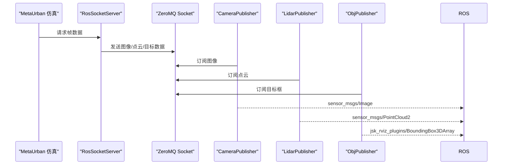
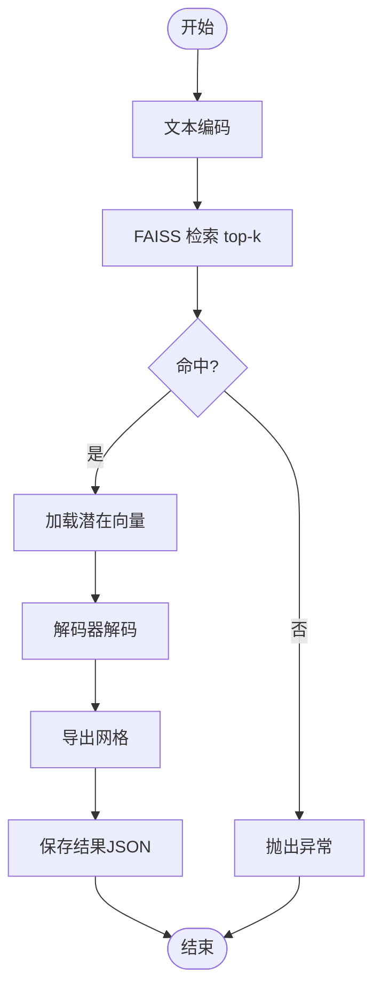
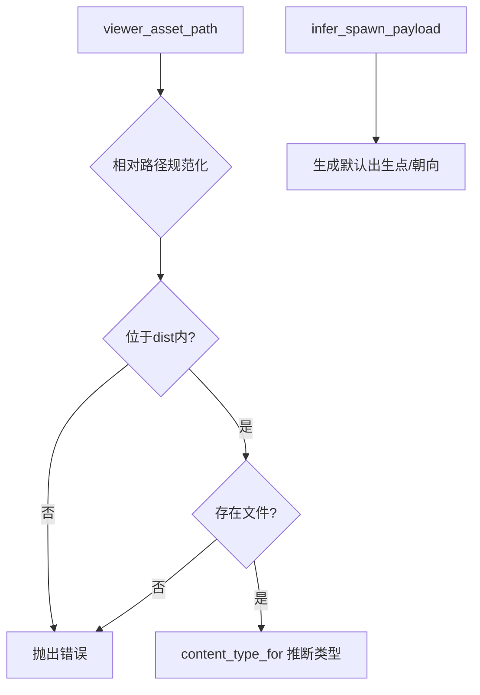
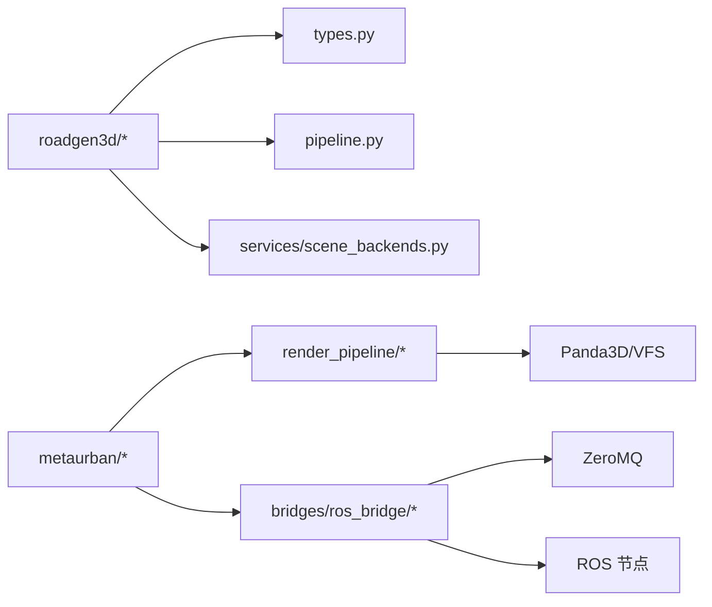

# 集成与扩展

<cite>
**本文引用的文件**
- [README.md](file://README.md)
- [metaurban/README.md](file://metaurban/README.md)
- [src/roadgen3d/__init__.py](file://src/roadgen3d/__init__.py)
- [src/roadgen3d/services/scene_backends.py](file://src/roadgen3d/services/scene_backends.py)
- [src/roadgen3d/pipeline.py](file://src/roadgen3d/pipeline.py)
- [metaurban/metaurban/render_pipeline/rpcore/pluginbase/base_plugin.py](file://metaurban/metaurban/render_pipeline/rpcore/pluginbase/base_plugin.py)
- [metaurban/metaurban/render_pipeline/rpcore/pluginbase/manager.py](file://metaurban/metaurban/render_pipeline/rpcore/pluginbase/manager.py)
- [metaurban/metaurban/render_pipeline/rpcore/render_stage.py](file://metaurban/metaurban/render_pipeline/rpcore/render_stage.py)
- [metaurban/metaurban/render_pipeline/rpcore/effect.py](file://metaurban/metaurban/render_pipeline/rpcore/effect.py)
- [metaurban/metaurban/render_pipeline/rpcore/mount_manager.py](file://metaurban/metaurban/render_pipeline/rpcore/mount_manager.py)
- [metaurban/bridges/ros_bridge/src/metaurban_example_bridge/metaurban_example_bridge/camera_bridge.py](file://metaurban/bridges/ros_bridge/src/metaurban_example_bridge/metaurban_example_bridge/camera_bridge.py)
- [metaurban/bridges/ros_bridge/src/metaurban_example_bridge/metaurban_example_bridge/lidar_bridge.py](file://metaurban/bridges/ros_bridge/src/metaurban_example_bridge/metaurban_example_bridge/lidar_bridge.py)
- [metaurban/bridges/ros_bridge/src/metaurban_example_bridge/metaurban_example_bridge/obj_bridge.py](file://metaurban/bridges/ros_bridge/src/metaurban_example_bridge/metaurban_example_bridge/obj_bridge.py)
- [metaurban/bridges/ros_bridge/ros_socket_server.py](file://metaurban/bridges/ros_bridge/ros_socket_server.py)
- [metaurban/bridges/ros_bridge/ros_socket_interactor.py](file://metaurban/bridges/ros_bridge/ros_socket_interactor.py)
- [metaurban/metaurban/engine/asset_loader.py](file://metaurban/metaurban/engine/asset_loader.py)
- [metaurban/metaurban/engine/interface.py](file://metaurban/metaurban/engine/interface.py)
- [src/roadgen3d/web_viewer_dev.py](file://src/roadgen3d/web_viewer_dev.py)
- [src/roadgen3d/scene_textures.py](file://src/roadgen3d/scene_textures.py)
- [tests/test_scene_backends.py](file://tests/test_scene_backends.py)
</cite>

## 目录
1. [简介](#简介)
2. [项目结构](#项目结构)
3. [核心组件](#核心组件)
4. [架构总览](#架构总览)
5. [详细组件分析](#详细组件分析)
6. [依赖分析](#依赖分析)
7. [性能考量](#性能考量)
8. [故障排查指南](#故障排查指南)
9. [结论](#结论)
10. [附录](#附录)

## 简介
本指南面向RoadGen3D的集成与扩展开发者，覆盖以下主题：
- 插件开发：自定义资产后端、渲染管线扩展、新增渲染阶段
- 与MetaUrban仿真系统的集成：ROS桥接、消息传递与状态同步
- 第三方系统集成：OSM数据、CAD/3D建模工具对接
- 扩展开发最佳实践：接口设计、错误处理、性能优化
- 自定义场景后端、新增解码器类型、专用渲染效果
- 集成测试、兼容性与版本管理策略
- 系统架构中的扩展点与插件化设计原则

## 项目结构
RoadGen3D由Python核心库、Web API与前端工作台/查看器、脚本工具、数据与知识库、以及与MetaUrban的桥接组成。核心模块围绕“文本检索—布局规划—网格导出”的M1管线展开，并在M3/M5等里程碑中引入多资产组合与OSM集成。

图表来源
- [README.md](file://README.md)
- [metaurban/README.md](file://metaurban/README.md)

章节来源
- [README.md](file://README.md)
- [metaurban/README.md](file://metaurban/README.md)

## 核心组件
- 文本检索与索引：CLIP文本编码 + FAISS向量检索（M1）
- 解码器：占位解码器与Shape-E解码器（支持回退）
- 场景后端：对象/材质/天空清单驱动的资产选择与加载
- 渲染管线（MetaUrban）：基于RenderPipeline的插件化渲染阶段与效果
- ROS桥接：ZeroMQ与ROS节点间的消息转发（相机、LiDAR、目标框）
- Web查看器：静态资源校验与内容类型推断

章节来源
- [src/roadgen3d/__init__.py](file://src/roadgen3d/__init__.py)
- [src/roadgen3d/pipeline.py](file://src/roadgen3d/pipeline.py)
- [src/roadgen3d/services/scene_backends.py](file://src/roadgen3d/services/scene_backends.py)
- [src/roadgen3d/web_viewer_dev.py](file://src/roadgen3d/web_viewer_dev.py)

## 架构总览
RoadGen3D通过可组合的M1管线完成从文本到网格的生成；MetaUrban提供仿真与渲染能力，其渲染管线采用插件化扩展；ROS桥接实现与外部仿真环境的状态同步与消息转发。

图表来源
- [src/roadgen3d/pipeline.py](file://src/roadgen3d/pipeline.py)

章节来源
- [src/roadgen3d/pipeline.py](file://src/roadgen3d/pipeline.py)

## 详细组件分析

### 组件A：场景后端（Manifest 后端）
场景后端负责根据配置与查询语义，从清单中选择合适的对象、地面材质与天空资源。清单驱动的设计便于扩展与替换不同来源的数据集。

图表来源
- [src/roadgen3d/services/scene_backends.py](file://src/roadgen3d/services/scene_backends.py)

章节来源
- [src/roadgen3d/services/scene_backends.py](file://src/roadgen3d/services/scene_backends.py)
- [tests/test_scene_backends.py](file://tests/test_scene_backends.py)

### 组件B：渲染管线插件系统（MetaUrban RenderPipeline）
MetaUrban的渲染管线采用插件化架构，通过插件管理器加载、启用与配置插件，每个插件可创建渲染阶段并注册到阶段管理器。阶段负责创建渲染目标、设置着色器输入与更新逻辑。

图表来源
- [metaurban/metaurban/render_pipeline/rpcore/pluginbase/manager.py](file://metaurban/metaurban/render_pipeline/rpcore/pluginbase/manager.py)
- [metaurban/metaurban/render_pipeline/rpcore/pluginbase/base_plugin.py](file://metaurban/metaurban/render_pipeline/rpcore/pluginbase/base_plugin.py)
- [metaurban/metaurban/render_pipeline/rpcore/render_stage.py](file://metaurban/metaurban/render_pipeline/rpcore/render_stage.py)

章节来源
- [metaurban/metaurban/render_pipeline/rpcore/pluginbase/manager.py](file://metaurban/metaurban/render_pipeline/rpcore/pluginbase/manager.py)
- [metaurban/metaurban/render_pipeline/rpcore/pluginbase/base_plugin.py](file://metaurban/metaurban/render_pipeline/rpcore/pluginbase/base_plugin.py)
- [metaurban/metaurban/render_pipeline/rpcore/render_stage.py](file://metaurban/metaurban/render_pipeline/rpcore/render_stage.py)

### 组件C：ROS桥接（相机/LiDAR/目标框）
ROS桥接通过ZeroMQ在MetaUrban仿真与ROS节点之间传递图像、点云与目标框信息，同时提供服务器侧的交互器以驱动仿真步进与数据发送。

图表来源
- [metaurban/bridges/ros_bridge/ros_socket_server.py](file://metaurban/bridges/ros_bridge/ros_socket_server.py)
- [metaurban/bridges/ros_bridge/src/metaurban_example_bridge/metaurban_example_bridge/camera_bridge.py](file://metaurban/bridges/ros_bridge/src/metaurban_example_bridge/metaurban_example_bridge/camera_bridge.py)
- [metaurban/bridges/ros_bridge/src/metaurban_example_bridge/metaurban_example_bridge/lidar_bridge.py](file://metaurban/bridges/ros_bridge/src/metaurban_example_bridge/metaurban_example_bridge/lidar_bridge.py)
- [metaurban/bridges/ros_bridge/src/metaurban_example_bridge/metaurban_example_bridge/obj_bridge.py](file://metaurban/bridges/ros_bridge/src/metaurban_example_bridge/metaurban_example_bridge/obj_bridge.py)
- [metaurban/bridges/ros_bridge/ros_socket_interactor.py](file://metaurban/bridges/ros_bridge/ros_socket_interactor.py)

章节来源
- [metaurban/bridges/ros_bridge/ros_socket_server.py](file://metaurban/bridges/ros_bridge/ros_socket_server.py)
- [metaurban/bridges/ros_bridge/ros_socket_interactor.py](file://metaurban/bridges/ros_bridge/ros_socket_interactor.py)
- [metaurban/bridges/ros_bridge/src/metaurban_example_bridge/metaurban_example_bridge/camera_bridge.py](file://metaurban/bridges/ros_bridge/src/metaurban_example_bridge/metaurban_example_bridge/camera_bridge.py)
- [metaurban/bridges/ros_bridge/src/metaurban_example_bridge/metaurban_example_bridge/lidar_bridge.py](file://metaurban/bridges/ros_bridge/src/metaurban_example_bridge/metaurban_example_bridge/lidar_bridge.py)
- [metaurban/bridges/ros_bridge/src/metaurban_example_bridge/metaurban_example_bridge/obj_bridge.py](file://metaurban/bridges/ros_bridge/src/metaurban_example_bridge/metaurban_example_bridge/obj_bridge.py)

### 组件D：管线与解码器（M1）
M1Pipeline串联文本编码、FAISS检索、潜在向量读取与解码器输出，最终导出网格。解码器支持返回元信息用于覆盖网格导出或记录错误。

图表来源
- [src/roadgen3d/pipeline.py](file://src/roadgen3d/pipeline.py)

章节来源
- [src/roadgen3d/pipeline.py](file://src/roadgen3d/pipeline.py)

### 组件E：Web查看器与纹理
Web查看器对静态资源进行路径校验与内容类型推断；场景纹理模块为网格赋予PBR材质与UV贴图，支持回退到纯色材质。

图表来源
- [src/roadgen3d/web_viewer_dev.py](file://src/roadgen3d/web_viewer_dev.py)

章节来源
- [src/roadgen3d/web_viewer_dev.py](file://src/roadgen3d/web_viewer_dev.py)
- [src/roadgen3d/scene_textures.py](file://src/roadgen3d/scene_textures.py)

## 依赖分析
- RoadGen3D核心库通过统一导出入口暴露类型、运行时与工具函数，便于上层服务与脚本使用。
- 渲染管线依赖Panda3D与RenderPipeline，插件系统通过YAML配置与自动挂载机制加载资源。
- ROS桥接依赖ZeroMQ与ROS Python接口，与仿真环境通过交互器驱动。

图表来源
- [src/roadgen3d/__init__.py](file://src/roadgen3d/__init__.py)
- [metaurban/metaurban/render_pipeline/rpcore/mount_manager.py](file://metaurban/metaurban/render_pipeline/rpcore/mount_manager.py)

章节来源
- [src/roadgen3d/__init__.py](file://src/roadgen3d/__init__.py)
- [metaurban/metaurban/render_pipeline/rpcore/mount_manager.py](file://metaurban/metaurban/render_pipeline/rpcore/mount_manager.py)

## 性能考量
- 渲染管线插件化：仅启用必要插件，避免不必要阶段与着色器重载。
- 资源挂载与缓存：RenderPipeline通过VFS挂载配置与着色器目录，减少IO开销。
- 纹理与材质：优先复用UV与PBR贴图，缺失时快速回退至纯色材质。
- 解码与导出：解码器输出元信息可用于选择更高效的导出方法或记录失败原因。

章节来源
- [metaurban/metaurban/render_pipeline/rpcore/mount_manager.py](file://metaurban/metaurban/render_pipeline/rpcore/mount_manager.py)
- [src/roadgen3d/scene_textures.py](file://src/roadgen3d/scene_textures.py)

## 故障排查指南
- 渲染管线插件未加载：检查插件配置文件与启用列表，确认依赖插件已启用。
- 插件设置变更：通过设置回调触发更新与着色器重载。
- 资源路径问题：确保资源路径在挂载范围内，避免越界访问。
- Web查看器资源：校验静态资源是否位于dist目录内，否则会抛出错误。
- ROS桥接：检查ZeroMQ连接状态与消息头时间戳，确认发布频率与仿真步进一致。

章节来源
- [metaurban/metaurban/render_pipeline/rpcore/pluginbase/manager.py](file://metaurban/metaurban/render_pipeline/rpcore/pluginbase/manager.py)
- [metaurban/metaurban/render_pipeline/rpcore/effect.py](file://metaurban/metaurban/render_pipeline/rpcore/effect.py)
- [metaurban/metaurban/render_pipeline/rpcore/mount_manager.py](file://metaurban/metaurban/render_pipeline/rpcore/mount_manager.py)
- [src/roadgen3d/web_viewer_dev.py](file://src/roadgen3d/web_viewer_dev.py)
- [metaurban/bridges/ros_bridge/ros_socket_server.py](file://metaurban/bridges/ros_bridge/ros_socket_server.py)

## 结论
RoadGen3D通过清单驱动的场景后端、可组合的M1管线与MetaUrban的插件化渲染系统，提供了良好的扩展性。结合ROS桥接与Web查看器，能够实现从生成到可视化的完整链路。遵循本文的最佳实践与扩展点，可安全地添加自定义资产后端、渲染效果与第三方系统集成。

## 附录

### 扩展开发最佳实践
- 接口设计
  - 使用数据类与类型注解，保持输入输出契约清晰。
  - 将配置与实现分离，通过YAML或配置对象注入参数。
- 错误处理
  - 对空索引、无命中、资源不存在等情况显式抛错并记录上下文。
  - 在解码器与导出阶段捕获异常并写入元信息，便于诊断。
- 性能优化
  - 渲染阶段按需启用，避免不必要的计算与纹理读取。
  - 利用VFS与资源缓存，减少重复加载。
- 兼容性与版本管理
  - 插件设置支持覆盖与重置，便于灰度与回滚。
  - Web查看器对静态资源进行白名单校验，防止路径逃逸。

章节来源
- [src/roadgen3d/services/scene_backends.py](file://src/roadgen3d/services/scene_backends.py)
- [src/roadgen3d/pipeline.py](file://src/roadgen3d/pipeline.py)
- [metaurban/metaurban/render_pipeline/rpcore/pluginbase/manager.py](file://metaurban/metaurban/render_pipeline/rpcore/pluginbase/manager.py)
- [src/roadgen3d/web_viewer_dev.py](file://src/roadgen3d/web_viewer_dev.py)

### 插件开发步骤（渲染管线）
- 新建插件目录与配置文件，声明启用状态与设置项。
- 在插件中继承基础类，创建渲染阶段并注册到阶段管理器。
- 通过设置回调在运行时动态更新参数与着色器。
- 使用资源与着色器路径工具定位插件内资源。

章节来源
- [metaurban/metaurban/render_pipeline/rpcore/pluginbase/base_plugin.py](file://metaurban/metaurban/render_pipeline/rpcore/pluginbase/base_plugin.py)
- [metaurban/metaurban/render_pipeline/rpcore/render_stage.py](file://metaurban/metaurban/render_pipeline/rpcore/render_stage.py)
- [metaurban/metaurban/render_pipeline/rpcore/pluginbase/manager.py](file://metaurban/metaurban/render_pipeline/rpcore/pluginbase/manager.py)

### 自定义场景后端与解码器
- 场景后端：实现对象/材质/天空后端接口，按查询语义评分与回退策略选择资源。
- 解码器：实现解码接口并返回概率场与二值场，支持元信息覆盖导出行为。

章节来源
- [src/roadgen3d/services/scene_backends.py](file://src/roadgen3d/services/scene_backends.py)
- [src/roadgen3d/pipeline.py](file://src/roadgen3d/pipeline.py)

### 与MetaUrban仿真系统集成（ROS桥接）
- 使用交互器驱动仿真步进与数据采集，通过ZeroMQ发送图像、点云与目标框。
- 在ROS节点中订阅对应主题，构建标准消息类型并发布。
- 服务器端维护连接状态与错误日志，便于调试。

章节来源
- [metaurban/bridges/ros_bridge/ros_socket_interactor.py](file://metaurban/bridges/ros_bridge/ros_socket_interactor.py)
- [metaurban/bridges/ros_bridge/ros_socket_server.py](file://metaurban/bridges/ros_bridge/ros_socket_server.py)
- [metaurban/bridges/ros_bridge/src/metaurban_example_bridge/metaurban_example_bridge/camera_bridge.py](file://metaurban/bridges/ros_bridge/src/metaurban_example_bridge/metaurban_example_bridge/camera_bridge.py)
- [metaurban/bridges/ros_bridge/src/metaurban_example_bridge/metaurban_example_bridge/lidar_bridge.py](file://metaurban/bridges/ros_bridge/src/metaurban_example_bridge/metaurban_example_bridge/lidar_bridge.py)
- [metaurban/bridges/ros_bridge/src/metaurban_example_bridge/metaurban_example_bridge/obj_bridge.py](file://metaurban/bridges/ros_bridge/src/metaurban_example_bridge/metaurban_example_bridge/obj_bridge.py)

### 第三方系统集成建议
- OSM数据：解析要素与投影，构建段级图与约束规则，作为布局先验。
- CAD/3D建模工具：通过清单与元数据标准化导入，统一坐标系与材质规范。
- ROS生态：复用现有桥接模式，扩展传感器类型与消息格式。

章节来源
- [README.md](file://README.md)
- [metaurban/README.md](file://metaurban/README.md)