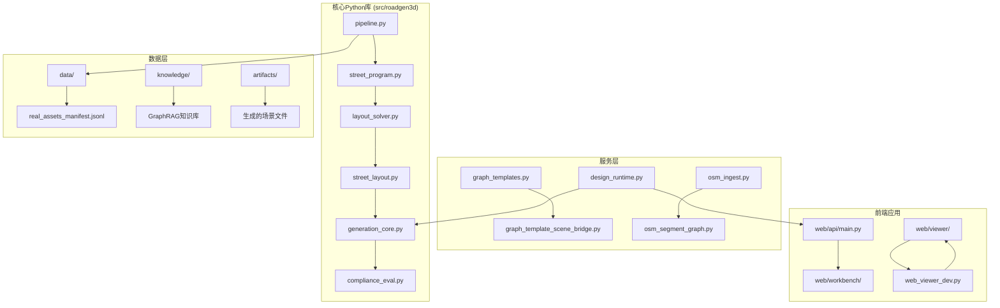
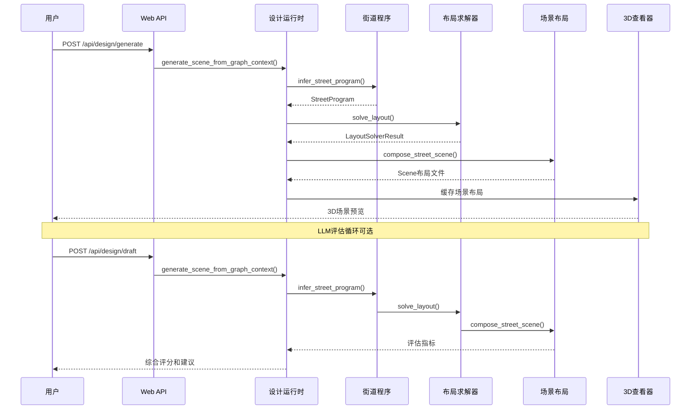
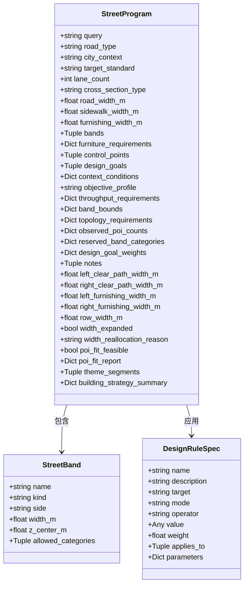
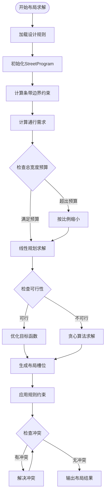
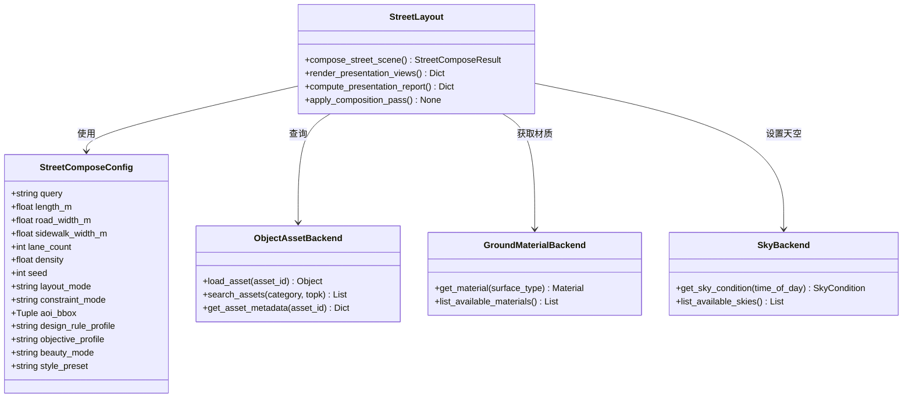
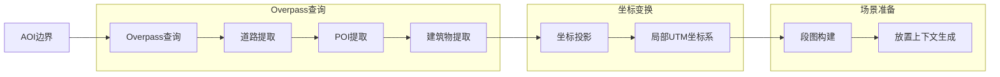
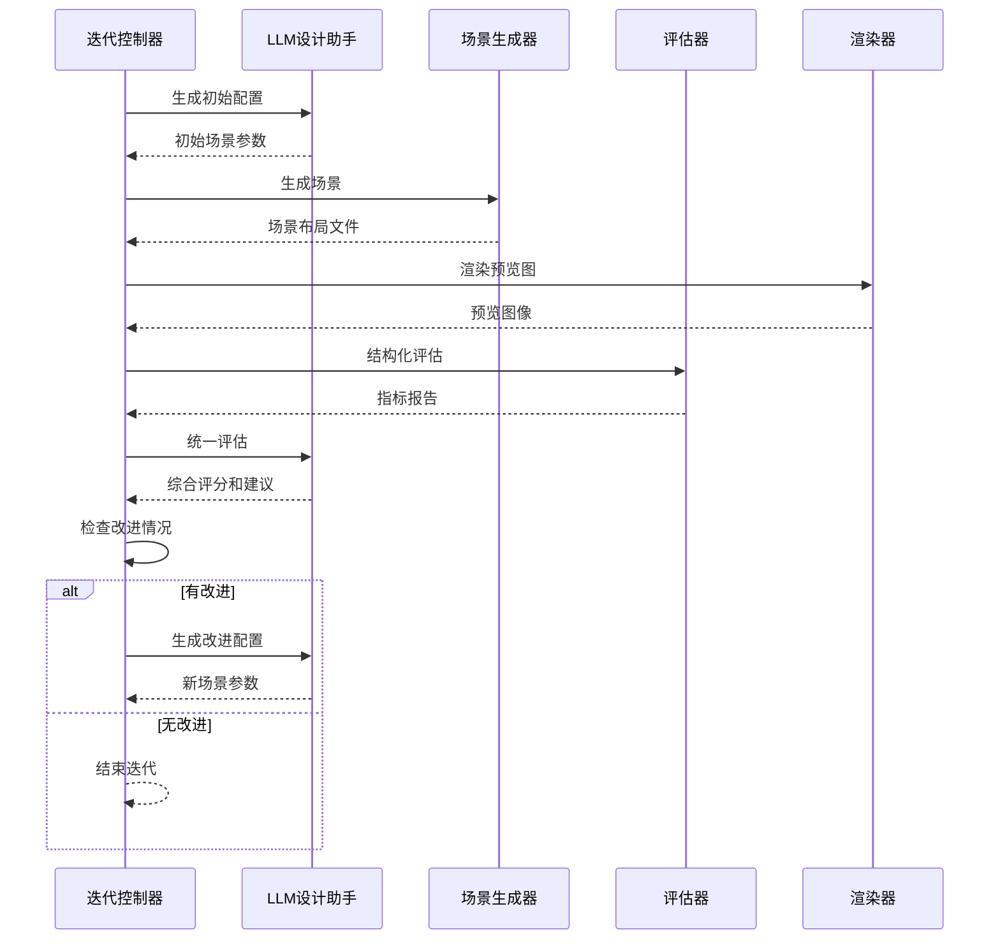
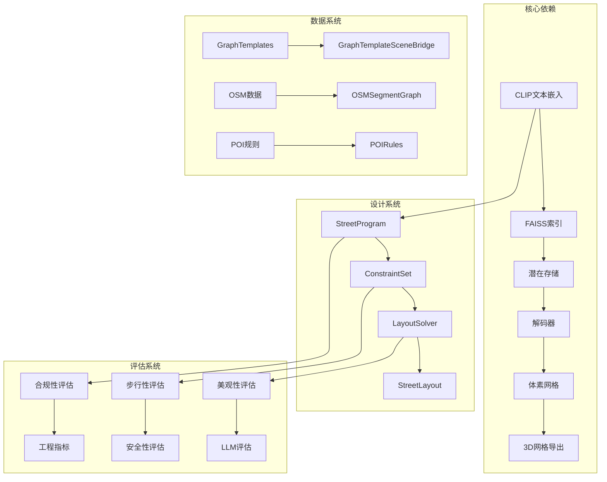

# RoadGen3D场景规划文档

<cite>
**本文档引用的文件**
- [readme.md](file://readme.md)
- [roadgen3d_scenario_plan.md](file://docs/roadgen3d_scenario_plan.md)
- [__init__.py](file://src/roadgen3d/__init__.py)
- [pipeline.py](file://src/roadgen3d/pipeline.py)
- [generation_core.py](file://src/roadgen3d/services/generation_core.py)
- [street_program.py](file://src/roadgen3d/street_program.py)
- [layout_solver.py](file://src/roadgen3d/layout_solver.py)
- [compliance_eval.py](file://src/roadgen3d/compliance_eval.py)
- [osm_ingest.py](file://src/roadgen3d/osm_ingest.py)
- [graph_templates.py](file://src/roadgen3d/graph_templates.py)
- [types.py](file://src/roadgen3d/types.py)
- [street_layout.py](file://src/roadgen3d/street_layout.py)
- [design_runtime.py](file://src/roadgen3d/services/design_runtime.py)
- [iteration_controller.py](file://src/roadgen3d/auto_pipeline/iteration_controller.py)
- [web_viewer_dev.py](file://src/roadgen3d/web_viewer_dev.py)
</cite>

## 目录
1. [项目概述](#项目概述)
2. [项目结构](#项目结构)
3. [核心组件](#核心组件)
4. [架构概览](#架构概览)
5. [详细组件分析](#详细组件分析)
6. [依赖关系分析](#依赖关系分析)
7. [性能考虑](#性能考虑)
8. [故障排除指南](#故障排除指南)
9. [结论](#结论)

## 项目概述

RoadGen3D是一个基于神经符号学的文本到3D城市街道场景生成系统。该项目能够将用户描述的设计目标（如"步行安全、全龄友好的完整街道"）转换为详细的3D城市街道场景。系统采用LLM驱动的RAG知识检索、设计规则约束和参数化街道布局生成相结合的方式。

### 主要特性

- **多模式生成路径**：支持模板模式、OSM真实数据模式和MetaUrban参考模式
- **LLM集成**：可选的LLM设计助手，提供设计建议和迭代优化
- **约束驱动布局**：基于设计规则的硬软约束，确保生成场景符合规范
- **POI集成**：整合真实世界的空间数据，包括道路、建筑和兴趣点
- **评估体系**：提供步行性、安全性、美观性的综合评估

## 项目结构

**图表来源**
- [readme.md:158-197](file://readme.md#L158-L197)
- [__init__.py:1-295](file://src/roadgen3d/__init__.py#L1-L295)

**章节来源**
- [readme.md:158-197](file://readme.md#L158-L197)
- [readme.md:291-451](file://readme.md#L291-L451)

## 核心组件

### 管线系统

RoadGen3D的核心管线由多个相互协作的组件组成：

1. **M1Pipeline** - 文本到3D资产的端到端管线
2. **StreetProgram** - 结构化街道程序生成
3. **LayoutSolver** - 约束感知的布局求解器
4. **StreetLayout** - 街道场景组合和渲染

### 设计规则系统

系统内置了多种设计规则配置文件：
- `balanced_complete_street_v1` - 平衡的完整街道
- `pedestrian_priority_v1` - 行人优先街道
- `transit_priority_v1` - 公交优先街道

### 场景生成服务

提供多种场景生成方式：
- 直接场景生成（绕过LLM）
- 图模板场景生成
- OSM基础场景生成
- MetaUrban参考场景生成

**章节来源**
- [pipeline.py:30-133](file://src/roadgen3d/pipeline.py#L30-L133)
- [street_program.py:25-81](file://src/roadgen3d/street_program.py#L25-L81)
- [layout_solver.py:1-800](file://src/roadgen3d/layout_solver.py#L1-L800)
- [generation_core.py:39-445](file://src/roadgen3d/services/generation_core.py#L39-L445)

## 架构概览

**图表来源**
- [readme.md:201-244](file://readme.md#L201-L244)
- [design_runtime.py:60-200](file://src/roadgen3d/services/design_runtime.py#L60-L200)
- [iteration_controller.py:66-200](file://src/roadgen3d/auto_pipeline/iteration_controller.py#L66-L200)

## 详细组件分析

### 街道程序生成器

StreetProgram是系统的核心抽象，负责将文本描述转换为结构化的街道设计意图。

**图表来源**
- [types.py:140-185](file://src/roadgen3d/types.py#L140-L185)
- [types.py:123-137](file://src/roadgen3d/types.py#L123-L137)
- [types.py:188-200](file://src/roadgen3d/types.py#L188-L200)

StreetProgram生成过程包含以下关键步骤：

1. **设计规则配置** - 加载预定义的设计规则配置文件
2. **道路类型推断** - 根据查询文本识别道路类型
3. **横截面构建** - 创建街道横截面的条带结构
4. **家具需求估算** - 基于密度和查询词估算街道家具需求
5. **POI绑定应用** - 将真实POI绑定到特定条带
6. **通行需求计算** - 计算行人、车辆和公交的通行需求

**章节来源**
- [street_program.py:525-649](file://src/roadgen3d/street_program.py#L525-L649)
- [street_program.py:25-81](file://src/roadgen3d/street_program.py#L25-L81)

### 布局求解器

LayoutSolver是约束感知的布局求解器，负责在满足设计规则的前提下优化街道布局。

**图表来源**
- [layout_solver.py:402-541](file://src/roadgen3d/layout_solver.py#L402-L541)
- [layout_solver.py:746-800](file://src/roadgen3d/layout_solver.py#L746-L800)

布局求解的关键特性：

1. **混合求解策略** - 结合线性规划和贪心算法
2. **约束处理** - 支持硬约束和软约束
3. **冲突检测** - 实时检测和解决布局冲突
4. **目标优化** - 最大化布局质量和满足设计目标

**章节来源**
- [layout_solver.py:1-800](file://src/roadgen3d/layout_solver.py#L1-L800)

### 场景组合器

StreetLayout负责将生成的布局转换为最终的3D场景文件。

**图表来源**
- [street_layout.py:155-200](file://src/roadgen3d/street_layout.py#L155-L200)
- [types.py:47-120](file://src/roadgen3d/types.py#L47-L120)

**章节来源**
- [street_layout.py:1-200](file://src/roadgen3d/street_layout.py#L1-L200)

### OSM数据集成

系统集成了真实的地理空间数据，提供更贴近现实的场景生成能力。

**图表来源**
- [osm_ingest.py:126-331](file://src/roadgen3d/osm_ingest.py#L126-L331)

**章节来源**
- [osm_ingest.py:1-331](file://src/roadgen3d/osm_ingest.py#L1-L331)

### 自动迭代管线

系统提供了自动化的场景生成、评估和改进循环。

**图表来源**
- [iteration_controller.py:66-200](file://src/roadgen3d/auto_pipeline/iteration_controller.py#L66-L200)

**章节来源**
- [iteration_controller.py:1-200](file://src/roadgen3d/auto_pipeline/iteration_controller.py#L1-L200)

## 依赖关系分析

**图表来源**
- [readme.md:270-289](file://readme.md#L270-L289)
- [__init__.py:1-295](file://src/roadgen3d/__init__.py#L1-L295)

**章节来源**
- [__init__.py:1-295](file://src/roadgen3d/__init__.py#L1-L295)

## 性能考虑

### 内存管理

系统采用了多种内存优化策略：

1. **延迟网格加载** - 仅在需要时加载完整网格对象
2. **网格缓存** - 使用LRU缓存限制内存使用
3. **批量处理** - 支持并行场景生成

### 计算优化

1. **混合求解策略** - 结合线性规划和贪心算法提高求解效率
2. **早期停止** - 在满足约束条件下提前终止计算
3. **增量更新** - 仅更新发生变化的部分

### 数据优化

1. **索引预构建** - FAISS索引预先构建以减少查询时间
2. **缓存机制** - OSM数据和场景布局的缓存
3. **批处理** - 支持批量场景生成和评估

## 故障排除指南

### 常见问题及解决方案

1. **FAISS索引为空**
   - 确保在运行管道前构建了非空的资产索引
   - 检查资产清单文件是否正确

2. **场景生成失败**
   - 检查设计规则配置是否合理
   - 验证POI数据是否充足
   - 确认网格导出权限

3. **LLM API连接问题**
   - 检查环境变量设置
   - 验证API密钥和基础URL
   - 确认网络连接

4. **3D查看器无法加载**
   - 确认Web查看器已正确构建
   - 检查场景布局文件格式
   - 验证文件路径权限

**章节来源**
- [pipeline.py:56-63](file://src/roadgen3d/pipeline.py#L56-L63)
- [web_viewer_dev.py:70-81](file://src/roadgen3d/web_viewer_dev.py#L70-L81)

## 结论

RoadGen3D是一个功能完整的文本到3D城市街道场景生成系统，具有以下特点：

1. **模块化架构** - 清晰的组件分离和职责划分
2. **多模式支持** - 支持模板、OSM和MetaUrban等多种生成模式
3. **约束驱动** - 基于设计规则的严格约束保证
4. **LLM集成** - 可选的智能设计助手提供迭代优化
5. **评估体系** - 完整的场景质量评估指标

系统目前处于快速发展阶段，未来计划包括加强OSM+POI集成、扩展POI分类体系、支持小街道网络等。对于场景规划人员，RoadGen3D提供了强大的工具来实现从概念设计到3D可视化的完整工作流程。