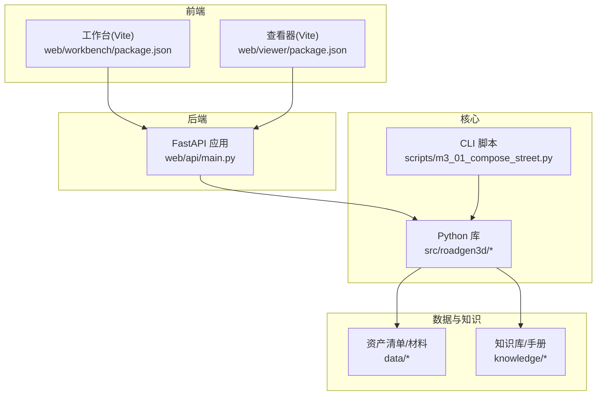
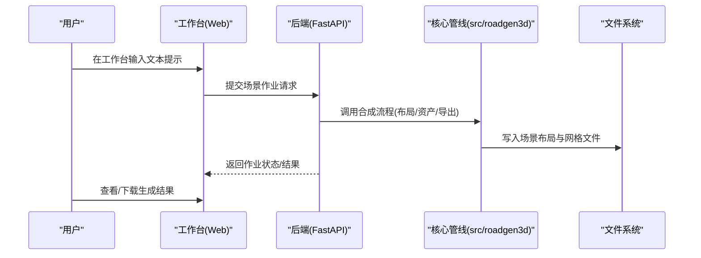
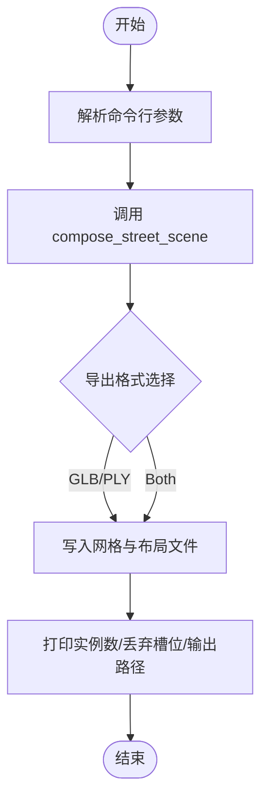
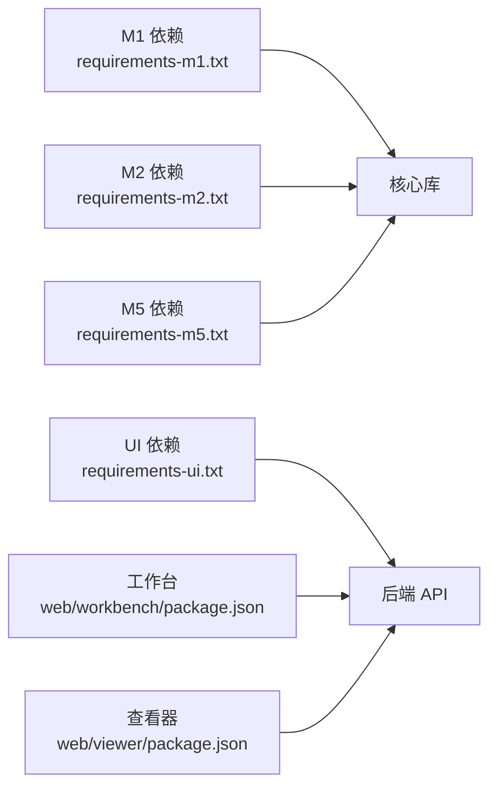

# 快速开始指南

<cite>
**本文引用的文件**
- [README.md](file://README.md)
- [Makefile](file://Makefile)
- [requirements-m1.txt](file://requirements-m1.txt)
- [requirements-m2.txt](file://requirements-m2.txt)
- [requirements-m5.txt](file://requirements-m5.txt)
- [requirements-ui.txt](file://requirements-ui.txt)
- [scripts/m3_01_compose_street.py](file://scripts/m3_01_compose_street.py)
- [web/api/main.py](file://web/api/main.py)
- [web/workbench/package.json](file://web/workbench/package.json)
- [web/viewer/package.json](file://web/viewer/package.json)
- [docs/manual_download.md](file://docs/manual_download.md)
- [scripts/m1_00_check_env.py](file://scripts/m1_00_check_env.py)
</cite>

## 目录
1. [简介](#简介)
2. [项目结构](#项目结构)
3. [核心组件](#核心组件)
4. [架构总览](#架构总览)
5. [详细组件分析](#详细组件分析)
6. [依赖关系分析](#依赖关系分析)
7. [性能与资源建议](#性能与资源建议)
8. [故障排查指南](#故障排查指南)
9. [结论](#结论)
10. [附录](#附录)

## 简介
本指南面向首次接触 RoadGen3D 的用户，帮助你在约 30 分钟内完成环境搭建、依赖安装、开发环境启动与第一个场景生成的全流程。RoadGen3D 是一个“从文本描述生成 3D 城市街道场景”的神经符号系统，支持命令行与 Web 工作台两种使用方式。

## 项目结构
- 核心库与管线：src/roadgen3d
- 脚本工具：scripts/（按里程碑划分，如 m1_*, m2_*, m3_* 等）
- Web 服务与前端：web/api（FastAPI）、web/workbench（Vite+React）、web/viewer（Three.js）
- 数据与知识库：data/、knowledge/
- 文档与测试：docs/、tests/

图表来源
- [web/api/main.py:1-286](file://web/api/main.py#L1-L286)
- [web/workbench/package.json:1-16](file://web/workbench/package.json#L1-L16)
- [web/viewer/package.json:1-20](file://web/viewer/package.json#L1-L20)
- [scripts/m3_01_compose_street.py:1-162](file://scripts/m3_01_compose_street.py#L1-L162)

章节来源
- [README.md:107-130](file://README.md#L107-L130)

## 核心组件
- 后端 API：基于 FastAPI 提供场景作业提交、查询、最近场景列表、知识检索等接口。
- 工作台：Vite + React 的可视化工作台，连接后端进行场景设计与生成。
- 查看器：基于 Three.js 的 3D 场景查看器。
- 核心管线：M3 街道合成脚本负责从文本提示到布局与网格导出的完整流程。
- 依赖管理：Python 依赖通过 requirements-*.txt 安装；前端依赖通过 npm 安装。

章节来源
- [web/api/main.py:188-222](file://web/api/main.py#L188-L222)
- [web/workbench/package.json:6-10](file://web/workbench/package.json#L6-L10)
- [web/viewer/package.json:6-10](file://web/viewer/package.json#L6-L10)
- [scripts/m3_01_compose_street.py:21-82](file://scripts/m3_01_compose_street.py#L21-L82)

## 架构总览
下图展示了从文本提示到 3D 场景输出的关键路径，以及 Web 服务与前端的交互。

图表来源
- [web/api/main.py:188-222](file://web/api/main.py#L188-L222)
- [scripts/m3_01_compose_street.py:85-157](file://scripts/m3_01_compose_street.py#L85-L157)

## 详细组件分析

### 环境与依赖准备
- 前置条件
  - Python 3.11+（推荐 CPython）
  - Git（含子模块支持）
  - Node.js（用于前端构建与开发）
- 克隆与子模块
  - 使用带子模块的克隆，并初始化子模块
- Python 依赖
  - 安装 M1/M2/UI 等多套 requirements 文件
- 前端依赖
  - 通过 make 目标安装工作台与查看器的 npm 依赖

章节来源
- [README.md:33-56](file://README.md#L33-L56)
- [requirements-m1.txt:1-7](file://requirements-m1.txt#L1-L7)
- [requirements-m2.txt:1-4](file://requirements-m2.txt#L1-L4)
- [requirements-ui.txt:1-12](file://requirements-ui.txt#L1-L12)
- [Makefile:57-70](file://Makefile#L57-L70)

### 开发环境启动
- 启动全部服务
  - make dev：同时启动后端 API、工作台 Web、查看器 Web
- 单独启动
  - make workbench-api：后端 API（默认端口 8010）
  - make workbench-web：工作台 Web（默认端口 4174）
  - make viewer-web：查看器 Web（默认端口 4173）

章节来源
- [README.md:59-71](file://README.md#L59-L71)
- [Makefile:29-34](file://Makefile#L29-L34)
- [Makefile:39-44](file://Makefile#L39-L44)
- [Makefile:48-53](file://Makefile#L48-L53)
- [Makefile:62-67](file://Makefile#L62-L67)

### 第一个场景生成（命令行）
- 目标：从文本提示生成一条街道场景，输出 GLB/PLY 与布局信息
- 关键参数要点
  - 查询语句：--query
  - 资产清单：--manifest
  - 输出目录：--out-dir
  - 尺寸与密度：--length-m、--road-width-m、--sidewalk-width-m、--density
  - 设计规则：--design-rule-profile
  - 导出格式：--export-format（glb/ply/both）
- 输出产物
  - 场景 GLB/PLY 文件
  - 场景布局 JSON

图表来源
- [scripts/m3_01_compose_street.py:85-157](file://scripts/m3_01_compose_street.py#L85-L157)

章节来源
- [README.md:72-91](file://README.md#L72-L91)
- [scripts/m3_01_compose_street.py:21-82](file://scripts/m3_01_compose_street.py#L21-L82)

### Web API 与工作台
- API 端点概览
  - 作业相关：POST /api/scene/jobs、GET /api/scene/jobs、GET /api/scene/jobs/{job_id}
  - 最近场景：GET /api/scenes/recent
  - 设计草稿/生成：POST /api/design/draft、POST /api/design/generate
  - 健康检查：GET /api/health
- 工作台与查看器
  - 工作台：npm 脚本 dev，端口 4174
  - 查看器：npm 脚本 dev，端口 4173

章节来源
- [web/api/main.py:92-222](file://web/api/main.py#L92-L222)
- [web/workbench/package.json:6-10](file://web/workbench/package.json#L6-L10)
- [web/viewer/package.json:6-10](file://web/viewer/package.json#L6-L10)

## 依赖关系分析
- Python 依赖分层
  - M1：基础张量/检索/测试
  - M2：网格处理/图像处理/GLTF
  - M5：几何/投影/HTTP/Pillow
  - UI：FastAPI/Uvicorn/HTTPX/Pydantic
- 前端依赖
  - 工作台：Vite + TypeScript
  - 查看器：Three.js + TypeScript

图表来源
- [requirements-m1.txt:1-7](file://requirements-m1.txt#L1-L7)
- [requirements-m2.txt:1-4](file://requirements-m2.txt#L1-L4)
- [requirements-m5.txt:1-5](file://requirements-m5.txt#L1-L5)
- [requirements-ui.txt:1-12](file://requirements-ui.txt#L1-L12)
- [web/workbench/package.json:11-14](file://web/workbench/package.json#L11-L14)
- [web/viewer/package.json:11-18](file://web/viewer/package.json#L11-L18)

章节来源
- [requirements-m1.txt:1-7](file://requirements-m1.txt#L1-L7)
- [requirements-m2.txt:1-4](file://requirements-m2.txt#L1-L4)
- [requirements-m5.txt:1-5](file://requirements-m5.txt#L1-L5)
- [requirements-ui.txt:1-12](file://requirements-ui.txt#L1-L12)

## 性能与资源建议
- 推荐使用 Python 3.11 或 3.12，确保与 PyTorch 版本兼容
- 若无 GPU，CPU 运行也可完成生成，但耗时较长
- 建议在内存充足的机器上运行，避免频繁换页
- 前端开发时可关闭不必要的浏览器标签页，减少资源占用

## 故障排查指南
- 环境自检
  - 使用环境检查脚本生成报告，确认 Python 版本、平台、包安装状态与 CUDA/MPS 可用性
- 模型下载与离线
  - 若网络受限，参考手动下载指南，将 CLIP 模型放置到指定目录并使用本地文件模式
- 常见错误定位
  - 后端端口占用：Makefile 中已内置端口检测逻辑，若端口被占用会提示或自动选择可用端口
  - 依赖缺失：根据 requirements-*.txt 逐项安装；UI 依赖用于 API 与查看器
- 系统差异
  - macOS（Apple Silicon）：注意 MPS 可用性；若无 GPU，CPU 仍可运行
  - Linux：确保系统具备编译依赖；若 faiss 编译失败，可尝试系统包管理器安装 faiss
  - Windows：建议使用 WSL2；若出现路径/权限问题，请以管理员身份运行终端

章节来源
- [scripts/m1_00_check_env.py:29-59](file://scripts/m1_00_check_env.py#L29-L59)
- [docs/manual_download.md:1-59](file://docs/manual_download.md#L1-L59)
- [Makefile:40-44](file://Makefile#L40-L44)
- [Makefile:48-53](file://Makefile#L48-L53)
- [Makefile:62-67](file://Makefile#L62-L67)

## 结论
按照本指南，你可以在 30 分钟内完成 RoadGen3D 的环境搭建、依赖安装与开发环境启动，并成功运行第一个场景生成任务。随后可进一步探索 Web 工作台与 API 的更多能力。

## 附录

### 常用 Make 目标速查
- make help：列出所有可用目标
- make dev：启动 API + 工作台 + 查看器
- make workbench-api：启动后端 API（端口 8010）
- make workbench-web：启动工作台（端口 4174）
- make viewer-web：启动查看器（端口 4173）
- make workbench-install / viewer-install：安装前端依赖
- make knowledge-build：从 PDF 构建知识库
- make collect / train / eval：M4 学习与评估流水线

章节来源
- [Makefile:15-28](file://Makefile#L15-L28)
- [Makefile:29-34](file://Makefile#L29-L34)
- [Makefile:57-70](file://Makefile#L57-L70)
- [Makefile:72-91](file://Makefile#L72-L91)