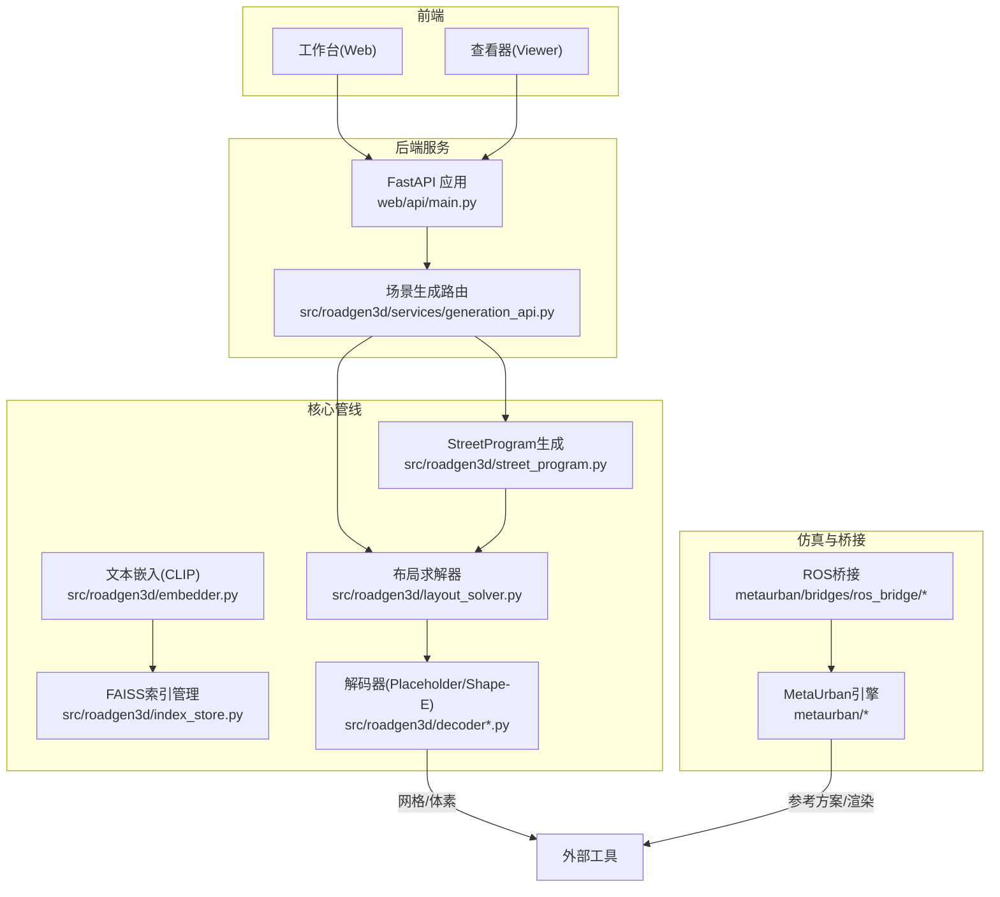
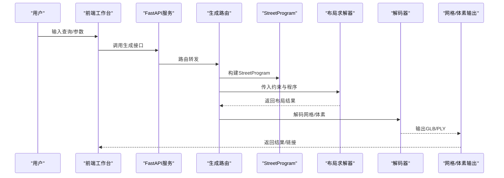
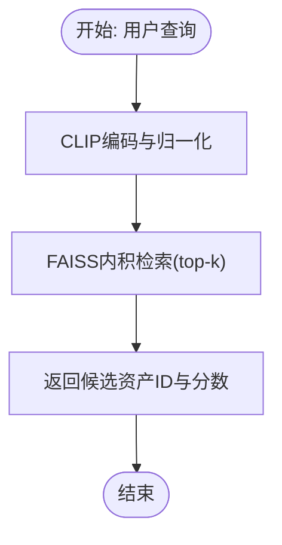
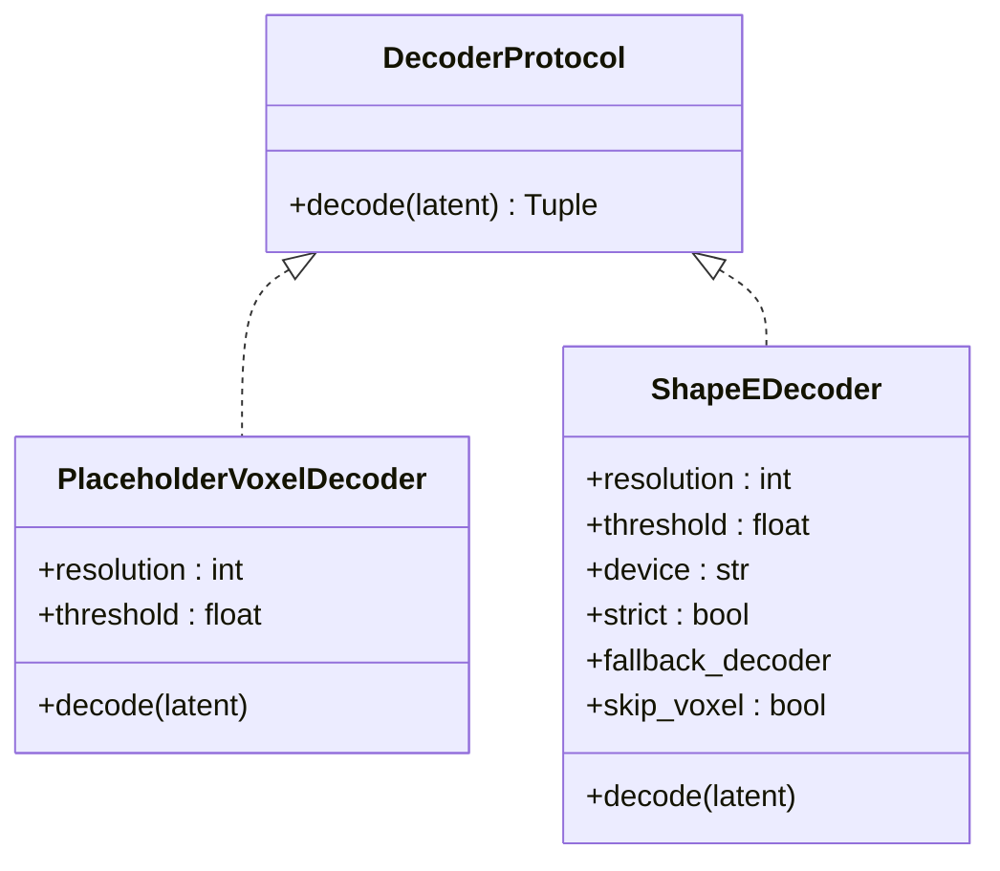
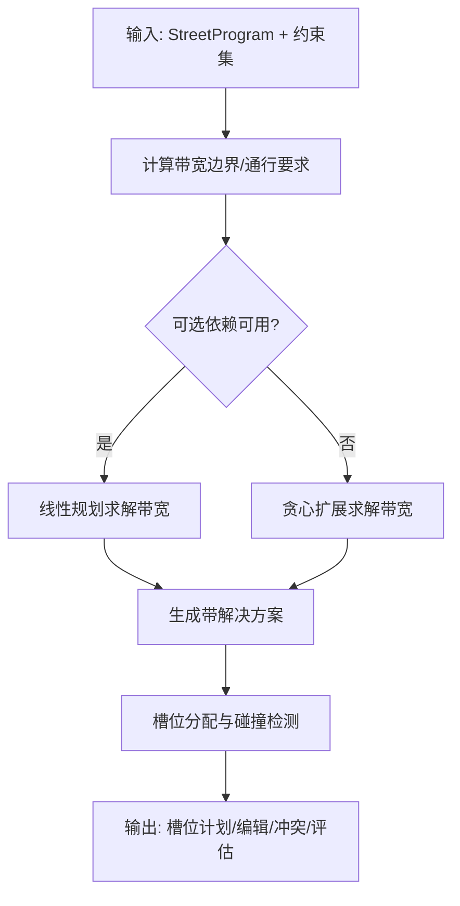
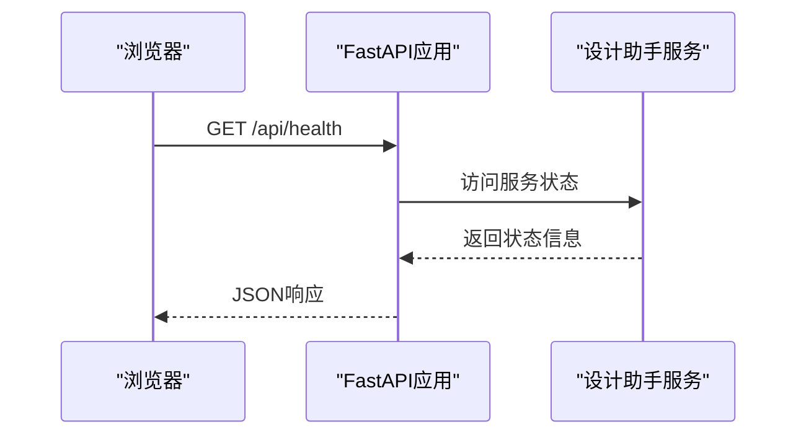
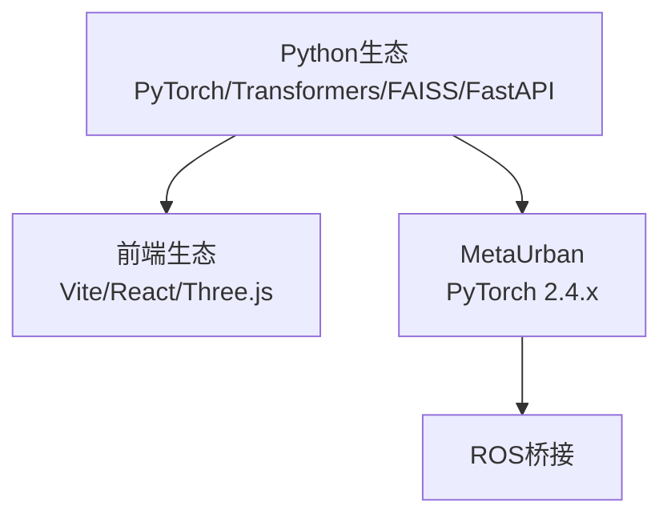

# 技术栈介绍

<cite>
**本文档引用的文件**
- [README.md](file://README.md)
- [requirements-m1.txt](file://requirements-m1.txt)
- [requirements-m2.txt](file://requirements-m2.txt)
- [requirements-ui.txt](file://requirements-ui.txt)
- [metaurban/requirements.txt](file://metaurban/requirements.txt)
- [web/api/main.py](file://web/api/main.py)
- [ui/api/main.py](file://ui/api/main.py)
- [web/viewer/package.json](file://web/viewer/package.json)
- [web/workbench/package.json](file://web/workbench/package.json)
- [src/roadgen3d/embedder.py](file://src/roadgen3d/embedder.py)
- [src/roadgen3d/index_store.py](file://src/roadgen3d/index_store.py)
- [src/roadgen3d/decoder.py](file://src/roadgen3d/decoder.py)
- [src/roadgen3d/decoder_shapee.py](file://src/roadgen3d/decoder_shapee.py)
- [src/roadgen3d/street_program.py](file://src/roadgen3d/street_program.py)
- [src/roadgen3d/layout_solver.py](file://src/roadgen3d/layout_solver.py)
- [src/roadgen3d/services/generation_api.py](file://src/roadgen3d/services/generation_api.py)
</cite>

## 目录
1. [引言](#引言)
2. [项目结构](#项目结构)
3. [核心组件](#核心组件)
4. [架构总览](#架构总览)
5. [详细组件分析](#详细组件分析)
6. [依赖关系分析](#依赖关系分析)
7. [性能考量](#性能考量)
8. [故障排查指南](#故障排查指南)
9. [结论](#结论)
10. [附录](#附录)

## 引言
本技术栈介绍面向 RoadGen3D 项目的不同技术背景开发者，系统阐述后端（Python 生态）、前端（React + Vite + TypeScript）与关键中间件（FAISS 向量检索、MetaUrban 自动驾驶仿真平台、ROS 桥接）的选型依据、版本兼容性与协作关系。文档同时给出数据流与处理逻辑的可视化图示，并提供性能与扩展性分析及学习路径建议。

## 项目结构
RoadGen3D 采用模块化分层组织：后端服务通过 FastAPI 提供 REST API；前端包含工作台（workbench）与 3D 查看器（viewer），分别使用 Vite + React/TypeScript 构建；核心生成管线位于 src/roadgen3d 下，涵盖文本检索、解码器、布局求解与导出等模块；仿真与桥接位于 metaurban 子模块中。



图表来源
- [web/api/main.py:81-267](file://web/api/main.py#L81-L267)
- [src/roadgen3d/services/generation_api.py:1-294](file://src/roadgen3d/services/generation_api.py#L1-L294)
- [src/roadgen3d/embedder.py:33-100](file://src/roadgen3d/embedder.py#L33-L100)
- [src/roadgen3d/index_store.py:33-96](file://src/roadgen3d/index_store.py#L33-L96)
- [src/roadgen3d/decoder.py:24-65](file://src/roadgen3d/decoder.py#L24-L65)
- [src/roadgen3d/decoder_shapee.py:34-245](file://src/roadgen3d/decoder_shapee.py#L34-L245)
- [src/roadgen3d/street_program.py:502-626](file://src/roadgen3d/street_program.py#L502-L626)
- [src/roadgen3d/layout_solver.py:402-541](file://src/roadgen3d/layout_solver.py#L402-L541)
- [metaurban/requirements.txt:116-116](file://metaurban/requirements.txt#L116-L116)

章节来源
- [README.md:107-130](file://README.md#L107-L130)

## 核心组件
- 文本检索与嵌入（CLIP + FAISS）
  - 使用 Transformers 的 CLIP 模型进行文本特征提取，结合 FAISS IndexFlatIP 进行向量检索，支持本地模型缓存与离线加载。
- 解码与网格导出
  - Placeholder 解码器提供确定性体素输出；Shape-E 解码器支持真实网格解码并可回退到 Placeholder；默认导出格式为 GLB/PLY。
- 神经符号生成管线（M6）
  - StreetProgram 声明式描述街道要素；ConstraintSet 定义硬软约束；LayoutSolver 执行带碰撞检测的布局优化。
- Web API 与前端
  - FastAPI 提供健康检查、知识库检索、场景作业管理等接口；前端工作台与查看器通过 Vite + React/TypeScript 开发。
- 仿真与桥接（MetaUrban + ROS）
  - MetaUrban 提供自动驾驶仿真环境与渲染；ROS 桥接实现与外部系统的通信。

章节来源
- [README.md:132-193](file://README.md#L132-L193)
- [requirements-m1.txt:1-7](file://requirements-m1.txt#L1-L7)
- [requirements-m2.txt:1-4](file://requirements-m2.txt#L1-L4)
- [requirements-ui.txt:1-12](file://requirements-ui.txt#L1-L12)

## 架构总览
下图展示从用户输入到最终网格导出的数据流与组件交互：



图表来源
- [web/api/main.py:188-201](file://web/api/main.py#L188-L201)
- [src/roadgen3d/services/generation_api.py:131-179](file://src/roadgen3d/services/generation_api.py#L131-L179)
- [src/roadgen3d/street_program.py:502-626](file://src/roadgen3d/street_program.py#L502-L626)
- [src/roadgen3d/layout_solver.py:402-541](file://src/roadgen3d/layout_solver.py#L402-L541)
- [src/roadgen3d/decoder_shapee.py:213-245](file://src/roadgen3d/decoder_shapee.py#L213-L245)

## 详细组件分析

### 文本检索与嵌入（CLIP + FAISS）
- 技术要点
  - 使用 Transformers 的 CLIPModel/CLIPTokenizer 获取文本特征，L2 归一化后与 FAISS 内积检索匹配。
  - 支持本地文件优先加载与错误提示，避免旧版 PyTorch 的不安全权重加载问题。
- 版本与兼容性
  - PyTorch 2.6.x、Transformers 4.46.x、FAISS 1.7.4，满足当前仓库锁定范围。
- 性能与扩展
  - FAISS CPU 索引适合中小规模资产库；可按需迁移至 GPU 或分布式索引以提升大规模检索吞吐。



图表来源
- [src/roadgen3d/embedder.py:84-99](file://src/roadgen3d/embedder.py#L84-L99)
- [src/roadgen3d/index_store.py:79-95](file://src/roadgen3d/index_store.py#L79-L95)

章节来源
- [requirements-m1.txt:3-5](file://requirements-m1.txt#L3-L5)
- [src/roadgen3d/embedder.py:33-100](file://src/roadgen3d/embedder.py#L33-L100)
- [src/roadgen3d/index_store.py:33-96](file://src/roadgen3d/index_store.py#L33-L96)

### 解码器（Placeholder 与 Shape-E）
- 组件职责
  - PlaceholderVoxelDecoder：确定性体素解码，便于快速验证与基准测试。
  - ShapeEDecoder：优先直接网格解码，失败时可回退到 Placeholder；支持跳过体素转换以减少精度损失。
- 设备与回退策略
  - 自动解析设备后端与 Torch 设备；严格模式下失败即抛错，否则回退。
- 导出与兼容
  - 默认导出 GLB（显示）+ PLY（调试），支持 Marching Cubes 与 cubes 两种重建方式。



图表来源
- [src/roadgen3d/decoder.py:17-65](file://src/roadgen3d/decoder.py#L17-L65)
- [src/roadgen3d/decoder_shapee.py:34-245](file://src/roadgen3d/decoder_shapee.py#L34-L245)

章节来源
- [README.md:145-156](file://README.md#L145-L156)
- [requirements-m2.txt:1-4](file://requirements-m2.txt#L1-L4)
- [src/roadgen3d/decoder.py:24-65](file://src/roadgen3d/decoder.py#L24-L65)
- [src/roadgen3d/decoder_shapee.py:34-245](file://src/roadgen3d/decoder_shapee.py#L34-L245)

### 神经符号生成（StreetProgram + ConstraintSet + LayoutSolver）
- 流程概述
  - StreetProgram：从自然语言与上下文推断跨路段结构、功能区、家具需求与控制点。
  - ConstraintSet：定义硬软约束（如带宽边界、通行能力、拓扑邻接/分离）。
  - LayoutSolver：在预算与规则约束下优化带宽分配与槽位布局，输出冲突、编辑与评估。
- 优化与回退
  - 若可选依赖可用，采用线性规划求解；否则使用贪心扩展策略作为回退。
- 可扩展性
  - 通过设计规则配置文件与目标权重实现多范式（平衡/步行优先/公交优先）切换。



图表来源
- [src/roadgen3d/street_program.py:502-626](file://src/roadgen3d/street_program.py#L502-L626)
- [src/roadgen3d/layout_solver.py:402-541](file://src/roadgen3d/layout_solver.py#L402-L541)

章节来源
- [README.md:158-170](file://README.md#L158-L170)
- [src/roadgen3d/street_program.py:25-81](file://src/roadgen3d/street_program.py#L25-L81)
- [src/roadgen3d/layout_solver.py:442-485](file://src/roadgen3d/layout_solver.py#L442-L485)

### Web API 与前端
- FastAPI 接口
  - 提供健康检查、知识库检索、场景作业管理、最近场景列表等接口；工作台与查看器通过统一后端提供能力。
- 前端技术栈
  - 工作台与查看器均基于 Vite + React/TypeScript，开发体验一致，便于协同维护。
- 兼容性与部署
  - 通过 CORS 中间件支持跨域访问；前端脚本通过 Vite host/port 配置实现本地联调。



图表来源
- [web/api/main.py:92-99](file://web/api/main.py#L92-L99)
- [web/viewer/package.json:6-10](file://web/viewer/package.json#L6-L10)
- [web/workbench/package.json:6-10](file://web/workbench/package.json#L6-L10)

章节来源
- [web/api/main.py:81-267](file://web/api/main.py#L81-L267)
- [ui/api/main.py:1-6](file://ui/api/main.py#L1-L6)
- [web/viewer/package.json:1-20](file://web/viewer/package.json#L1-L20)
- [web/workbench/package.json:1-16](file://web/workbench/package.json#L1-L16)

### 仿真与桥接（MetaUrban + ROS）
- MetaUrban
  - 提供自动驾驶仿真环境、传感器模拟、渲染管线与强化学习/模仿学习示例；依赖 PyTorch 2.4.x（与主流程略有差异，注意隔离使用）。
- ROS 桥接
  - 通过 ROS 包与 socket 交互，实现 MetaUrban 与 ROS 生态的桥接，支持相机/激光雷达/对象消息传输。

```mermaid
graph LR
MU["MetaUrban引擎"] <- --> ROS["ROS桥接"]
ROS --> SYS["外部系统/机器人"]
```

图表来源
- [metaurban/requirements.txt:116-116](file://metaurban/requirements.txt#L116-L116)
- [README.md:1-258](file://README.md#L1-L258)

章节来源
- [metaurban/requirements.txt:1-129](file://metaurban/requirements.txt#L1-L129)
- [README.md:1-258](file://README.md#L1-L258)

## 依赖关系分析
- 后端依赖
  - Python 3.11+/3.12，核心依赖包括 PyTorch 2.6.x、Transformers 4.46.x、FAISS 1.7.4、FastAPI/uvicorn、pydantic 等。
- 前端依赖
  - Three.js（查看器）、Vite + TypeScript（工作台/查看器）、React（工作台）。
- 仿真与桥接
  - MetaUrban 依赖 PyTorch 2.4.x 与大量科学计算/图形库；ROS 桥接依赖标准 ROS 工具链。



图表来源
- [requirements-m1.txt:3-5](file://requirements-m1.txt#L3-L5)
- [requirements-ui.txt:3-6](file://requirements-ui.txt#L3-L6)
- [metaurban/requirements.txt:116-116](file://metaurban/requirements.txt#L116-L116)

章节来源
- [requirements-m1.txt:1-7](file://requirements-m1.txt#L1-L7)
- [requirements-ui.txt:1-12](file://requirements-ui.txt#L1-L12)
- [metaurban/requirements.txt:1-129](file://metaurban/requirements.txt#L1-L129)

## 性能考量
- 文本检索
  - FAISS CPU 索引在中小规模（数万级）资产库上具备良好延迟；大规模场景建议使用 GPU 索引或分片检索。
- 解码阶段
  - Shape-E 直接网格解码成本较高，建议在生产中启用 skip_voxel 并缓存中间结果；Placeholder 适合快速迭代与基准测试。
- 布局求解
  - 线性规划在带约束较少时高效；当约束复杂导致不可行时，贪心回退保证系统可用性但可能牺牲最优性。
- 渲染与导出
  - GLB 更利于前端显示，PLY 便于调试；Marching Cubes 在高分辨率下计算开销较大，可按需调整阈值与分辨率。

## 故障排查指南
- CLIP 模型加载失败
  - 症状：提示 torch 版本过低或权重加载受限。
  - 处理：升级 PyTorch 至 2.6.x 或改用 safetensors 权重；确保本地模型目录存在且权限正确。
- FAISS 不可用
  - 症状：导入失败或找不到索引文件。
  - 处理：安装 requirements-m1.txt 中的 faiss-cpu；确认索引与 ID 映射文件路径有效。
- Shape-E 解码异常
  - 症状：缺失 trimesh、空网格或潜在维度不匹配。
  - 处理：安装 trimesh；确保 latent 维度与 Shape-E transmitter 一致；必要时回退到 Placeholder。
- 布局不可行
  - 症状：带宽预算不足或通行要求无法满足。
  - 处理：放宽带宽边界或降低通行要求；检查硬约束是否相互冲突。

章节来源
- [src/roadgen3d/embedder.py:53-83](file://src/roadgen3d/embedder.py#L53-L83)
- [src/roadgen3d/index_store.py:25-30](file://src/roadgen3d/index_store.py#L25-L30)
- [src/roadgen3d/decoder_shapee.py:102-111](file://src/roadgen3d/decoder_shapee.py#L102-L111)
- [src/roadgen3d/layout_solver.py:426-440](file://src/roadgen3d/layout_solver.py#L426-L440)

## 结论
RoadGen3D 的技术栈围绕“文本检索 + 神经符号生成 + 仿真桥接”展开：后端以 FastAPI 与 PyTorch/Transformers/FAISS 为核心，前端以 Vite/React/Three.js 提供交互体验；MetaUrban 与 ROS 桥接为自动驾驶仿真与真实系统集成提供支撑。该组合在可解释性与工程落地之间取得平衡，具备良好的扩展性与可维护性。

## 附录
- 学习路径建议
  - 后端入门：先掌握 FastAPI 基础与 Pydantic 数据模型，再深入理解 CLIP 嵌入与 FAISS 检索流程。
  - 前端入门：从 Vite + React/TypeScript 基础入手，逐步熟悉 Three.js 与 3D 场景交互。
  - 仿真与桥接：了解 MetaUrban 的渲染与传感器机制，掌握 ROS 消息协议与桥接通信。
- 关键版本与兼容性
  - Python 3.11+/3.12、PyTorch 2.6.x、Transformers 4.46.x、FAISS 1.7.4、FastAPI/uvicorn、Three.js 0.180.x。