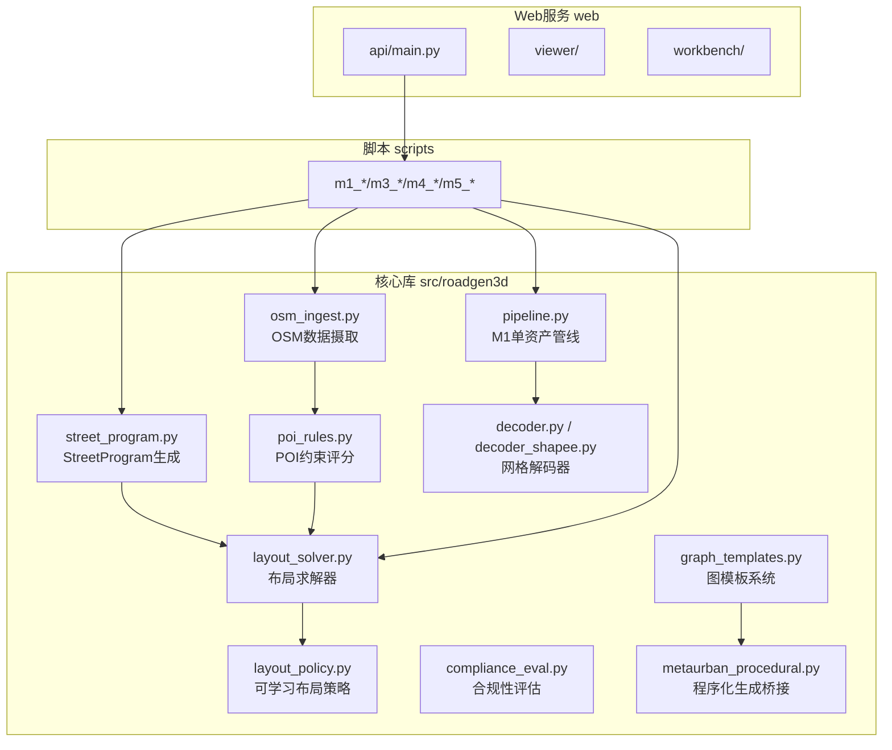
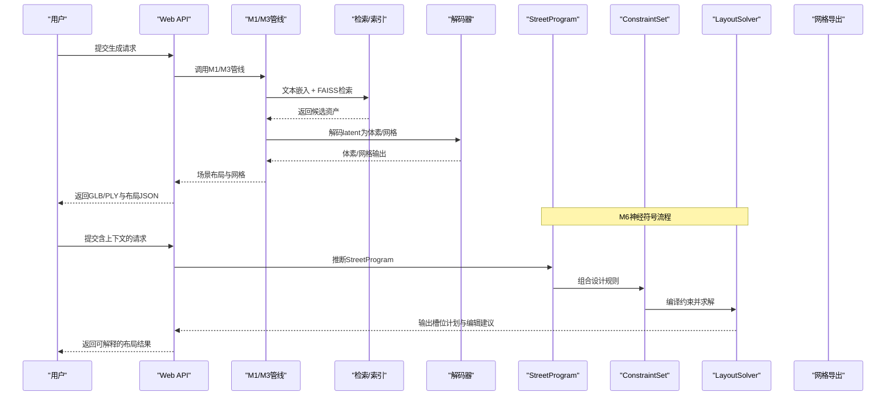
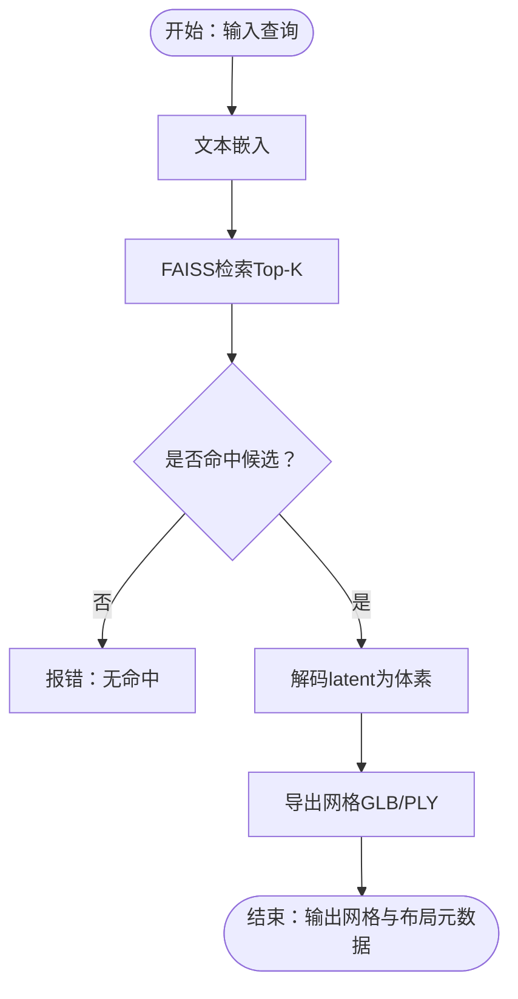
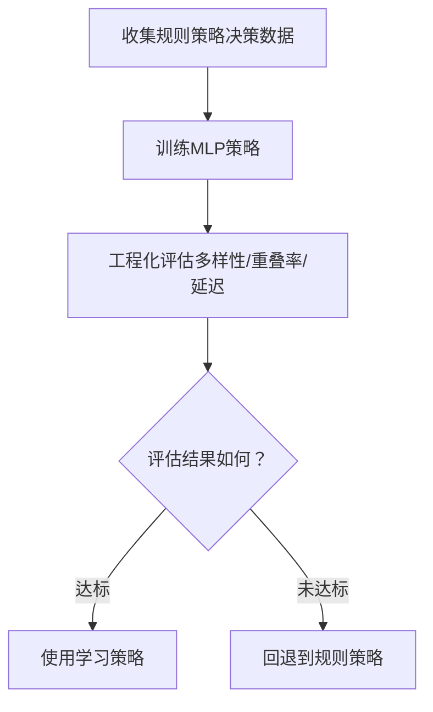
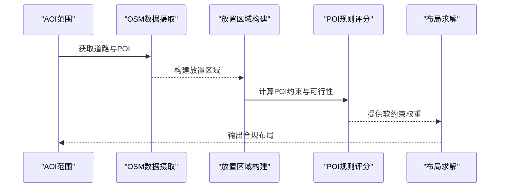
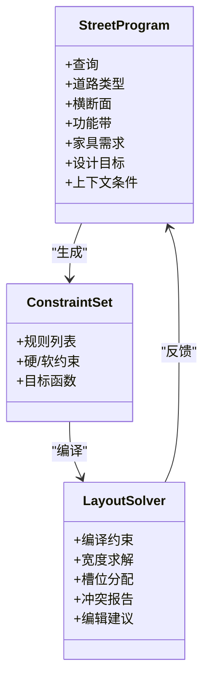
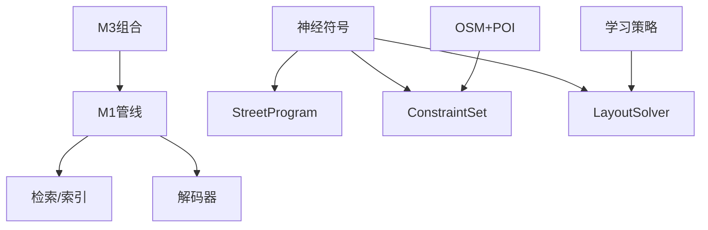

# 核心特性概览

<cite>
**本文档引用的文件**
- [README.md](file://README.md)
- [docs/readme.md](file://docs/readme.md)
- [docs/roadmap.md](file://docs/roadmap.md)
- [docs/m6_neurosymbolic_street_generation.md](file://docs/m6_neurosymbolic_street_generation.md)
- [docs/m4_learning_and_evaluation.md](file://docs/m4_learning_and_evaluation.md)
- [docs/m5_osm_poi_constraints.md](file://docs/m5_osm_poi_constraints.md)
- [README_M1.md](file://README_M1.md)
- [src/roadgen3d/__init__.py](file://src/roadgen3d/__init__.py)
- [src/roadgen3d/pipeline.py](file://src/roadgen3d/pipeline.py)
- [src/roadgen3d/street_program.py](file://src/roadgen3d/street_program.py)
- [src/roadgen3d/layout_solver.py](file://src/roadgen3d/layout_solver.py)
- [src/roadgen3d/layout_policy.py](file://src/roadgen3d/layout_policy.py)
- [src/roadgen3d/layout_features.py](file://src/roadgen3d/layout_features.py)
- [src/roadgen3d/osm_ingest.py](file://src/roadgen3d/osm_ingest.py)
- [src/roadgen3d/placement_zones.py](file://src/roadgen3d/placement_zones.py)
- [src/roadgen3d/poi_rules.py](file://src/roadgen3d/poi_rules.py)
- [src/roadgen3d/compliance_eval.py](file://src/roadgen3d/compliance_eval.py)
- [src/roadgen3d/program_generator.py](file://src/roadgen3d/program_generator.py)
- [src/roadgen3d/milp_solver.py](file://src/roadgen3d/milp_solver.py)
- [src/roadgen3d/eval_metrics.py](file://src/roadgen3d/eval_metrics.py)
- [src/roadgen3d/graph_templates.py](file://src/roadgen3d/graph_templates.py)
- [src/roadgen3d/graph_template_scene_bridge.py](file://src/roadgen3d/graph_template_scene_bridge.py)
- [src/roadgen3d/metaurban_procedural.py](file://src/roadgen3d/metaurban_procedural.py)
- [src/roadgen3d/metaurban_scene_bridge.py](file://src/roadgen3d/metaurban_scene_bridge.py)
- [src/roadgen3d/decoder.py](file://src/roadgen3d/decoder.py)
- [src/roadgen3d/decoder_shapee.py](file://src/roadgen3d/decoder_shapee.py)
- [src/roadgen3d/embedder.py](file://src/roadgen3d/embedder.py)
- [src/roadgen3d/index_store.py](file://src/roadgen3d/index_store.py)
- [src/roadgen3d/latent_store.py](file://src/roadgen3d/latent_store.py)
- [src/roadgen3d/street_layout.py](file://src/roadgen3d/street_layout.py)
- [src/roadgen3d/voxel_export.py](file://src/roadgen3d/voxel_export.py)
- [scripts/m1_06_run_pipeline.py](file://scripts/m1_06_run_pipeline.py)
- [scripts/m3_01_compose_street.py](file://scripts/m3_01_compose_street.py)
- [scripts/m4_01_collect_policy_data.py](file://scripts/m4_01_collect_policy_data.py)
- [scripts/m4_02_train_layout_policy.py](file://scripts/m4_02_train_layout_policy.py)
- [scripts/m4_10_eval_engineering.py](file://scripts/m4_10_eval_engineering.py)
- [scripts/m5_01_fetch_osm.py](file://scripts/m5_01_fetch_osm.py)
- [scripts/m5_02_build_placement_zones.py](file://scripts/m5_02_build_placement_zones.py)
- [scripts/m5_10_eval_compliance.py](file://scripts/m5_10_eval_compliance.py)
</cite>

## 目录
1. [简介](#简介)
2. [项目结构](#项目结构)
3. [核心组件](#核心组件)
4. [架构总览](#架构总览)
5. [详细组件分析](#详细组件分析)
6. [依赖关系分析](#依赖关系分析)
7. [性能考量](#性能考量)
8. [故障排查指南](#故障排查指南)
9. [结论](#结论)
10. [附录](#附录)

## 简介
RoadGen3D 是一个神经符号（neuro-symbolic）的3D城市街道场景生成系统，能够将自然语言描述转换为详细的3D场景。其核心特色在于六大里程碑（M1-M6）的渐进式能力构建，涵盖从单资产生成到真实数据链路、从多资产组合到可学习布局策略、再到OSM集成与神经符号管道的完整演进。

与传统3D场景生成方法相比，RoadGen3D在准确性、效率与可控性方面具有显著优势：
- 准确性：通过设计规则约束与OSM真实数据驱动，确保布局符合现实需求。
- 效率：采用检索驱动与可学习策略，减少手工调整与迭代成本。
- 可控性：神经符号中间表示（StreetProgram、ConstraintSet、LayoutSolver）使设计意图可编辑、可解释、可测试。

## 项目结构
项目采用模块化组织，核心库位于 src/roadgen3d，配套脚本位于 scripts，Web服务位于 web，知识库与数据位于 knowledge/data，测试位于 tests。

图表来源
- [src/roadgen3d/pipeline.py:30-125](file://src/roadgen3d/pipeline.py#L30-L125)
- [src/roadgen3d/street_program.py:502-626](file://src/roadgen3d/street_program.py#L502-L626)
- [src/roadgen3d/layout_solver.py:402-540](file://src/roadgen3d/layout_solver.py#L402-L540)
- [src/roadgen3d/layout_policy.py](file://src/roadgen3d/layout_policy.py)
- [src/roadgen3d/osm_ingest.py](file://src/roadgen3d/osm_ingest.py)
- [src/roadgen3d/poi_rules.py](file://src/roadgen3d/poi_rules.py)
- [src/roadgen3d/compliance_eval.py](file://src/roadgen3d/compliance_eval.py)
- [src/roadgen3d/graph_templates.py](file://src/roadgen3d/graph_templates.py)
- [src/roadgen3d/metaurban_procedural.py](file://src/roadgen3d/metaurban_procedural.py)
- [src/roadgen3d/decoder.py](file://src/roadgen3d/decoder.py)
- [src/roadgen3d/decoder_shapee.py](file://src/roadgen3d/decoder_shapee.py)

章节来源
- [README.md:107-130](file://README.md#L107-L130)

## 核心组件
- 文本检索与嵌入：基于CLIP文本特征与FAISS索引进行相似度检索，支撑M1/M2/M3的资产选择。
- 解码器：支持占位解码器与Shape-E解码器，后者提供mesh_ref编码的实时网格输出。
- 街道程序（StreetProgram）：声明式描述道路类型、横断面、功能区、家具需求、控制点与设计目标。
- 约束集合（ConstraintSet）：硬软约束规则，明确可解释的目标与边界。
- 布局求解器（LayoutSolver）：带碰撞检测的优化求解，输出槽位计划、编辑建议与冲突报告。
- 可学习布局策略（M4）：基于特征的MLP策略，替代启发式规则，支持工程化评估。
- OSM集成与POI约束（M5）：真实道路几何与POI感知的布局约束，提供合规性评估。
- 神经符号管道（M6）：以StreetProgram-ConstraintSet-LayoutSolver为主线的声明式设计流程。

章节来源
- [README.md:132-193](file://README.md#L132-L193)
- [docs/m6_neurosymbolic_street_generation.md:1-60](file://docs/m6_neurosymbolic_street_generation.md#L1-L60)
- [docs/m4_learning_and_evaluation.md:1-191](file://docs/m4_learning_and_evaluation.md#L1-L191)
- [docs/m5_osm_poi_constraints.md:1-101](file://docs/m5_osm_poi_constraints.md#L1-L101)

## 架构总览
下图展示了从文本到3D场景的端到端流程，以及M1-M6各阶段的关键节点：

图表来源
- [README.md:9-18](file://README.md#L9-L18)
- [src/roadgen3d/pipeline.py:30-125](file://src/roadgen3d/pipeline.py#L30-L125)
- [src/roadgen3d/street_program.py:502-626](file://src/roadgen3d/street_program.py#L502-L626)
- [src/roadgen3d/layout_solver.py:402-540](file://src/roadgen3d/layout_solver.py#L402-L540)
- [src/roadgen3d/decoder.py](file://src/roadgen3d/decoder.py)
- [src/roadgen3d/decoder_shapee.py](file://src/roadgen3d/decoder_shapee.py)

## 详细组件分析

### M1：单资产生成端到端流程
- 功能概述：验证从文本到网格的完整闭环，支持占位解码器与Shape-E解码器。
- 关键实现：
  - 文本嵌入与FAISS检索：使用CLIP文本特征与FAISS索引进行相似度搜索。
  - Latent解码：将资产latent解码为体素概率与二值体素，并导出网格。
  - 错误处理：对空索引、无命中等异常进行显式提示。
- 性能特点：检索阶段O(logN)近似，解码阶段受latent维度与网格算法影响。
- 适用场景：快速验证资产质量、构建小规模演示场景。
- 使用案例：参考M1运行手册中的命令顺序与产物检查。

图表来源
- [src/roadgen3d/pipeline.py:39-125](file://src/roadgen3d/pipeline.py#L39-L125)
- [src/roadgen3d/decoder.py](file://src/roadgen3d/decoder.py)
- [src/roadgen3d/decoder_shapee.py](file://src/roadgen3d/decoder_shapee.py)
- [src/roadgen3d/voxel_export.py](file://src/roadgen3d/voxel_export.py)

章节来源
- [README_M1.md:1-273](file://README_M1.md#L1-L273)
- [src/roadgen3d/pipeline.py:30-125](file://src/roadgen3d/pipeline.py#L30-L125)

### M2：真实数据链路的mesh_ref编码
- 功能概述：在无Blender环境下，通过mesh_ref编码实现真实网格的高效解码与导出。
- 关键实现：
  - mesh_ref编码：将真实mesh路径写入latent元数据，避免Blender依赖。
  - 解码器回退：当mesh_ref不可用时回退至占位解码器。
- 性能特点：mesh_ref路径直连真实几何，解码与导出速度更快，质量更稳定。
- 适用场景：大规模真实资产管线、生产环境部署。
- 使用案例：参考M1运行手册中的Shape-E模式与mesh_ref路径配置。

章节来源
- [README_M1.md:187-217](file://README_M1.md#L187-L217)
- [src/roadgen3d/decoder_shapee.py](file://src/roadgen3d/decoder_shapee.py)
- [src/roadgen3d/decoder.py](file://src/roadgen3d/decoder.py)

### M3：多资产街道组合的智能布局
- 功能概述：在单路段直线路段模板上，进行多资产的检索、去重、碰撞检测与导出。
- 关键实现：
  - 槽位规划：沿道路中心线均匀分布槽位，按类别与位置约束分配资产。
  - 去重与多样性：同类资产优先不重复，候选耗尽可能放宽重复以填满场景。
  - 多样性门槛：对资产面数设置硬门槛，防止低质量资产堆叠。
- 性能特点：整体复杂度与槽位数量线性相关，通过softmax采样与重复策略平衡多样性与覆盖率。
- 适用场景：城市街道场景的快速合成与批量生成。
- 使用案例：参考M1运行手册中的M3组合命令与输出文件。

章节来源
- [README_M1.md:218-273](file://README_M1.md#L218-L273)

### M4：可学习布局策略的自适应优化
- 功能概述：通过收集规则策略的决策数据，训练可学习的布局策略，替代启发式规则。
- 关键实现：
  - 特征提取：固定32维候选特征，包含槽位几何、道路参数、检索分数、类别分布等。
  - 模型结构：MLP（32→64→32→1），使用交叉熵损失与熵正则化。
  - 训练与推理：支持规则基线与学习策略切换，提供工程化评估指标。
- 性能特点：学习策略在多样性与覆盖率上优于启发式，且具备可解释的特征反馈。
- 适用场景：需要稳定、可复现且可优化的布局策略场景。
- 使用案例：参考M4学习与评估规范中的收集、训练与评估流程。

图表来源
- [docs/m4_learning_and_evaluation.md:1-191](file://docs/m4_learning_and_evaluation.md#L1-L191)
- [src/roadgen3d/layout_features.py](file://src/roadgen3d/layout_features.py)
- [src/roadgen3d/layout_policy.py](file://src/roadgen3d/layout_policy.py)

章节来源
- [docs/m4_learning_and_evaluation.md:1-191](file://docs/m4_learning_and_evaluation.md#L1-L191)

### M5：OSM集成的基础设施适配
- 功能概述：引入真实道路几何与POI约束，使布局更贴近现实。
- 关键实现：
  - OSM数据摄取：下载并缓存指定AOI范围内的OSM数据。
  - POI约束评分：对建筑入口、消防栓、公交站等POI施加软约束，计算可行性得分。
  - 合规性评估：统计违规次数、平均可行性得分等指标。
- 性能特点：POI扫描与距离计算为主要开销，可通过缓存与批处理优化。
- 适用场景：真实城市环境下的街道设计与合规性验证。
- 使用案例：参考M5 OSM与POI约束规范中的CLI工作流与规则集。

图表来源
- [docs/m5_osm_poi_constraints.md:1-101](file://docs/m5_osm_poi_constraints.md#L1-L101)
- [src/roadgen3d/osm_ingest.py](file://src/roadgen3d/osm_ingest.py)
- [src/roadgen3d/placement_zones.py](file://src/roadgen3d/placement_zones.py)
- [src/roadgen3d/poi_rules.py](file://src/roadgen3d/poi_rules.py)
- [src/roadgen3d/compliance_eval.py](file://src/roadgen3d/compliance_eval.py)

章节来源
- [docs/m5_osm_poi_constraints.md:1-101](file://docs/m5_osm_poi_constraints.md#L1-L101)

### M6：神经符号管道的声明式设计
- 功能概述：以StreetProgram-ConstraintSet-LayoutSolver为主线，将设计意图显式化、可编辑、可测试。
- 关键实现：
  - StreetProgram：推断道路类型、横断面、功能带、家具需求、控制点与设计目标。
  - ConstraintSet：硬软约束规则，支持带宽、通行能力、拓扑关系等。
  - LayoutSolver：带预算与拓扑约束的宽度求解与槽位分配，输出编辑建议与冲突报告。
- 性能特点：通过混合整数规划与贪心扩展相结合，兼顾求解质量与时效。
- 适用场景：需要高可控性与可解释性的街道设计系统。
- 使用案例：参考M6神经符号生成规范中的接口与输出字段。

图表来源
- [docs/m6_neurosymbolic_street_generation.md:1-60](file://docs/m6_neurosymbolic_street_generation.md#L1-L60)
- [src/roadgen3d/street_program.py:502-626](file://src/roadgen3d/street_program.py#L502-L626)
- [src/roadgen3d/layout_solver.py:402-540](file://src/roadgen3d/layout_solver.py#L402-L540)

章节来源
- [docs/m6_neurosymbolic_street_generation.md:1-60](file://docs/m6_neurosymbolic_street_generation.md#L1-L60)

## 依赖关系分析
- 模块耦合：
  - M1/M3管线依赖检索与解码模块，耦合度较低，便于独立演进。
  - M6神经符号模块形成闭环：StreetProgram→ConstraintSet→LayoutSolver，彼此反馈。
  - M5 OSM与POI模块作为外部输入增强M3/M6的现实约束。
- 外部依赖：
  - CLIP文本嵌入与FAISS索引用于检索。
  - PuLP用于混合整数规划求解（可选）。
  - Shapely/PyProj/Requests用于OSM几何处理。

图表来源
- [src/roadgen3d/__init__.py:1-295](file://src/roadgen3d/__init__.py#L1-L295)
- [src/roadgen3d/layout_solver.py:442-485](file://src/roadgen3d/layout_solver.py#L442-L485)
- [src/roadgen3d/osm_ingest.py](file://src/roadgen3d/osm_ingest.py)

章节来源
- [src/roadgen3d/__init__.py:1-295](file://src/roadgen3d/__init__.py#L1-L295)

## 性能考量
- 检索阶段：FAISS索引大小与查询维度决定检索效率；建议在构建索引时进行数据清洗与维度校验。
- 解码阶段：mesh_ref直连真实网格可显著降低解码与导出时间；Shape-E解码器在无Blender环境下仍需注意内存占用。
- 布局阶段：槽位数量与候选池规模直接影响求解时间；M4学习策略可减少无效尝试，提升整体吞吐。
- OSM阶段：POI扫描与距离计算为瓶颈，建议缓存AOI数据与批处理规则评分。

## 故障排查指南
- M1空索引或无命中：检查FAISS索引是否为空或未构建；确认资产清单与索引一致。
- 解码失败：检查latent维度与解码器匹配情况；查看mesh_ref路径是否存在。
- M3多样性不足：调整密度与类别权重；确保候选池足够丰富。
- M4策略训练失败：检查收集数据格式与标签分布；确认设备与批次设置。
- M5合规性差：检查POI规则权重与阈值；核对AOI范围与缓存状态。
- 工程评估异常：查看评估报告中的失败条目与退出码，定位具体场景问题。

章节来源
- [src/roadgen3d/pipeline.py:56-68](file://src/roadgen3d/pipeline.py#L56-L68)
- [docs/m4_learning_and_evaluation.md:177-191](file://docs/m4_learning_and_evaluation.md#L177-L191)
- [docs/m5_osm_poi_constraints.md:54-101](file://docs/m5_osm_poi_constraints.md#L54-L101)

## 结论
RoadGen3D通过M1-M6的持续演进，构建了从文本到3D场景的完整神经符号流水线。其在准确性、效率与可控性方面的优势体现在：
- 准确性：OSM与POI约束确保布局贴合现实；
- 效率：检索与学习策略减少人工干预；
- 可控性：神经符号中间表示使设计意图可编辑、可解释、可测试。

未来路线图进一步强调OSM主路径稳定、POI真实影响强化与横断面解释性提升，为更大尺度路网与街道设计系统的建设奠定基础。

## 附录
- 快速开始与CLI示例参见README与M1运行手册。
- Web API与工作台参见README与API指南。
- 资产与数据管理参见docs/readme.md与资产任务清单。