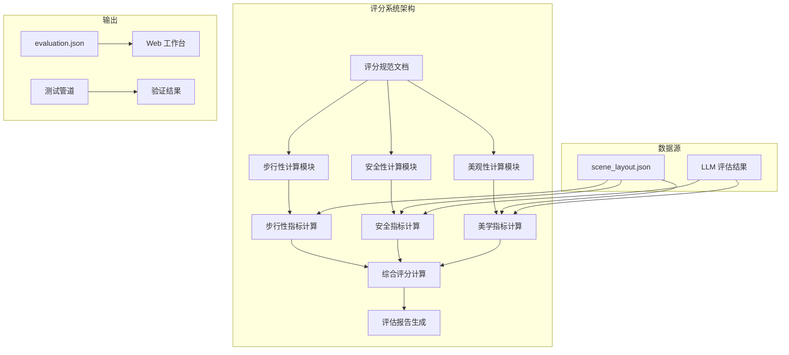
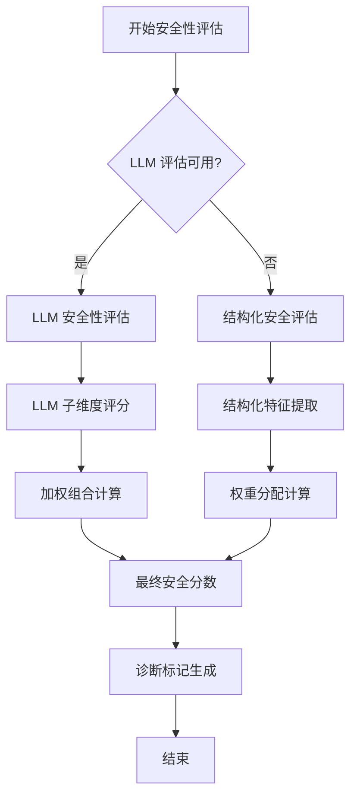
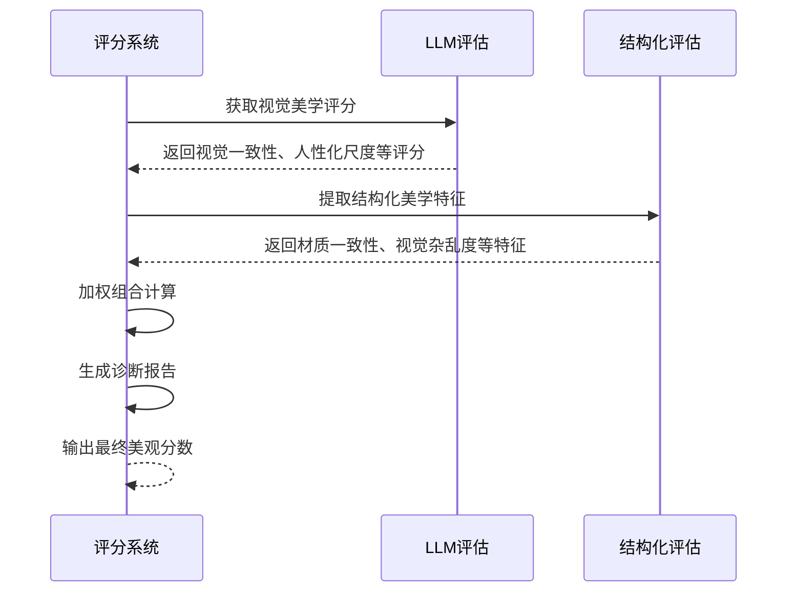
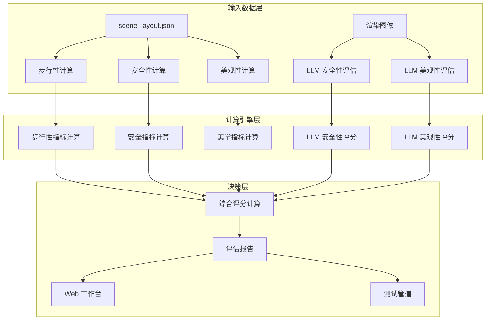
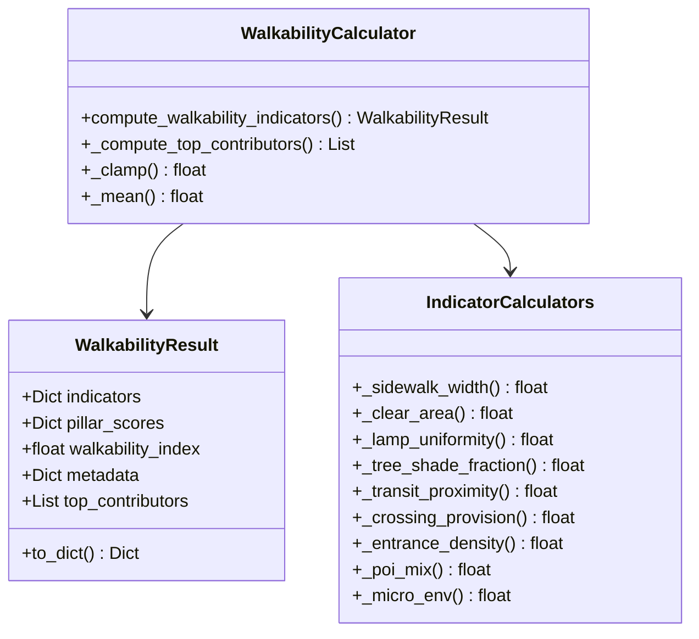
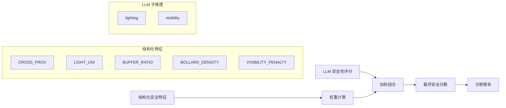
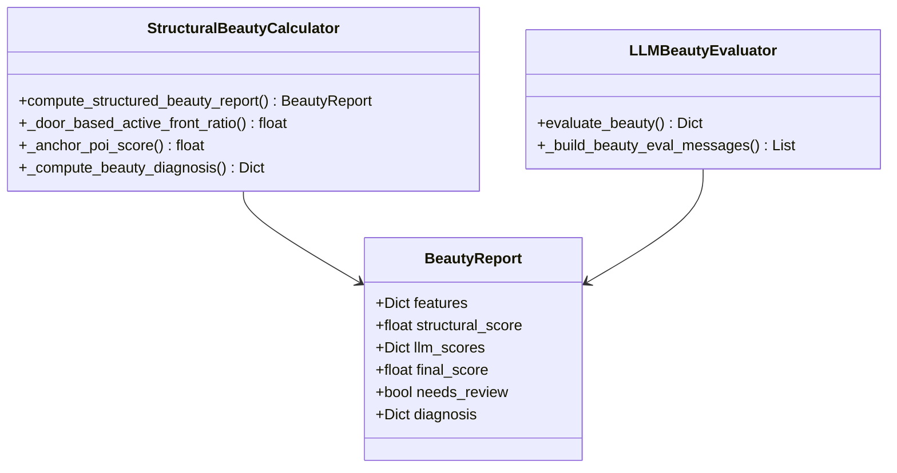
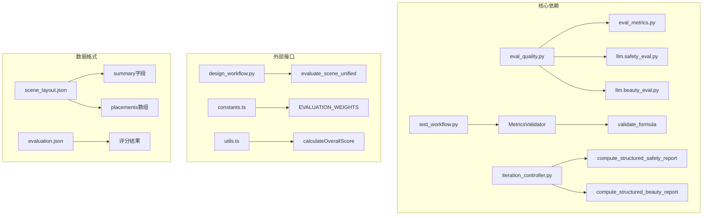

# 评分公式规范

<cite>
**本文档引用的文件**
- [scoring_formula_specification.md](file://docs/scoring_formula_specification.md)
- [eval_quality.py](file://src/roadgen3d/eval_quality.py)
- [test_workflow.py](file://scripts/test_workflow.py)
- [design_workflow.py](file://src/roadgen3d/llm/design_workflow.py)
- [iteration_controller.py](file://src/roadgen3d/auto_pipeline/iteration_controller.py)
- [constants.ts](file://web/workbench/src/lib/constants.ts)
- [utils.ts](file://web/workbench/src/lib/utils.ts)
- [scene_layout.json](file://artifacts/auto_pipeline/scene/iter_00/scene_layout.json)
- [evaluation.json](file://artifacts/auto_pipeline/scene/iter_00/evaluation.json)
</cite>

## 目录
1. [简介](#简介)
2. [项目结构](#项目结构)
3. [核心组件](#核心组件)
4. [架构概览](#架构概览)
5. [详细组件分析](#详细组件分析)
6. [依赖关系分析](#依赖关系分析)
7. [性能考虑](#性能考虑)
8. [故障排除指南](#故障排除指南)
9. [结论](#结论)

## 简介

RoadGen3D 评分公式规范定义了街道场景的三维评分体系，包括步行性（Walkability）、安全性（Safety）和美观性（Beauty）三个核心维度，以及最终的综合评分（Evaluation Score）。该规范基于 scene_layout.json 中的结构化数据，兼顾可解释性与城市设计文献依据。

评分体系采用加权平均算法，其中：
- 综合评分 = 0.45 × 步行性指数 + 0.35 × 安全性分数 + 0.20 × 美观性分数

所有指标输出范围均为 [0, 1]，在 UI 报表中通常乘以 100 展示为 0-100 分。

## 项目结构

**图表来源**
- [scoring_formula_specification.md:10-18](file://docs/scoring_formula_specification.md#L10-L18)
- [eval_quality.py:201-267](file://src/roadgen3d/eval_quality.py#L201-L267)

**章节来源**
- [scoring_formula_specification.md:1-314](file://docs/scoring_formula_specification.md#L1-L314)

## 核心组件

### 步行性（Walkability）指标体系

步行性指标基于 Protection-Comfort-Delight（保护-舒适-愉悦）框架，包含以下 11 项基础指标：

| 指标名称 | 权重 | 计算方法 | 数据来源 |
|---------|------|----------|----------|
| SID_CLR | 0.40 | 人行道净宽归一化 | sidewalk_width_m, left_clear_path_width_m, right_clear_path_width_m |
| CLEAR_CONT | 0.35 | 无障碍连续性比率 | length_m, sidewalk_width_m |
| FURN_D | 0.25 | 街道家具密度 | placements, length_m |
| LIGHT_UNI | 0.40 | 照明均匀度 | lamp_x 坐标分布 |
| BUFFER_RATIO | 0.35 | 行人缓冲强度 | furnishing_width_m, road_width_m |
| TREE_SHADE | 0.25 | 树冠遮荫率 | tree_count, sidewalk_area |
| TRANSIT_PROX | 0.40 | 公交可达性 | bus_stop 距离计算 |
| CROSS_PROV | 0.35 | 过街设施供给 | crossing_count, length_m |
| ENTR_DENS | 0.25 | 入口密度 | entrance_count, length_m |
| POI_MIX | 0.40 | 场所多样性 | Shannon 熵计算 |
| MICRO_ENV | 0.35 | 微气候综合 | tree_shade, noise_shielding, entrance_openness |

**章节来源**
- [scoring_formula_specification.md:22-171](file://docs/scoring_formula_specification.md#L22-L171)
- [eval_quality.py:201-267](file://src/roadgen3d/eval_quality.py#L201-L267)

### 安全性（Safety）评分体系

安全性评分采用双重评估机制：

**图表来源**
- [eval_quality.py:349-407](file://src/roadgen3d/eval_quality.py#L349-L407)
- [scoring_formula_specification.md:174-221](file://docs/scoring_formula_specification.md#L174-L221)

**章节来源**
- [scoring_formula_specification.md:174-221](file://docs/scoring_formula_specification.md#L174-L221)
- [eval_quality.py:349-407](file://src/roadgen3d/eval_quality.py#L349-L407)

### 美观性（Beauty）评分体系

美观性评分同样采用双重评估机制：

**图表来源**
- [eval_quality.py:438-500](file://src/roadgen3d/eval_quality.py#L438-L500)
- [scoring_formula_specification.md:224-275](file://docs/scoring_formula_specification.md#L224-L275)

**章节来源**
- [scoring_formula_specification.md:224-275](file://docs/scoring_formula_specification.md#L224-L275)
- [eval_quality.py:438-500](file://src/roadgen3d/eval_quality.py#L438-L500)

## 架构概览

**图表来源**
- [iteration_controller.py:194-218](file://src/roadgen3d/auto_pipeline/iteration_controller.py#L194-L218)
- [design_workflow.py:492-529](file://src/roadgen3d/llm/design_workflow.py#L492-L529)

## 详细组件分析

### 步行性计算组件

步行性计算采用层次化评估结构：

**图表来源**
- [eval_quality.py:83-99](file://src/roadgen3d/eval_quality.py#L83-L99)
- [eval_quality.py:201-267](file://src/roadgen3d/eval_quality.py#L201-L267)

**章节来源**
- [eval_quality.py:83-99](file://src/roadgen3d/eval_quality.py#L83-L99)
- [eval_quality.py:201-267](file://src/roadgen3d/eval_quality.py#L201-L267)

### 安全性评估组件

安全性评估采用混合模型：

**图表来源**
- [eval_quality.py:349-407](file://src/roadgen3d/eval_quality.py#L349-L407)
- [scoring_formula_specification.md:174-221](file://docs/scoring_formula_specification.md#L174-L221)

**章节来源**
- [eval_quality.py:349-407](file://src/roadgen3d/eval_quality.py#L349-L407)
- [scoring_formula_specification.md:174-221](file://docs/scoring_formula_specification.md#L174-L221)

### 美观性评估组件

美观性评估同样采用双重评估机制：

**图表来源**
- [eval_quality.py:438-500](file://src/roadgen3d/eval_quality.py#L438-L500)
- [scoring_formula_specification.md:224-275](file://docs/scoring_formula_specification.md#L224-L275)

**章节来源**
- [eval_quality.py:438-500](file://src/roadgen3d/eval_quality.py#L438-L500)
- [scoring_formula_specification.md:224-275](file://docs/scoring_formula_specification.md#L224-L275)

## 依赖关系分析

**图表来源**
- [iteration_controller.py:194-218](file://src/roadgen3d/auto_pipeline/iteration_controller.py#L194-L218)
- [test_workflow.py:293-331](file://scripts/test_workflow.py#L293-L331)
- [constants.ts:1-69](file://web/workbench/src/lib/constants.ts#L1-L69)

**章节来源**
- [iteration_controller.py:194-218](file://src/roadgen3d/auto_pipeline/iteration_controller.py#L194-L218)
- [test_workflow.py:293-331](file://scripts/test_workflow.py#L293-L331)
- [constants.ts:1-69](file://web/workbench/src/lib/constants.ts#L1-L69)

## 性能考虑

### 计算复杂度分析

1. **步行性计算复杂度**: O(n)，其中 n 为街道长度上的采样点数量
2. **安全性计算复杂度**: O(m)，其中 m 为街道家具数量
3. **美观性计算复杂度**: O(k)，其中 k 为 POI 数量

### 内存优化策略

- 使用生成器模式处理大规模场景数据
- 实施缓存机制存储中间计算结果
- 采用分块处理避免内存溢出

### 并行处理能力

系统支持多线程并行计算不同维度的评分，最大并发度取决于硬件资源。

## 故障排除指南

### 常见问题及解决方案

| 问题类型 | 症状 | 可能原因 | 解决方案 |
|---------|------|----------|----------|
| 评分异常 | 分数超出 [0,1] 范围 | 数据预处理错误 | 检查 _clamp 函数调用 |
| 指标缺失 | 某些指标为 None | 数据源不完整 | 验证 scene_layout.json 结构 |
| LLM 评估失败 | 安全性/美观性分数为 None | API 调用失败 | 检查网络连接和 API 密钥 |
| 权重不匹配 | 综合评分不符合预期 | 权重设置错误 | 验证权重配置文件 |

**章节来源**
- [test_workflow.py:788-797](file://scripts/test_workflow.py#L788-L797)

### 调试工具和方法

1. **评分验证**: 使用 MetricsValidator.validate_formula() 方法
2. **数据完整性检查**: 验证 scene_layout.json 中必需字段
3. **日志分析**: 查看详细的计算过程日志
4. **单元测试**: 运行独立的指标计算测试

## 结论

RoadGen3D 评分公式规范提供了一个完整的三维街道场景评估体系，通过科学的数学模型和城市设计原则，实现了客观、可解释的自动化评估。该体系的特点包括：

1. **多维度综合评估**: 同时考虑步行性、安全性和美观性三个核心维度
2. **双评估机制**: 结构化特征与 LLM 视觉评估相结合
3. **可解释性**: 提供 Top Contributors 和诊断报告
4. **可扩展性**: 支持权重调整和新指标添加
5. **自动化集成**: 与工作流管道无缝集成

该规范为城市规划师、设计师和开发者提供了可靠的工具，用于评估和改进街道环境质量。