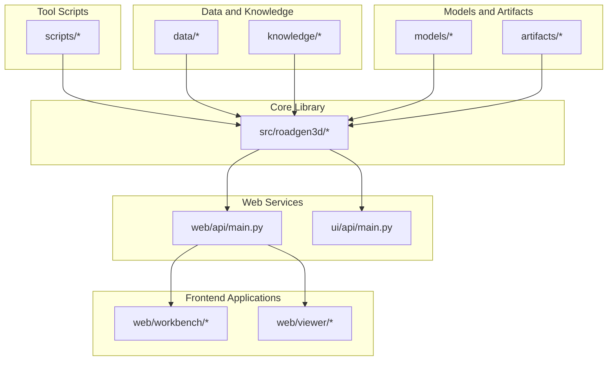
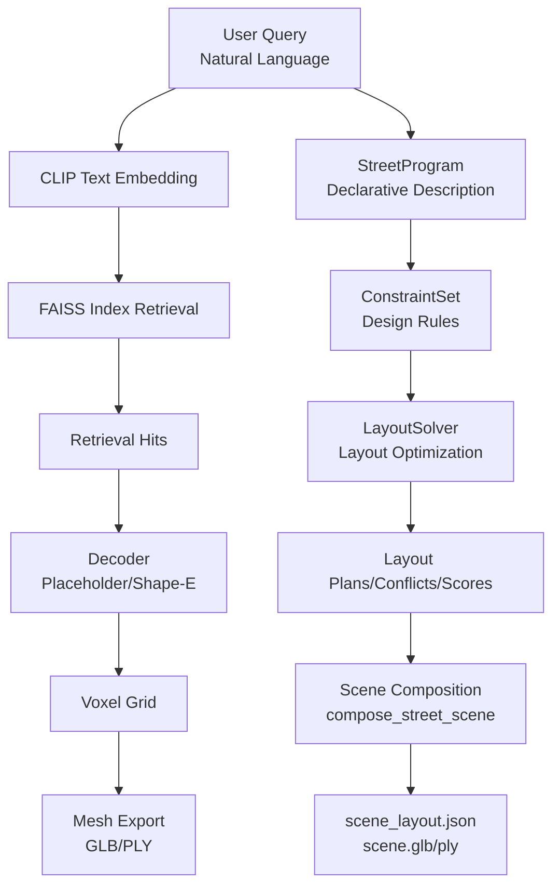
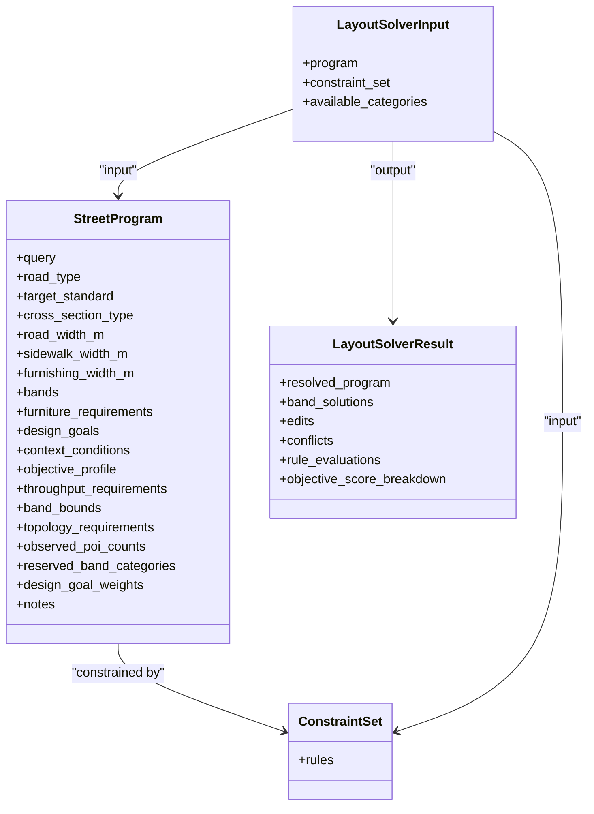
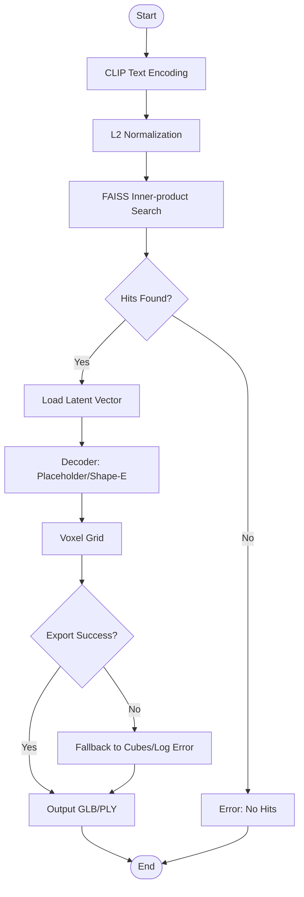
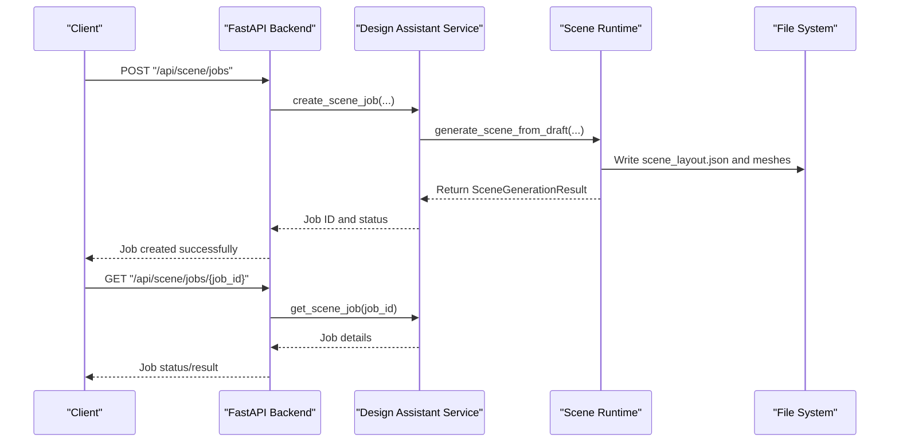
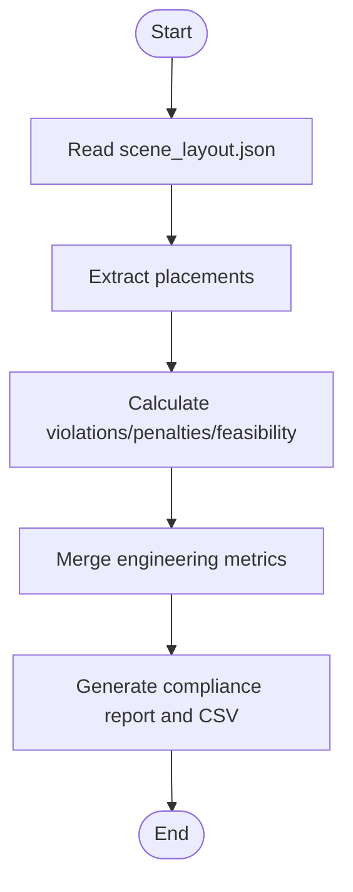
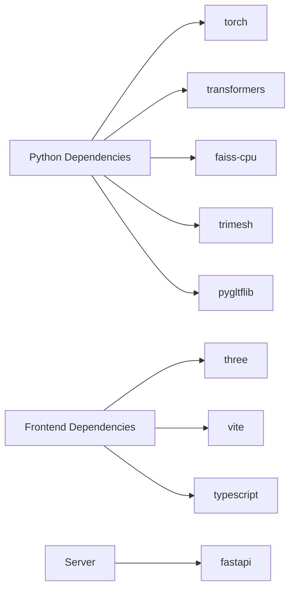

# 项目概述

<cite>
**本文引用的文件**
- [readme.md](file://readme.md)
- [docs/current_system_review.md](file://docs/current_system_review.md)
- [docs/roadmap.md](file://docs/roadmap.md)
- [docs/m6_neurosymbolic_street_generation.md](file://docs/m6_neurosymbolic_street_generation.md)
- [docs/m4_learning_and_evaluation.md](file://docs/m4_learning_and_evaluation.md)
- [src/roadgen3d/__init__.py](file://src/roadgen3d/__init__.py)
- [web/api/main.py](file://web/api/main.py)
- [ui/api/main.py](file://ui/api/main.py)
- [src/roadgen3d/street_program.py](file://src/roadgen3d/street_program.py)
- [src/roadgen3d/layout_solver.py](file://src/roadgen3d/layout_solver.py)
- [src/roadgen3d/compliance_eval.py](file://src/roadgen3d/compliance_eval.py)
- [requirements-m1.txt](file://requirements-m1.txt)
- [requirements-m2.txt](file://requirements-m2.txt)
- [web/viewer/package.json](file://web/viewer/package.json)
- [web/workbench/package.json](file://web/workbench/package.json)
- [src/roadgen3d/services/design_runtime.py](file://src/roadgen3d/services/design_runtime.py)
- [src/roadgen3d/pipeline.py](file://src/roadgen3d/pipeline.py)
</cite>

## 更新摘要
**所做更改**
- 将项目概述文档重写为英文结构化文档格式
- 更新项目定位为"POI-driven street generation workbench"
- 增强快速开始指南和CLI使用说明
- 更新里程碑描述以反映当前系统状态
- 添加Auto场景管线的详细说明
- 更新技术栈和架构图示

## 目录
1. [引言](#引言)
2. [项目定位](#项目定位)
3. [快速开始](#快速开始)
4. [项目结构](#项目结构)
5. [核心组件](#核心组件)
6. [架构总览](#架构总览)
7. [详细组件分析](#详细组件分析)
8. [依赖分析](#依赖分析)
9. [性能考量](#性能考量)
10. [故障排查指南](#故障排查指南)
11. [结论](#结论)
12. [附录](#附录)

## 引言

RoadGen3D is a neuro-symbolic system that transforms text descriptions into detailed 3D urban street scenes. Given a natural language query like "modern clean urban street", it retrieves relevant assets, plans a street layout with design-rule constraints, and exports a complete 3D scene (GLB/PLY).

**核心特性**:
- **Text-to-3D Generation**: Input natural language queries, system retrieves relevant assets and generates street layouts
- **Neuro-symbolic Pipeline**: Uses StreetProgram (declarative street description), ConstraintSet (design rules), and LayoutSolver (layout optimizer) for interpretable, extensible intermediate representations
- **Open Ecosystem**: Supports multiple asset sources (real data, parametric assets, graph templates) with Web API, workbench, and 3D viewer

**章节来源**
- [readme.md:1-258](file://readme.md#L1-L258)

## 项目定位

RoadGen3D is now positioned as a comprehensive street generation and research workbench, not merely a "neuro-symbolic street generation prototype". The system provides three main capabilities:

1. **Data and Environment Preparation**: Asset manifest validation, latent encoding, FAISS index building, OSM cache preheating, and POI-rich road discovery
2. **Street Generation and Scene Export**: Automatic road selection, program inference, constraint solving, and final scene generation
3. **Research, Distillation, Training, and Replay**: Layout policy training, program generator training, distillation data collection, and best model replay

**章节来源**
- [docs/current_system_review.md:1-226](file://docs/current_system_review.md#L1-L226)

## 快速开始

### Prerequisites
- Python 3.11+ (tested on macOS arm64)
- Git (with submodule support)
- Node.js (for web workbench & viewer)

### Installation

```bash
# Clone with submodules
git clone https://github.com/GIStudio/RoadGen3D.git
cd RoadGen3D
git submodule update --init

# Python dependencies
.venv/bin/python -m pip install -r requirements-m1.txt
.venv/bin/python -m pip install -r requirements-m2.txt
.venv/bin/python -m pip install -r requirements-ui.txt

# Frontend dependencies
make workbench-install
make viewer-install
```

### Run Services

**Start the full development environment** (API + Workbench + Viewer):

```bash
make dev
```

This launches three services:
- **API** — `http://127.0.0.1:8010`
- **Workbench** — `http://127.0.0.1:4174`
- **Viewer** — `http://127.0.0.1:4173`

### Generate a Street Scene (CLI)

```bash
.venv/bin/python scripts/m3_01_compose_street.py \
  --query "modern clean urban street" \
  --manifest data/real/real_assets_manifest.jsonl \
  --artifacts artifacts/real \
  --out-dir artifacts/real \
  --length-m 80 \
  --road-width-m 8 \
  --sidewalk-width-m 2.5 \
  --density 1.0 \
  --seed 42 \
  --design-rule-profile balanced_complete_street_v1 \
  --model-dir models/clip-vit-base-patch32 \
  --local-files-only \
  --export-format both
```

Output: `artifacts/real/scene.glb`, `artifacts/real/scene_layout.json`

### Auto Scene Pipeline (CLI)

Automatically generate, evaluate, and iteratively improve a street scene from a Viewer-exported graph JSON:

```bash
.venv/bin/python scripts/auto_scene_pipeline.py \
  --graph-json path/to/exported_graph.json \
  --base-map path/to/reference.png \
  --output-dir artifacts/auto_pipeline/my_scene \
  --manifest data/real/real_assets_manifest.jsonl \
  --model-dir models/clip-vit-base-patch32 \
  --max-iterations 5 \
  --query "modern clean urban street" \
  --local-files-only
```

**章节来源**
- [readme.md:67-175](file://readme.md#L67-L175)

## 项目结构

The project follows a modular architecture with "core library + tool scripts + web services + frontend applications + data and knowledge" organization for easy module development and deployment.



**图表来源**
- [readme.md:191-220](file://readme.md#L191-L220)
- [web/api/main.py:1-286](file://web/api/main.py#L1-L286)
- [ui/api/main.py:1-6](file://ui/api/main.py#L1-L6)
- [web/workbench/package.json:1-16](file://web/workbench/package.json#L1-L16)
- [web/viewer/package.json:1-20](file://web/viewer/package.json#L1-L20)

**章节来源**
- [readme.md:191-220](file://readme.md#L191-L220)

## 核心组件

### Neuro-symbolic Pipeline (M6)
- **StreetProgram**: Declarative street description containing cross-section types, functional zones, control points, design goals, and bandwidth boundaries
- **ConstraintSet**: Hard/soft design rule collections covering bandwidth, topology, accessibility, and capacity constraints
- **LayoutSolver**: Bandwidth allocation optimization with collision detection, outputs slot plans, edit suggestions, and conflict reports

### Text Retrieval and Decoding (M1/M2)
- **CLIP Text Encoding + FAISS Vector Retrieval**: Neural text embeddings with L2 normalization and inner-product search
- **Decoders**: Placeholder (lightweight reproducible) and Shape-E (real latent/mesh reference) with fallback mechanisms
- **Mesh Export**: Marching Cubes as default, Cubes as fallback, GLB (display) + PLY (debug) output formats

### Scene Composition and Post-processing
- **compose_street_scene**: Integrates retrieval, layout, and rendering backends to output layout JSON and mesh files

### Web API and Workbench
- **FastAPI**: REST API endpoints for job submission, status querying, knowledge retrieval, and scene evaluation
- **React/Vite**: Interactive workbench and Three.js viewer for scene management and preview

**章节来源**
- [readme.md:248-271](file://readme.md#L248-L271)
- [src/roadgen3d/__init__.py:150-295](file://src/roadgen3d/__init__.py#L150-L295)

## 架构总览

The end-to-end flow from text prompt to 3D scene export, showing module interactions:



**图表来源**
- [readme.md:9-53](file://readme.md#L9-L53)
- [src/roadgen3d/street_program.py:502-626](file://src/roadgen3d/street_program.py#L502-L626)
- [src/roadgen3d/layout_solver.py:402-541](file://src/roadgen3d/layout_solver.py#L402-L541)
- [src/roadgen3d/services/design_runtime.py:336-397](file://src/roadgen3d/services/design_runtime.py#L336-L397)

## 详细组件分析

### Neuro-symbolic Pipeline (M6)

#### StreetProgram
- Infers cross-sections, functional zones, design goals, and bandwidth boundaries from queries and context
- Built-in configuration profiles: "balanced", "pedestrian priority", "transit priority"
- Supports POI observations binding and reserved band categories for real-world alignment

#### ConstraintSet
- Rules covering bandwidth limits, topology adjacency/separation, capacity, and total width budget
- Hard/soft rule modes for solver flexibility

#### LayoutSolver
- Bandwidth allocation optimization with collision detection and goal weight maximization
- Outputs bandwidth solutions, active constraints, feasibility assessment, and objective score breakdown



**图表来源**
- [src/roadgen3d/street_program.py:502-626](file://src/roadgen3d/street_program.py#L502-L626)
- [src/roadgen3d/layout_solver.py:402-541](file://src/roadgen3d/layout_solver.py#L402-L541)

**章节来源**
- [src/roadgen3d/street_program.py:25-81](file://src/roadgen3d/street_program.py#L25-L81)
- [src/roadgen3d/street_program.py:502-626](file://src/roadgen3d/street_program.py#L502-L626)
- [src/roadgen3d/layout_solver.py:22-34](file://src/roadgen3d/layout_solver.py#L22-L34)
- [src/roadgen3d/layout_solver.py:402-541](file://src/roadgen3d/layout_solver.py#L402-L541)

### Text Retrieval and Decoding (M1/M2)

#### Text Retrieval
- CLIP text feature extraction with L2 normalization
- FAISS IndexFlatIP inner-product search for efficient similarity

#### Decoders
- **Placeholder**: Lightweight reproducible decoder outputting voxel probability and binary voxels
- **Shape-E**: Real latent/mesh reference decoding with Placeholder fallback

#### Mesh Export
- Default: Marching Cubes algorithm
- Fallback: Cubes algorithm
- Output formats: GLB (display) + PLY (debug)



**图表来源**
- [readme.md:224-247](file://readme.md#L224-L247)
- [src/roadgen3d/pipeline.py:30-133](file://src/roadgen3d/pipeline.py#L30-L133)

**章节来源**
- [readme.md:224-247](file://readme.md#L224-L247)
- [src/roadgen3d/pipeline.py:30-133](file://src/roadgen3d/pipeline.py#L30-L133)

### Web API and Workbench (FastAPI + React/Vite)

#### FastAPI Backend
- Health checks, city listing, graph templates and reference plans management
- Draft and generation, job queue, recent scenes, knowledge base rebuild and search
- Scene evaluation APIs

#### Workbench and Viewer
- Vite + React workbench for interactive design and scene management
- Three.js viewer for GLB scene browsing



**图表来源**
- [web/api/main.py:188-216](file://web/api/main.py#L188-L216)
- [src/roadgen3d/services/design_runtime.py:336-397](file://src/roadgen3d/services/design_runtime.py#L336-L397)

**章节来源**
- [web/api/main.py:81-267](file://web/api/main.py#L81-L267)
- [ui/api/main.py:1-6](file://ui/api/main.py#L1-L6)
- [web/workbench/package.json:1-16](file://web/workbench/package.json#L1-L16)
- [web/viewer/package.json:1-20](file://web/viewer/package.json#L1-L20)

### Design Rules and Compliance Evaluation (M5)

#### Design Rules
- ConstraintSet defines hard/soft rules: bandwidth bounds, topology adjacency/separation, capacity, total width budget

#### Compliance Evaluation
- Statistics violations, average penalties, and feasibility scores for each scene instance
- Batch aggregation and CSV export capabilities



**图表来源**
- [src/roadgen3d/compliance_eval.py:14-160](file://src/roadgen3d/compliance_eval.py#L14-L160)

**章节来源**
- [src/roadgen3d/compliance_eval.py:14-160](file://src/roadgen3d/compliance_eval.py#L14-L160)

### Auto Scene Pipeline

An LLM-driven closed-loop system that accepts a Viewer-exported road network graph and iteratively produces optimal street scenes:

1. **Graph Parser** (`graph_loader.py`) - Parses ConvertedGraphPayload JSON, calls existing pipeline, extracts GraphSceneContext
2. **LLM Initial Design** (`design_workflow.py`) - Sends graph summary + optional base-map to LLM for initial compose_config_patch
3. **Scene Generation** (`design_runtime.py`) - Calls compose_street_scene with layout_mode="graph_template"
4. **Preview Rendering** (`scene_renderer.py`) - Renders matplotlib top-down schematic from scene_layout.json
5. **LLM Evaluation** - Reuses evaluate_scene() to score scene and suggest parameter adjustments
6. **Iteration Controller** (`iteration_controller.py`) - Loops steps 3-5, applying LLM-suggested config patches

**章节来源**
- [readme.md:261-271](file://readme.md#L261-L271)

## 依赖分析

### Python Dependencies
- **PyTorch**: Deep learning inference and device backend resolution
- **Transformers**: Text encoding (CLIP)
- **FAISS**: High-dimensional vector retrieval
- **trimesh, pygltflib**: Mesh processing and GLTF export

### Frontend Dependencies
- **Three.js**: 3D scene rendering
- **Vite + TypeScript**: Fast build and type checking

### Server Dependencies
- **FastAPI**: High-performance asynchronous API framework



**图表来源**
- [requirements-m1.txt:1-7](file://requirements-m1.txt#L1-L7)
- [requirements-m2.txt:1-4](file://requirements-m2.txt#L1-L4)
- [web/viewer/package.json:11-18](file://web/viewer/package.json#L11-L18)
- [web/workbench/package.json:11-15](file://web/workbench/package.json#L11-L15)

**章节来源**
- [requirements-m1.txt:1-7](file://requirements-m1.txt#L1-L7)
- [requirements-m2.txt:1-4](file://requirements-m2.txt#L1-L4)
- [web/viewer/package.json:11-18](file://web/viewer/package.json#L11-L18)
- [web/workbench/package.json:11-15](file://web/workbench/package.json#L11-L15)

## 性能考量

### Retrieval and Decoding
- FAISS inner-product search provides high throughput
- Placeholder decoder is lightweight, Shape-E requires matching latent dimensions

### Layout Optimization
- Linear programming solver fallback to greedy strategy when unavailable
- Maintains availability but may sacrifice optimality

### Export and Rendering
- Marching Cubes provides high quality but higher computational cost
- Cubes as fallback improves stability

### Device and Acceleration
- Device resolution and CUDA availability selection reduces inference latency

## 故障排查指南

### Common Issues
- **No Retrieval Hits**: Verify FAISS index built and non-empty; check query validity
- **Decoding Failures**: Check latent dimension compatibility; enable Placeholder fallback
- **Export Exceptions**: Review mesh export error fields; try Cubes fallback or adjust voxel size
- **API Errors**: Check HTTP status codes and error details; verify request payloads and environment variables
- **Compliance Evaluation**: Validate scene_layout.json format and placements field; confirm rule names and counts

**章节来源**
- [src/roadgen3d/pipeline.py:56-68](file://src/roadgen3d/pipeline.py#L56-L68)
- [src/roadgen3d/services/design_runtime.py:190-220](file://src/roadgen3d/services/design_runtime.py#L190-L220)
- [web/api/main.py:167-171](file://web/api/main.py#L167-L171)

## 结论

RoadGen3D represents a comprehensive street generation and research workbench with "neuro-symbolic" principles at its core. The system transforms text descriptions into interpretable, constrained, and evaluable 3D street scenes through six milestones of steady evolution. The current system provides:

- **Neuro-symbolic Pipeline**: StreetProgram + ConstraintSet + LayoutSolver for explicit, editable, and testable street structures
- **POI-driven Generation**: OSM + POI integration with strong binding and awareness
- **Research Infrastructure**: Training, evaluation, and replay capabilities
- **Web-based Workflow**: FastAPI + React/Vite architecture suitable for both research exploration and engineering deployment

**章节来源**
- [docs/current_system_review.md:1-226](file://docs/current_system_review.md#L1-L226)

## 附录

### Six Milestones and Capabilities

| Milestone | Capability | Status |
|-----------|------------|--------|
| **M1** | Single-asset pipeline: `text → FAISS → latent → voxel → mesh` | Done |
| **M2** | Real data pipeline (Blender-free `mesh_ref` encoding) | Done |
| **M3** | Multi-asset street composition (retrieval + dedup + collision + export) | Done |
| **M4** | Learnable layout policy + engineering evaluation loop | Done |
| **M5** | OpenStreetMap integration with POI-aware generation | In Progress |
| **M6** | Neuro-symbolic generation (StreetProgram + ConstraintSet + LayoutSolver) | Done (v1) |
| **Auto** | LLM-driven auto pipeline: graph → generate → evaluate → iterate closed loop | Done (v1) |

**章节来源**
- [readme.md:55-66](file://readme.md#L55-L66)

### Technology Stack and Advantages

#### Core Technologies
- **Python**: Mature ecosystem for deep learning and scientific computing libraries
- **FastAPI**: High-performance asynchronous API with automatic OpenAPI documentation
- **React/Vite**: Fast development with hot reload, TypeScript for type safety
- **PyTorch**: Powerful tensor computation and autograd for model training and inference
- **FAISS**: Industrial-grade high-dimensional vector retrieval
- **Three.js**: Browser-based 3D rendering with rich ecosystem

#### Architecture Decisions
- **Modular Design**: Clear separation between data preparation, generation, and research phases
- **POI Integration**: Strong emphasis on Points of Interest driving street design
- **Neuro-symbolic Approach**: Explicit intermediate representations for interpretability
- **Web-first Interface**: Comprehensive web-based workbench for accessibility

**章节来源**
- [requirements-m1.txt:1-7](file://requirements-m1.txt#L1-L7)
- [requirements-m2.txt:1-4](file://requirements-m2.txt#L1-L4)
- [web/viewer/package.json:11-18](file://web/viewer/package.json#L11-L18)
- [web/workbench/package.json:11-15](file://web/workbench/package.json#L11-L15)
- [web/api/main.py:81-267](file://web/api/main.py#L81-L267)

### Roadmap and Future Directions

#### Recent Goals
- **Stabilize OSM + POI Main Path**: Refine current OSM generation chain into stable default path
- **Enhance POI Influence**: Make new POI types more than statistical entries, affecting layout structure
- **Improve Cross-section Synthesis Explainability**: Make "why this road became this width" more readable

#### Medium-term Objectives
- **Expand Street Facilities Ontology**: Complete street facilities system beyond current POI taxonomy
- **Segment-level Graph Participation**: Move from uniform slot to segment-aware generation
- **Learned Program Generator Integration**: Make learned_v1 a strong available backend

#### Long-term Vision
- **Small Network Generation**: Support interconnected roads beyond single segments
- **Street Design System**: Express design intent beyond asset placement
- **Standardized Research Loop**: Stable research workbench with unified protocols

**章节来源**
- [docs/roadmap.md:1-175](file://docs/roadmap.md#L1-L175)