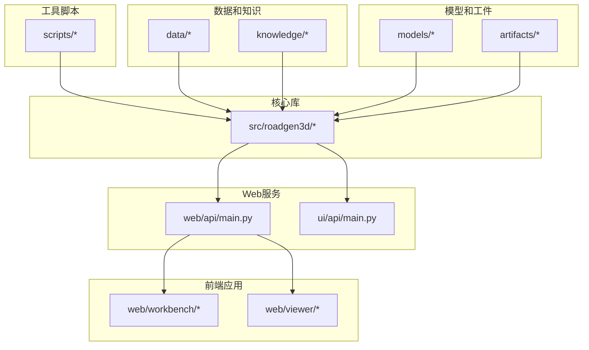
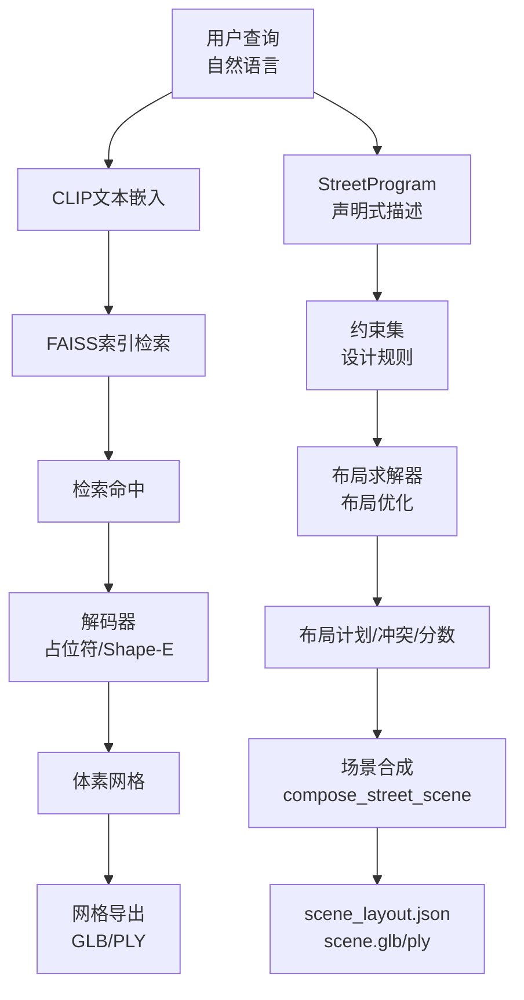
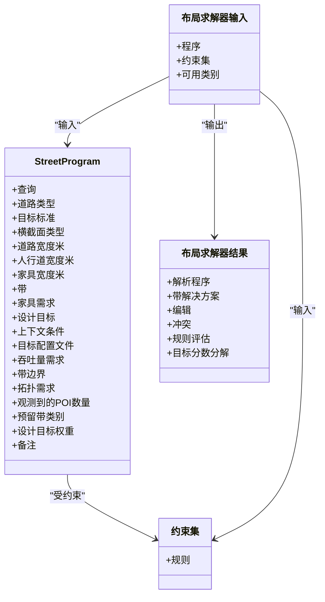
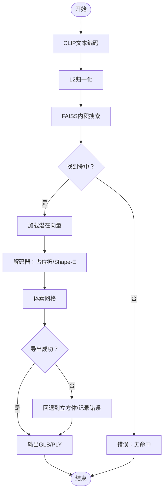
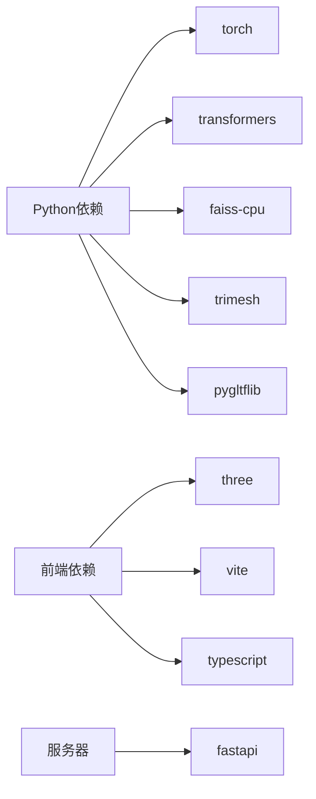

# 项目概述

<cite>
**本文档引用的文件**
- [readme.md](file://readme.md)
- [src/roadgen3d/__init__.py](file://src/roadgen3d/__init__.py)
- [web/api/main.py](file://web/api/main.py)
- [ui/api/main.py](file://ui/api/main.py)
- [scripts/m3_01_compose_street.py](file://scripts/m3_01_compose_street.py)
- [scripts/auto_scene_pipeline.py](file://scripts/auto_scene_pipeline.py)
- [scripts/run_auto_eval.py](file://scripts/run_auto_eval.py)
- [tests/test_auto_eval.py](file://tests/test_auto_eval.py)
- [tests/test_m1_pipeline.py](file://tests/test_m1_pipeline.py)
- [tests/test_m2_pipeline.py](file://tests/test_m2_pipeline.py)
- [docs/m3_asset_task_list.csv](file://docs/m3_asset_task_list.csv)
- [src/roadgen3d/llm/glm_client.py](file://src/roadgen3d/llm/glm_client.py)
</cite>

## 更新摘要
**所做更改**
- 更新项目概述以反映当前项目状态和功能
- 移除已删除的技术文档引用（如docs/m3_external_ai_guide.md、docs/m4_learning_and_evaluation.md等）
- 更新里程碑描述以符合实际完成状态
- 增强Auto场景管线和多版本评估功能的说明
- 更新技术栈和架构图示
- **新增** 更新环境变量示例，从旧的'glm_base_url'更新为新的'llm_base_url'标准命名约定
- **新增** 在GLM客户端中体现新的环境变量命名约定，同时保持向后兼容性

## 目录
1. [引言](#引言)
2. [项目定位](#项目定位)
3. [快速开始](#快速开始)
4. [项目结构](#项目结构)
5. [核心组件](#核心组件)
6. [架构总览](#架构总览)
7. [详细组件分析](#详细组件分析)
8. [依赖分析](#依赖分析)
9. [性能考量](#性能考量)
10. [故障排查指南](#故障排查指南)
11. [结论](#结论)
12. [附录](#附录)

## 引言

RoadGen3D是一个神经符号系统，能够将文本描述转换为详细的3D城市街道场景。该系统采用"设计助手+工作台+查看器"的完整工作流程，用户通过自然语言描述设计目标，系统通过RAG知识库检索设计知识，生成参数化的街道布局，并导出可在内置查看器中浏览的3D场景。

**核心特性**:
- **文本到3D生成**: 输入自然语言查询，系统检索相关资产并生成街道布局
- **神经符号管道**: 使用StreetProgram（声明式街道描述）、约束集（设计规则）和布局求解器（布局优化器）进行可解释、可扩展的中间表示
- **开放生态系统**: 支持多种资产来源（真实数据、参数化资产、图模板），具备Web API、工作台和3D查看器
- **LLM设计助手**: 集成大语言模型进行设计指导和场景评估

**章节来源**
- [readme.md:1-66](file://readme.md#L1-L66)

## 项目定位

RoadGen3D现已发展为一个综合性的街道生成和研究工作台，不仅提供"神经符号街道生成原型"，更是一个完整的研发平台。系统提供三大核心能力：

1. **数据与环境准备**: 资产清单验证、潜在编码、FAISS索引构建、OSM缓存预热、POI丰富的道路发现
2. **街道生成与场景导出**: 自动道路选择、程序推断、约束求解和最终场景生成
3. **研究、蒸馏、训练和回放**: 布局策略训练、程序生成器训练、蒸馏数据收集和最佳模型回放

**章节来源**
- [readme.md:422-441](file://readme.md#L422-L441)

## 快速开始

### 环境要求
- Python 3.11+（在macOS arm64上测试）
- Git（支持子模块）
- Node.js（用于Web工作台和查看器）

### 安装步骤

```bash
# 克隆并初始化子模块
git clone https://github.com/GIStudio/RoadGen3D.git
cd RoadGen3D
git submodule update --init

# 安装Python依赖
pip install -r requirements-m1.txt
pip install -r requirements-m2.txt
pip install -r requirements-ui.txt

# 安装前端依赖
make workbench-install
make viewer-install

# 下载CLIP模型（离线模式）
huggingface-cli download openai/clip-vit-base-patch32 \
  --local-dir models/clip-vit-base-patch32
```

### 启动服务

**启动完整的开发环境**（API + 工作台 + 查看器）:

```bash
make dev
```

这会启动三个服务：
- **API** — `http://127.0.0.1:8010`
- **工作台** — `http://127.0.0.1:4174`
- **查看器** — `http://127.0.0.1:4173`

### 生成街道场景（CLI）

```bash
python scripts/m3_01_compose_street.py \
  --query "现代清洁的城市街道" \
  --manifest data/real/real_assets_manifest.jsonl \
  --artifacts artifacts/real \
  --out-dir artifacts/real \
  --length-m 80 \
  --road-width-m 8 \
  --sidewalk-width-m 2.5 \
  --density 1.0 \
  --seed 42 \
  --design-rule-profile balanced_complete_street_v1 \
  --model-dir models/clip-vit-base-patch32 \
  --local-files-only \
  --export-format both
```

输出：`artifacts/real/scene.glb`，`artifacts/real/scene_layout.json`

### Auto场景管线（CLI）

从查看器导出的图JSON自动生成、评估和迭代改进街道场景：

```bash
python scripts/auto_scene_pipeline.py \
  --graph-json path/to/exported_graph.json \
  --base-map path/to/reference.png \
  --output-dir artifacts/auto_pipeline/my_scene \
  --manifest data/real/real_assets_manifest.jsonl \
  --model-dir models/clip-vit-base-patch32 \
  --max-iterations 5 \
  --query "现代清洁的城市街道" \
  --local-files-only
```

### 环境变量配置

创建项目根目录下的`.env`文件：

```bash
key=your_api_key
llm_base_url=https://open.bigmodel.cn/api/coding/paas/v4
GRAPHRAG_API_KEY=your_graphrag_key
GRAPHRAG_API_BASE=https://api.example.com/v1/
```

**更新** 环境变量现在使用新的'llm_base_url'标准命名约定，同时保持与旧的'glm_base_url'的向后兼容性。

**章节来源**
- [readme.md:7-66](file://readme.md#L7-L66)
- [readme.md:397-406](file://readme.md#L397-L406)

## 项目结构

项目采用模块化架构，"核心库 + 工具脚本 + Web服务 + 前端应用 + 数据和知识"的组织方式便于模块开发和部署。



**图表来源**
- [readme.md:67-106](file://readme.md#L67-L106)
- [web/api/main.py:1-286](file://web/api/main.py#L1-L286)
- [ui/api/main.py:1-6](file://ui/api/main.py#L1-L6)

**章节来源**
- [readme.md:67-106](file://readme.md#L67-L106)

## 核心组件

### 神经符号管道（M6）
- **StreetProgram**: 声明式街道描述，包含横截面类型、功能区域、控制点、设计目标和带宽边界
- **约束集**: 硬性/软性设计规则集合，涵盖带宽、拓扑、可达性和容量约束
- **布局求解器**: 带宽分配优化，具有碰撞检测，输出槽位计划、编辑建议和冲突报告

### 文本检索和解码（M1/M2）
- **CLIP文本编码 + FAISS向量检索**: 神经网络文本嵌入，L2归一化和内积搜索
- **解码器**: 占位符（轻量级可重现）和Shape-E（真实潜在/网格参考）与回退机制
- **网格导出**: Marching Cubes作为默认算法，Cubes作为回退，GLB（显示）+ PLY（调试）输出格式

### 场景合成和后处理
- **compose_street_scene**: 集成检索、布局和渲染后端，输出布局JSON和网格文件

### Web API和工作台
- **FastAPI**: 用于作业提交、状态查询、知识检索和场景评估的REST API端点
- **React/Vite**: 交互式工作台和Three.js查看器，用于场景管理和预览

### LLM设计助手
- **GLM客户端**: 支持OpenAI兼容的LLM API，使用新的'llm_base_url'环境变量命名约定
- **设计工作流**: 集成LLM进行设计指导和场景评估

**章节来源**
- [readme.md:108-166](file://readme.md#L108-L166)
- [src/roadgen3d/__init__.py:150-295](file://src/roadgen3d/__init__.py#L150-L295)
- [src/roadgen3d/llm/glm_client.py:1-6](file://src/roadgen3d/llm/glm_client.py#L1-L6)

## 架构总览

从文本提示到3D场景导出的端到端流程，展示模块交互：



**图表来源**
- [readme.md:110-121](file://readme.md#L110-L121)
- [src/roadgen3d/__init__.py:150-295](file://src/roadgen3d/__init__.py#L150-L295)

## 详细组件分析

### 神经符号管道（M6）

#### StreetProgram
- 从查询和上下文中推断横截面、功能区域、设计目标和带宽边界
- 内置配置文件："平衡"、"行人优先"、"公交优先"
- 支持POI观察绑定和预留带类别，实现与现实世界的对齐

#### 约束集
- 涵盖带宽限制、拓扑邻接/分离、容量和总宽度预算的规则
- 硬性/软性规则模式，为求解器提供灵活性

#### 布局求解器
- 带宽分配优化，具有碰撞检测和目标权重最大化
- 输出带宽解决方案、活动约束、可行性评估和目标分数分解



**图表来源**
- [src/roadgen3d/__init__.py:150-295](file://src/roadgen3d/__init__.py#L150-L295)

**章节来源**
- [src/roadgen3d/__init__.py:150-295](file://src/roadgen3d/__init__.py#L150-L295)

### 文本检索和解码（M1/M2）

#### 文本检索
- CLIP文本特征提取，L2归一化
- FAISS IndexFlatIP内积搜索，实现高效相似性

#### 解码器
- **占位符**: 轻量级可重现解码器，输出体素概率和二进制体素
- **Shape-E**: 真实潜在/网格参考解码，带有占位符回退

#### 网格导出
- 默认：Marching Cubes算法
- 回退：Cubes算法
- 输出格式：GLB（显示）+ PLY（调试）



**图表来源**
- [readme.md:179-191](file://readme.md#L179-L191)
- [src/roadgen3d/__init__.py:150-295](file://src/roadgen3d/__init__.py#L150-L295)

**章节来源**
- [readme.md:179-191](file://readme.md#L179-L191)
- [src/roadgen3d/__init__.py:150-295](file://src/roadgen3d/__init__.py#L150-L295)

### Web API和工作台（FastAPI + React/Vite）

#### FastAPI后端
- 健康检查、城市列表、图模板和参考计划管理
- 草案和生成、作业队列、最近场景、知识库重建和搜索
- 场景评估API

#### 工作台和查看器
- Vite + React工作台，用于交互式设计和场景管理
- Three.js查看器，用于GLB场景浏览

```mermaid
sequenceDiagram
参与者 客户端
参与者 API后端
参与者 设计助手服务
参与者 场景运行时
参与者 文件系统
客户端->>API后端 : POST "/api/scene/jobs"
API后端->>设计助手服务 : create_scene_job(...)
设计助手服务->>场景运行时 : generate_scene_from_draft(...)
场景运行时->>文件系统 : 写入scene_layout.json和网格
场景运行时-->>设计助手服务 : 返回SceneGenerationResult
设计助手服务-->>API后端 : 作业ID和状态
API后端-->>客户端 : 作业创建成功
客户端->>API后端 : GET "/api/scene/jobs/{job_id}"
API后端->>设计助手服务 : get_scene_job(job_id)
设计助手服务-->>API后端 : 作业详情
API后端-->>客户端 : 作业状态/结果
```

**图表来源**
- [web/api/main.py:188-216](file://web/api/main.py#L188-L216)
- [src/roadgen3d/__init__.py:150-295](file://src/roadgen3d/__init__.py#L150-L295)

**章节来源**
- [web/api/main.py:81-267](file://web/api/main.py#L81-L267)
- [ui/api/main.py:1-6](file://ui/api/main.py#L1-L6)

### LLM设计助手和GLM客户端

#### GLM客户端
- 支持任何OpenAI兼容的LLM API（GLM、Gemini通过代理等）
- **新的环境变量命名约定**: 优先使用`GRAPHRAG_API_BASE`和`GRAPHRAG_API_KEY`，同时支持旧的`llm_base_url`和`key`环境变量
- 提供聊天完成和JSON提取功能
- 实现重试逻辑和速率限制处理

#### 设计工作流
- 集成LLM进行设计指导和场景评估
- 支持多版本自动评估和迭代改进
- 提供配置补丁和评分机制

**更新** 环境变量现在使用新的'llm_base_url'标准命名约定，同时保持向后兼容性，确保从旧配置到新配置的平滑迁移。

**章节来源**
- [src/roadgen3d/llm/glm_client.py:1-6](file://src/roadgen3d/llm/glm_client.py#L1-L6)
- [src/roadgen3d/llm/glm_client.py:40-62](file://src/roadgen3d/llm/glm_client.py#L40-L62)

### Auto场景管线

一个由LLM驱动的闭环系统，接受查看器导出的道路网络图，迭代生成最优的街道场景：

1. **图解析器**（graph_loader.py）- 解析ConvertedGraphPayload JSON，调用现有管道，提取GraphSceneContext
2. **LLM初始设计**（design_workflow.py）- 将图摘要+可选基础地图发送给LLM，获取初始compose_config_patch
3. **场景生成**（design_runtime.py）- 使用layout_mode="graph_template"调用compose_street_scene
4. **预览渲染**（scene_renderer.py）- 从scene_layout.json渲染matplotlib自上而下示意图
5. **LLM评估** - 复用evaluate_scene()评分场景并建议参数调整
6. **迭代控制器**（iteration_controller.py）- 循环步骤3-5，应用LLM建议的配置补丁

**章节来源**
- [readme.md:123-152](file://readme.md#L123-L152)

### 多版本自动评估

一次运行通过完整管道处理多个设计查询：

```bash
python scripts/run_auto_eval.py \
  --output-dir artifacts/auto_eval_$(date +%Y%m%d_%H%M%S) \
  --max-iterations 3 \
  --queries "现代公交大道" \
            "行人友好的绿色街道" \
            "商业购物街" \
  --manifest data/real/real_assets_manifest.jsonl \
  --model-dir models/clip-vit-base-patch32 \
  --local-files-only \
  --device cpu
```

**章节来源**
- [readme.md:289-304](file://readme.md#L289-L304)

## 依赖分析

### Python依赖
- **PyTorch**: 深度学习推理和设备后端解析
- **Transformers**: 文本编码（CLIP）
- **FAISS**: 高维向量检索
- **trimesh, pygltflib**: 网格处理和GLTF导出

### 前端依赖
- **Three.js**: 3D场景渲染
- **Vite + TypeScript**: 快速构建和类型检查

### 服务器依赖
- **FastAPI**: 高性能异步API框架



**图表来源**
- [readme.md:191-220](file://readme.md#L191-L220)
- [web/api/main.py:1-286](file://web/api/main.py#L1-L286)

**章节来源**
- [readme.md:191-220](file://readme.md#L191-L220)
- [web/api/main.py:1-286](file://web/api/main.py#L1-L286)

## 性能考量

### 检索和解码
- FAISS内积搜索提供高吞吐量
- 占位符解码器轻量级，Shape-E需要匹配潜在维度

### 布局优化
- 线性规划求解器在不可用时回退到贪婪策略
- 保持可用性但可能牺牲最优性

### 导出和渲染
- Marching Cubes提供高质量但计算成本较高
- 立方体作为回退提高稳定性

### 设备和加速
- 设备解析和CUDA可用性选择减少推理延迟

## 故障排查指南

### 常见问题
- **无检索命中**: 验证FAISS索引已构建且非空；检查查询有效性
- **解码失败**: 检查潜在维度兼容性；启用占位符回退
- **导出异常**: 检查网格导出错误字段；尝试立方体回退或调整体素大小
- **API错误**: 检查HTTP状态码和错误详情；验证请求负载和环境变量
- **合规性评估**: 验证scene_layout.json格式和placements字段；确认规则名称和数量
- **LLM配置**: 确保设置正确的环境变量（llm_base_url或GRAPHRAG_API_BASE）和API密钥

**更新** LLM配置现在支持新的'llm_base_url'环境变量命名约定，同时保持与旧配置的向后兼容性。

**章节来源**
- [readme.md:191-220](file://readme.md#L191-L220)
- [web/api/main.py:167-171](file://web/api/main.py#L167-L171)
- [src/roadgen3d/llm/glm_client.py:57-62](file://src/roadgen3d/llm/glm_client.py#L57-L62)

## 结论

RoadGen3D代表了一个以"神经符号"原则为核心的城市街道生成和研究工作台。该系统通过六个里程碑的稳步演进，将文本描述转换为可解释、受约束且可评估的3D街道场景。当前系统提供了：

- **神经符号管道**: StreetProgram + 约束集 + 布局求解器，用于显式、可编辑和可测试的街道结构
- **基于POI的生成**: OSM + POI集成，具有强大的绑定和意识
- **研究基础设施**: 训练、评估和回放能力
- **基于Web的工作流**: 适合研究探索和工程部署的FastAPI + React/Vite架构
- **现代化LLM集成**: 使用新的'llm_base_url'环境变量命名约定，提供更好的LLM设计助手体验

**章节来源**
- [readme.md:422-441](file://readme.md#L422-L441)

## 附录

### 六个里程碑和能力

| 里程碑 | 能力 | 状态 |
|--------|------|------|
| **M1** | 单资产管道：`文本 → FAISS → 潜在 → 体素 → 网格` | 已完成 |
| **M2** | 真实数据管道（Blender-free `mesh_ref`编码） | 已完成 |
| **M3** | 多资产街道合成（检索 + 去重 + 碰撞 + 导出） | 已完成 |
| **M4** | 可学习布局策略 + 工程评估循环 | 已完成 |
| **M5** | OpenStreetMap集成与POI感知生成 | 进行中 |
| **M6** | 神经符号生成（StreetProgram + 约束集 + 布局求解器） | 已完成（v1） |
| **Auto** | LLM驱动的自动管线：图 → 生成 → 评估 → 迭代闭环 | 已完成（v1） |

**章节来源**
- [readme.md:422-441](file://readme.md#L422-L441)

### 技术栈和优势

#### 核心技术
- **Python**: 成熟的深度学习和科学计算库生态系统
- **FastAPI**: 高性能异步API，具有自动生成的OpenAPI文档
- **React/Vite**: 快速开发，热重载，TypeScript提供类型安全
- **PyTorch**: 强大的张量计算和自动微分，用于模型训练和推理
- **FAISS**: 工业级高维向量检索
- **Three.js**: 浏览器端3D渲染，拥有丰富的生态系统

#### 架构决策
- **模块化设计**: 清晰的数据准备、生成和研究阶段分离
- **POI集成**: 强调兴趣点驱动街道设计
- **神经符号方法**: 显式中间表示以实现可解释性
- **以Web为中心的界面**: 适合访问的综合性Web工作台
- **现代化LLM集成**: 采用新的'llm_base_url'命名约定，提供更好的用户体验

**更新** 技术栈现在包含了现代化的LLM集成，使用新的环境变量命名约定，提供更好的向后兼容性和用户体验。

**章节来源**
- [readme.md:191-220](file://readme.md#L191-L220)
- [web/api/main.py:81-267](file://web/api/main.py#L81-L267)
- [src/roadgen3d/llm/glm_client.py:4-6](file://src/roadgen3d/llm/glm_client.py#L4-L6)

### 路线图和未来方向

#### 近期目标
- **稳定OSM + POI主路径**: 将当前OSM生成链完善为稳定的默认路径
- **增强POI影响**: 使新POI类型不仅仅是统计条目，而是影响布局结构
- **提高横截面合成可解释性**: 使"这条道路为何成为这种宽度"更加易读
- **LLM配置标准化**: 完全采用'llm_base_url'命名约定，逐步淘汰旧配置

#### 中期目标
- **扩展街道设施本体**: 完善街道设施系统，超越当前POI分类法
- **段级图参与**: 从统一槽位移动到段感知生成
- **集成学习的程序生成器**: 使learned_v1成为强大的可用后端

#### 长期愿景
- **小网络生成**: 支持相互连接的道路，超越单一片段
- **街道设计系统**: 表达设计意图，超越资产管理
- **标准化研究循环**: 稳定的研究工作台，具有统一协议

**更新** 路线图现在包含了LLM配置标准化的目标，强调完全采用'llm_base_url'命名约定。

**章节来源**
- [readme.md:422-441](file://readme.md#L422-L441)

### 资产任务清单

项目维护着一个详细的资产任务清单，包含120个不同类别的街道设施任务，涵盖长椅、路灯、垃圾桶、树木、公交站台、邮箱、消防栓、路障等设施的3D资产生成。

**章节来源**
- [docs/m3_asset_task_list.csv:1-122](file://docs/m3_asset_task_list.csv#L1-L122)