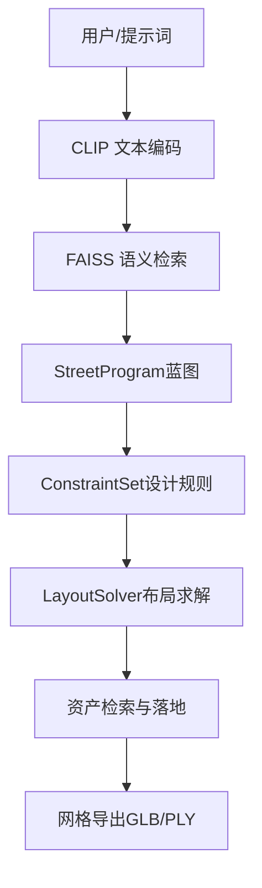
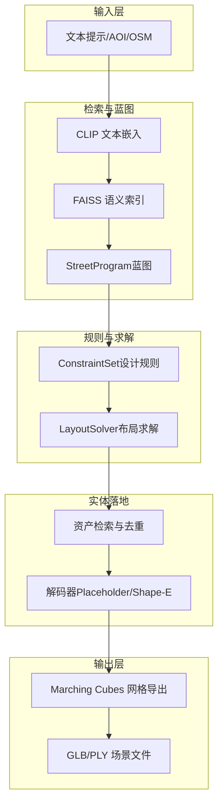
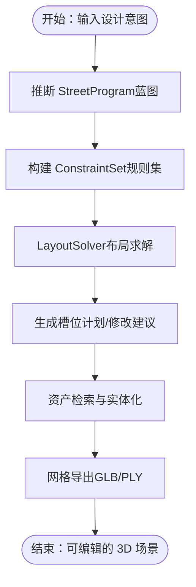
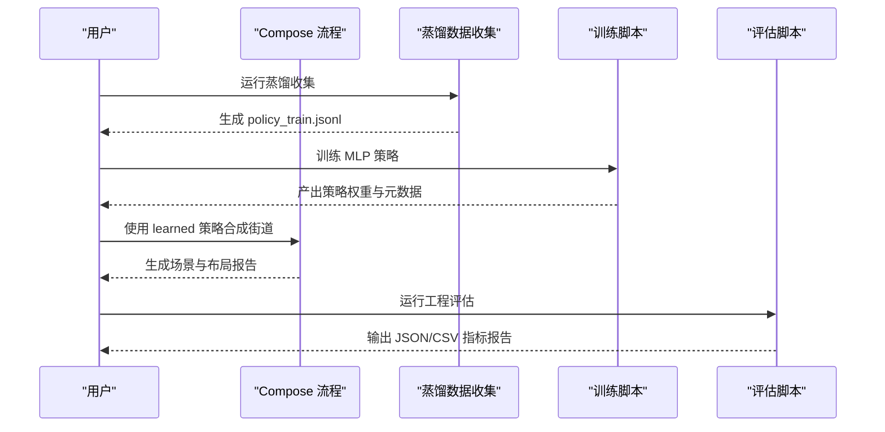
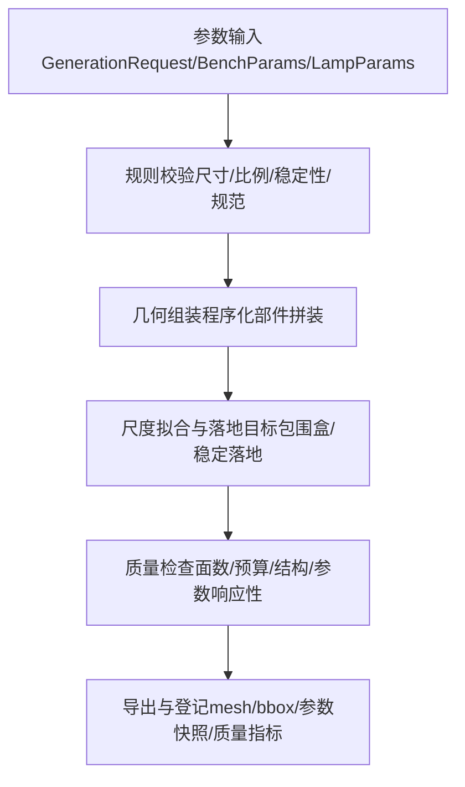
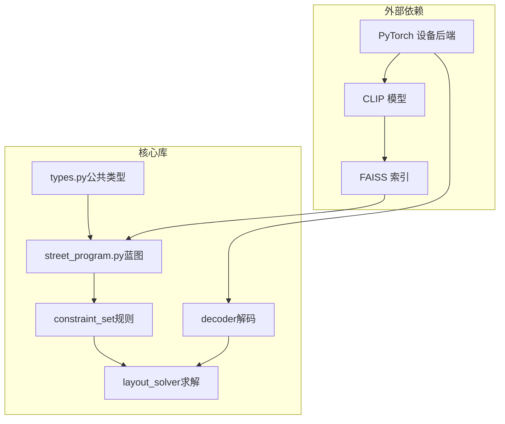

# 项目简介与目标

<cite>
**本文引用的文件**
- [readme.md](file://readme.md)
- [docs/m6_neurosymbolic_street_generation.md](file://docs/m6_neurosymbolic_street_generation.md)
- [docs/m4_learning_and_evaluation.md](file://docs/m4_learning_and_evaluation.md)
- [docs/design.md](file://docs/design.md)
- [docs/roadmap.md](file://docs/roadmap.md)
- [docs/llm_rag_design_outline.md](file://docs/llm_rag_design_outline.md)
- [docs/compare.md](file://docs/compare.md)
- [src/roadgen3d/__init__.py](file://src/roadgen3d/__init__.py)
- [src/roadgen3d/street_program.py](file://src/roadgen3d/street_program.py)
- [src/roadgen3d/types.py](file://src/roadgen3d/types.py)
- [.gitmodules](file://.gitmodules)
</cite>

## 目录
1. [引言](#引言)
2. [项目结构](#项目结构)
3. [核心组件](#核心组件)
4. [架构总览](#架构总览)
5. [详细组件分析](#详细组件分析)
6. [依赖分析](#依赖分析)
7. [性能考量](#性能考量)
8. [故障排查指南](#故障排查指南)
9. [结论](#结论)
10. [附录](#附录)

## 引言
RoadGen3D 是一个“神经符号”（neuro-symbolic）系统，其核心使命是将自然语言描述转化为详细的三维城市街道场景。该系统通过“显式的中间表示 + 可编辑的设计规则 + 约束求解”的方式，确保生成过程可解释、可调试、可迭代，从而服务于城市规划辅助、游戏开发资源生成、虚拟现实内容创作等实际应用。

项目由 GIStudio 发起与维护，依托模块化的代码库、完善的管线与工具链，提供从文本提示到 3D 场景导出的全链路能力，并持续在“OSM + POI + 街道蓝图 + 约束求解 + 资产落地”的主线道路上演进。

## 项目结构
RoadGen3D 采用“核心库 + 脚本工具 + Web 前后端 + 数据与知识库”的组织方式：
- 核心库（src/roadgen3d）：提供神经符号管线、布局策略、检索与解码、评估指标等关键能力
- 脚本工具（scripts/*）：按里程碑划分的命令行流水线，覆盖单资产、真实数据、多资产组合、学习策略、OSM/POI、管线合成等
- Web 前后端（web/）：FastAPI 后端、工作台与 3D 查看器前端
- 数据与知识（data/、knowledge/）：资产清单、材质、训练数据、设计手册 RAG 等
- 测试与文档（tests/、docs/）：测试套件与系统设计、路线图、对比分析等文档

图表来源
- [readme.md: 132-170:132-170](file://readme.md#L132-L170)

章节来源
- [readme.md: 107-130:107-130](file://readme.md#L107-L130)

## 核心组件
- 神经符号管线（M6）：以 StreetProgram、ConstraintSet、LayoutSolver 为核心，将设计意图显式化、规则化、可求解化
- 学习策略（M4）：基于规则策略蒸馏的可学习布局策略，配合工程化评估指标
- 文本检索与解码：CLIP + FAISS + Placeholder/Shape-E 解码器
- OSM/POI 集成：从地理边界与兴趣点出发，进行横断面合成与布局
- Web 工作台与查看器：提供交互式生成与可视化

章节来源
- [docs/m6_neurosymbolic_street_generation.md: 1-60:1-60](file://docs/m6_neurosymbolic_street_generation.md#L1-L60)
- [docs/m4_learning_and_evaluation.md: 1-191:1-191](file://docs/m4_learning_and_evaluation.md#L1-L191)
- [readme.md: 132-170:132-170](file://readme.md#L132-L170)

## 架构总览
RoadGen3D 的系统架构围绕“设计意图 → 蓝图 → 规则 → 求解 → 实体落地 → 场景导出”的主干展开。其中：
- 文本提示经 CLIP 编码与 FAISS 检索，得到候选资产
- StreetProgram 描述道路类型、横断面、功能带、家具需求、控制点与设计目标
- ConstraintSet 将硬性/软性设计规则显式化，支持可编辑与解释
- LayoutSolver 进行带冲突检测的布局优化，输出槽位计划与修改建议
- 资产落地与网格导出，支持 GLB（展示）与 PLY（调试）

图表来源
- [readme.md: 132-170:132-170](file://readme.md#L132-L170)
- [docs/m6_neurosymbolic_street_generation.md: 1-60:1-60](file://docs/m6_neurosymbolic_street_generation.md#L1-L60)

## 详细组件分析

### 神经符号系统（M6）设计理念与创新
- 显式中间表示：将“横断面蓝图 + 设计规则 + 布局求解”作为可编辑、可解释的中间层，替代端到端黑箱
- 规则可编辑：设计规则以“硬性/软性”形式表达，支持针对不同城市语境的配置文件（如平衡型/步行优先/公交优先）
- 求解可诊断：输出槽位计划、修改建议、冲突与规则评估，便于人工介入与自动化改进
- 与 LLM/RAG 结合：为后续引入设计助理与规范检索提供清晰的系统边界

图表来源
- [docs/m6_neurosymbolic_street_generation.md: 1-60:1-60](file://docs/m6_neurosymbolic_street_generation.md#L1-L60)
- [readme.md: 158-170:158-170](file://readme.md#L158-L170)

章节来源
- [docs/m6_neurosymbolic_street_generation.md: 1-60:1-60](file://docs/m6_neurosymbolic_street_generation.md#L1-L60)
- [src/roadgen3d/street_program.py: 25-81:25-81](file://src/roadgen3d/street_program.py#L25-L81)

### 学习策略（M4）：从规则到可学习策略
- 数据蒸馏：从现有规则策略中收集“槽位决策”样本，形成可训练数据集
- 特征提取：固定维度的候选特征（槽位几何、道路参数、检索分数、类别分布等）
- 模型结构：轻量 MLP（32 → 64 → 32 → 1），对每个槽位输出候选评分
- 训练与评估：交叉熵损失 + 熵正则，工程化指标（多样性、丢槽率、重叠率、延迟等）

图表来源
- [docs/m4_learning_and_evaluation.md: 108-191:108-191](file://docs/m4_learning_and_evaluation.md#L108-L191)

章节来源
- [docs/m4_learning_and_evaluation.md: 1-191:1-191](file://docs/m4_learning_and_evaluation.md#L1-L191)

### 参数化生成（近期设计）：以 Bench/Lamp 为例
- 设计原则：物理合理优先、设计规范优先、参数优先、设备可移植
- Bench/Lamp 两条主线：参数输入 → 规则校验 → 几何组装 → 尺度拟合与落地 → 质量检查 → 导出与登记
- 设备策略：Apple Silicon 优先、CUDA 可选、CPU 回退，统一 auto 解析

图表来源
- [docs/design.md: 60-117:60-117](file://docs/design.md#L60-L117)
- [docs/design.md: 124-165:124-165](file://docs/design.md#L124-L165)

章节来源
- [docs/design.md: 1-340:1-340](file://docs/design.md#L1-L340)

### OSM/POI 集成与横断面合成
- 从 AOI 获取 OSM 数据，自动发现道路与 POI
- 基于 POI 的压力与需求，进行横断面合成与带宽分配
- 与 StreetProgram/ConstraintSet/OSM 图谱衔接，形成可解释的布局依据

章节来源
- [docs/roadmap.md: 9-60:9-60](file://docs/roadmap.md#L9-L60)
- [docs/compare.md: 67-92:67-92](file://docs/compare.md#L67-L92)

### 与 UrbanVerse 的定位差异与借鉴
- RoadGen3D：设计驱动型生成，强调“蓝图 + 规则 + 可编辑性 + OSM/POI 结合”
- UrbanVerse：真实世界重建 + 仿真数据库 + 物理属性场景创建
- 借鉴点：资产数据库、检索框架、多阶段检索思路；不照搬视频重建与全栈仿真

章节来源
- [docs/compare.md: 13-422:13-422](file://docs/compare.md#L13-L422)

### LLM + RAG 设计工作台（下一阶段）
- 产品定位：以设计意图为中心，LLM 澄清目标、RAG 检索规范、LLM 生成可解释设计草案
- 分工明确：LLM 负责设计理解与参数建议，检索负责具体资产匹配
- 保留主线：OSM/POI、StreetProgram、ConstraintSet、LayoutSolver、text-to-scene

章节来源
- [docs/llm_rag_design_outline.md: 18-77:18-77](file://docs/llm_rag_design_outline.md#L18-L77)

## 依赖分析
- 外部子模块：Web 查看器与 3D 资源批量下载工具
- 内部模块耦合：核心库通过公共类型与接口对外暴露，脚本工具与 Web 前后端通过 API 与服务集成
- 设计规则与求解：StreetProgram 与 ConstraintSet 之间为编译边界，LayoutSolver 作为求解执行器

图表来源
- [src/roadgen3d/__init__.py: 150-295:150-295](file://src/roadgen3d/__init__.py#L150-L295)
- [src/roadgen3d/street_program.py: 1-200:1-200](file://src/roadgen3d/street_program.py#L1-L200)
- [src/roadgen3d/types.py: 87-112:87-112](file://src/roadgen3d/types.py#L87-L112)
- [.gitmodules: 1-6:1-6](file://.gitmodules#L1-L6)

章节来源
- [src/roadgen3d/__init__.py: 1-295:1-295](file://src/roadgen3d/__init__.py#L1-L295)
- [.gitmodules: 1-6:1-6](file://.gitmodules#L1-L6)

## 性能考量
- 设备后端：Apple Silicon 优先、CUDA 可选、CPU 回退；统一 auto 解析，避免参数语义漂移
- 近期目标：参数化资产生成在 preview/production 档位分别控制在亚秒级与毫秒级以内，减少盲试重跑
- 优化抓手：减少无效重试、设计直通质量门槛的 detail 预设、双运行档位、统一设备解析

章节来源
- [docs/design.md: 269-303:269-303](file://docs/design.md#L269-L303)

## 故障排查指南
- 环境变量：确保 API Key 与 RAG 接口地址已配置
- 依赖安装：子模块初始化、前端依赖安装、Python 依赖安装
- 常见问题：CLIP/FAISS 初始化失败、资产清单为空、设备后端不可用、策略权重加载失败
- 建议：优先启用规则策略回退、检查日志与诊断输出、核对设备后端与精度设置

章节来源
- [readme.md: 208-231:208-231](file://readme.md#L208-L231)

## 结论
RoadGen3D 以“神经符号”为核心范式，将设计意图、规则约束与布局求解显式化、可编辑化，既保证了生成的可解释性与可控性，也为未来与 LLM/RAG 的深度融合预留了清晰边界。项目在城市规划、游戏开发与虚拟现实等领域具有广泛的应用前景，同时通过工程化评估与参数化资产生成，持续提升质量与效率。

## 附录

### 神经符号系统入门：什么是“神经符号”？
- 神经符号系统将“深度学习的感知/检索能力”与“符号逻辑/规则推理”的可解释性相结合
- 在 RoadGen3D 中体现为：CLIP/FAISS 负责语义检索，StreetProgram/ConstraintSet/OSM/POI 负责蓝图与规则，LayoutSolver 负责可解释的布局求解，最终实体化与导出

章节来源
- [docs/m6_neurosymbolic_street_generation.md: 1-60:1-60](file://docs/m6_neurosymbolic_street_generation.md#L1-L60)

### 与传统方法相比的优势
- 可解释性：中间表示与规则可编辑，便于人工审核与迭代
- 可靠性：硬性/软性规则明确，冲突与修改建议可诊断
- 可扩展性：模块化设计，易于接入 LLM/RAG、新资产与新规则
- 工程化：M4 评估指标与训练流程，保障质量与性能

章节来源
- [docs/m4_learning_and_evaluation.md: 108-191:108-191](file://docs/m4_learning_and_evaluation.md#L108-L191)
- [docs/compare.md: 13-422:13-422](file://docs/compare.md#L13-L422)