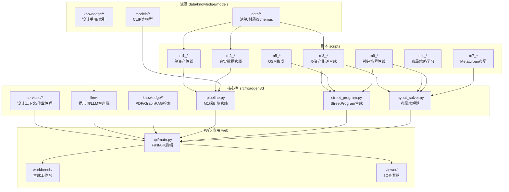
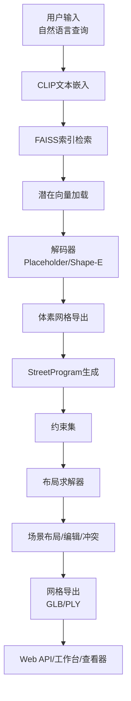
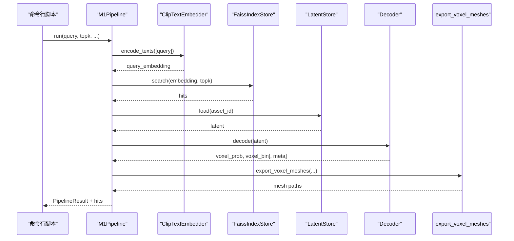
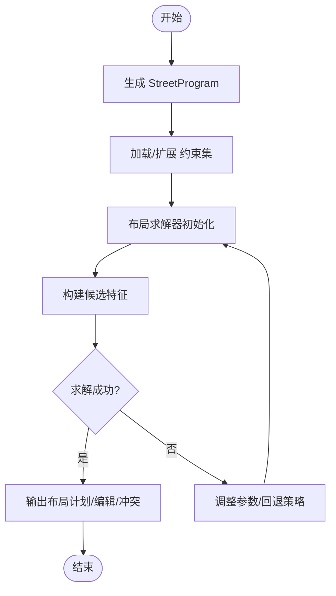
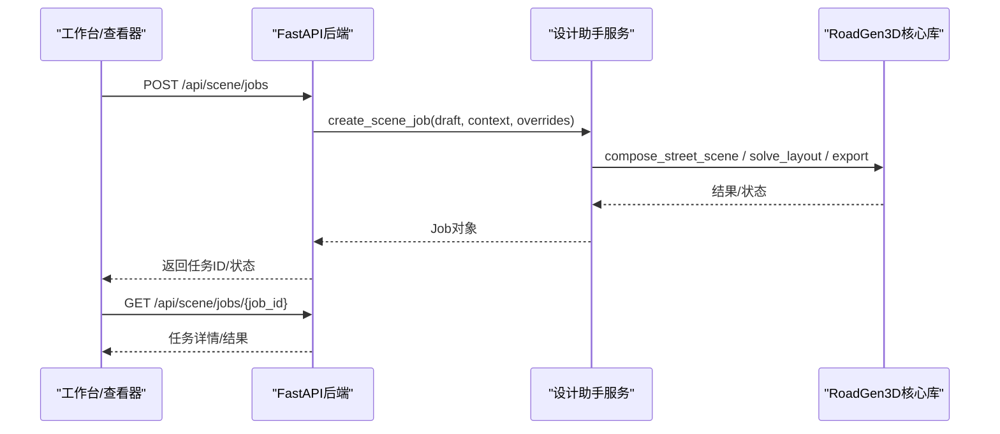
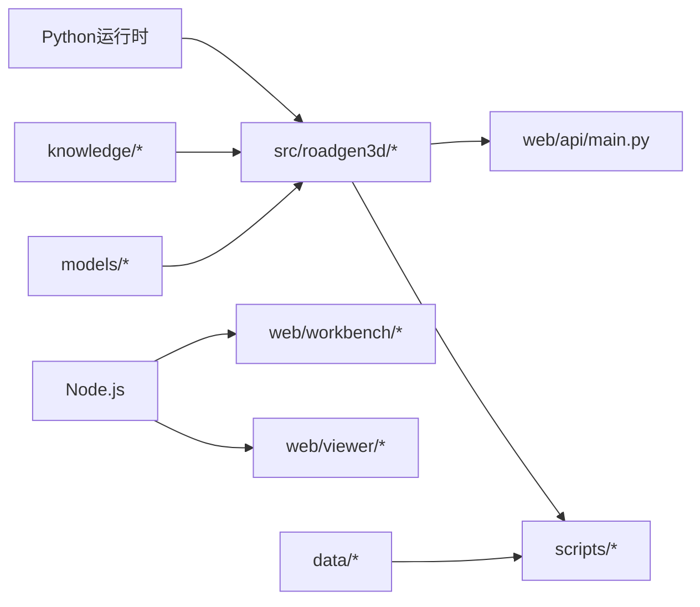

# 项目结构说明

<cite>
**本文引用的文件**
- [README.md](file://README.md)
- [Makefile](file://Makefile)
- [requirements-m1.txt](file://requirements-m1.txt)
- [requirements-m2.txt](file://requirements-m2.txt)
- [requirements-m5.txt](file://requirements-m5.txt)
- [src/roadgen3d/__init__.py](file://src/roadgen3d/__init__.py)
- [src/roadgen3d/services/__init__.py](file://src/roadgen3d/services/__init__.py)
- [src/roadgen3d/knowledge/__init__.py](file://src/roadgen3d/knowledge/__init__.py)
- [src/roadgen3d/llm/__init__.py](file://src/roadgen3d/llm/__init__.py)
- [web/api/main.py](file://web/api/main.py)
- [web/viewer/index.html](file://web/viewer/index.html)
- [src/roadgen3d/street_program.py](file://src/roadgen3d/street_program.py)
- [src/roadgen3d/layout_solver.py](file://src/roadgen3d/layout_solver.py)
- [src/roadgen3d/pipeline.py](file://src/roadgen3d/pipeline.py)
- [scripts/m1_06_run_pipeline.py](file://scripts/m1_06_run_pipeline.py)
</cite>

## 目录
1. [简介](#简介)
2. [项目结构](#项目结构)
3. [核心组件](#核心组件)
4. [架构总览](#架构总览)
5. [详细组件分析](#详细组件分析)
6. [依赖关系分析](#依赖关系分析)
7. [性能与扩展性考虑](#性能与扩展性考虑)
8. [故障排查指南](#故障排查指南)
9. [结论](#结论)
10. [附录：开发与调试最佳实践](#附录开发与调试最佳实践)

## 简介
RoadGen3D 是一个“文本到3D城市街道场景生成”的神经符号系统。它通过自然语言描述（如“现代整洁的城市街道”）检索相关资产，规划街道布局并导出完整的3D场景（GLB/PLY）。项目采用模块化设计，分为核心库、脚本工具、Web前端应用、数据与知识库、模型等主要目录，支持从单体资产到多资产街道组合的完整管线。

## 项目结构
项目采用按功能域分层的目录组织方式：
- src/roadgen3d：核心Python库，包含生成管线、布局求解、检索与嵌入、LLM与知识库、服务与类型定义等
- scripts：里程碑式CLI工具，覆盖M1-M7各阶段的端到端流程
- web：FastAPI后端API、工作台（Vite+React）与3D查看器（Three.js）
- data：资产清单、材质、Schema、真实数据等
- knowledge：设计手册PDF与RAG索引构建产物
- models：预训练模型（如CLIP）
- artifacts：中间结果与最终输出（场景、网格、评估报告）
- docs：架构决策、路线图、使用手册等
- tests：测试套件
- tools：外部工具子模块（如下载器）

图表来源
- [README.md:107-130](file://README.md#L107-L130)
- [web/api/main.py:81-267](file://web/api/main.py#L81-L267)
- [src/roadgen3d/__init__.py:1-295](file://src/roadgen3d/__init__.py#L1-L295)

章节来源
- [README.md:107-130](file://README.md#L107-L130)

## 核心组件
- 核心库（src/roadgen3d）
  - 服务与类型：设计上下文解析、作业管理、类型定义与序列化
  - 检索与嵌入：CLIP文本嵌入、FAISS索引、潜在向量存储
  - 街道程序与布局：StreetProgram声明式描述、约束集、布局求解器
  - LLM与知识库：GLM客户端、提示词工程、PDF/GraphRAG检索
  - 网关与桥接：参考注解到场景、图模板到场景桥接
- 脚本工具（scripts）
  - 按里程碑划分的CLI工具，串联检索、解码、布局与导出
- Web应用（web）
  - FastAPI后端提供REST接口，工作台与查看器提供交互界面
- 数据与知识（data/knowledge/models）
  - 资产清单、材质、Schema；设计手册与RAG索引；预训练模型
- 测试与文档（tests/docs）
  - 针对各里程碑的测试用例与系统文档

章节来源
- [src/roadgen3d/__init__.py:1-295](file://src/roadgen3d/__init__.py#L1-L295)
- [src/roadgen3d/services/__init__.py:1-23](file://src/roadgen3d/services/__init__.py#L1-L23)
- [src/roadgen3d/knowledge/__init__.py:1-27](file://src/roadgen3d/knowledge/__init__.py#L1-L27)
- [src/roadgen3d/llm/__init__.py:1-23](file://src/roadgen3d/llm/__init__.py#L1-L23)

## 架构总览
系统采用“文本→检索→解码→布局→导出”的流水线式架构，并通过Web API统一对外提供能力。核心模块之间通过清晰的类型与服务边界协作，既保证可测试性也便于扩展。

图表来源
- [README.md:132-170](file://README.md#L132-L170)
- [src/roadgen3d/pipeline.py:30-125](file://src/roadgen3d/pipeline.py#L30-L125)
- [src/roadgen3d/street_program.py:1-200](file://src/roadgen3d/street_program.py#L1-L200)
- [src/roadgen3d/layout_solver.py:1-200](file://src/roadgen3d/layout_solver.py#L1-L200)

## 详细组件分析

### 组件A：文本到网格的M1端到端管线
- 职责：封装查询嵌入、FAISS检索、潜在向量解码与网格导出的完整流程
- 关键点：参数校验、空索引保护、解码输出归一化、网格导出异常捕获与元信息记录
- 入口：M1Pipeline.run；CLI入口：scripts/m1_06_run_pipeline.py

图表来源
- [src/roadgen3d/pipeline.py:30-125](file://src/roadgen3d/pipeline.py#L30-L125)
- [scripts/m1_06_run_pipeline.py:60-102](file://scripts/m1_06_run_pipeline.py#L60-L102)

章节来源
- [src/roadgen3d/pipeline.py:30-125](file://src/roadgen3d/pipeline.py#L30-L125)
- [scripts/m1_06_run_pipeline.py:60-102](file://scripts/m1_06_run_pipeline.py#L60-L102)

### 组件B：神经符号街道生成（M6）
- 职责：以StreetProgram为声明式输入，结合ConstraintSet硬软规则，通过LayoutSolver进行碰撞检测与优化，输出布局计划与冲突诊断
- 关键点：带宽启发式求解、带别名解析、带重算、POI聚类与绑定、目标权重与需求融合

图表来源
- [src/roadgen3d/street_program.py:1-200](file://src/roadgen3d/street_program.py#L1-L200)
- [src/roadgen3d/layout_solver.py:1-200](file://src/roadgen3d/layout_solver.py#L1-L200)

章节来源
- [src/roadgen3d/street_program.py:1-200](file://src/roadgen3d/street_program.py#L1-L200)
- [src/roadgen3d/layout_solver.py:1-200](file://src/roadgen3d/layout_solver.py#L1-L200)

### 组件C：Web API与前端工作台
- 后端（FastAPI）：提供健康检查、参考方案/图模板列表、草稿与生成、作业队列、知识库重建与检索、场景评估等接口
- 前端：工作台（Vite+React）与查看器（Three.js），通过API驱动生成与可视化

图表来源
- [web/api/main.py:81-267](file://web/api/main.py#L81-L267)
- [src/roadgen3d/__init__.py:1-295](file://src/roadgen3d/__init__.py#L1-L295)

章节来源
- [web/api/main.py:81-267](file://web/api/main.py#L81-L267)
- [web/viewer/index.html:1-13](file://web/viewer/index.html#L1-L13)

### 组件D：知识库与LLM辅助设计
- 知识库：PDF知识库构建与检索（PDF+SentenceTransformer）、GraphRAG检索
- LLM：GLM客户端、提示词工程（意图/草稿/追问翻译）
- 服务：设计助手服务整合知识与LLM，提供草稿生成与场景生成

章节来源
- [src/roadgen3d/knowledge/__init__.py:1-27](file://src/roadgen3d/knowledge/__init__.py#L1-L27)
- [src/roadgen3d/llm/__init__.py:1-23](file://src/roadgen3d/llm/__init__.py#L1-L23)
- [src/roadgen3d/services/__init__.py:1-23](file://src/roadgen3d/services/__init__.py#L1-L23)

## 依赖关系分析
- 运行时依赖
  - Python 3.11+，PyTorch、Transformers、FAISS、Trimesh、Shapely、Requests等
  - Node.js用于前端工作台与查看器
- 内部依赖
  - web/api/main.py 依赖 src/roadgen3d 的类型与服务
  - scripts/* 依赖 src/roadgen3d 的具体模块（检索、解码、布局、管线等）
  - Makefile 提供统一启动与任务编排

图表来源
- [requirements-m1.txt:1-7](file://requirements-m1.txt#L1-L7)
- [requirements-m2.txt:1-4](file://requirements-m2.txt#L1-L4)
- [requirements-m5.txt:1-5](file://requirements-m5.txt#L1-L5)
- [Makefile:1-92](file://Makefile#L1-L92)

章节来源
- [requirements-m1.txt:1-7](file://requirements-m1.txt#L1-L7)
- [requirements-m2.txt:1-4](file://requirements-m2.txt#L1-L4)
- [requirements-m5.txt:1-5](file://requirements-m5.txt#L1-L5)
- [Makefile:1-92](file://Makefile#L1-L92)

## 性能与扩展性考虑
- 检索与解码
  - FAISS内积搜索与CPU实现适合中小规模索引；大规模场景建议评估GPU版本或分布式索引
  - 解码器选择（Placeholder/Shape-E）影响延迟与质量，需根据硬件与精度要求权衡
- 布局求解
  - 当前采用带宽启发式与整数规划混合策略；复杂拓扑与大规模候选集可能成为瓶颈
- 导出与渲染
  - Marching Cubes相比立方体方法更平滑但计算更重；前端Three.js渲染受几何面数影响
- 扩展方向
  - 引入增量索引与缓存、异步作业队列、分布式解码与导出、可插拔布局求解器

## 故障排查指南
- 索引为空或未构建
  - 现象：检索返回空
  - 排查：确认已执行索引构建步骤，检查artifacts中的FAISS索引文件是否存在
- 模型加载失败
  - 现象：ModelLoadError
  - 排查：检查本地模型路径与网络模式，确保模型目录存在且权重完整
- 网格导出异常
  - 现象：mesh_export_error
  - 排查：检查体素二值化阈值、导出方法与格式，确认输出目录权限
- Web服务端口占用
  - 现象：端口被占用
  - 排查：使用lsof检查8010/4174/4173端口，或修改Makefile中的端口配置
- 知识库构建失败
  - 现象：PDF解析或索引构建报错
  - 排查：确认PDF路径正确、依赖安装完成、临时目录可写

章节来源
- [src/roadgen3d/pipeline.py:56-68](file://src/roadgen3d/pipeline.py#L56-L68)
- [scripts/m1_06_run_pipeline.py:88-93](file://scripts/m1_06_run_pipeline.py#L88-L93)
- [Makefile:39-44](file://Makefile#L39-L44)

## 结论
RoadGen3D 通过清晰的模块划分与稳健的管线设计，实现了从文本到3D街道场景的自动化生成。核心库提供可复用的检索、解码、布局与导出能力，Web API与前端工作台提供了良好的交互体验。建议在团队协作中遵循统一的类型与服务边界，持续完善知识库与LLM辅助设计能力，并针对性能瓶颈逐步引入分布式与缓存机制。

## 附录：开发与调试最佳实践
- 开发环境
  - 使用Makefile提供的快捷命令启动全栈服务，或分别启动API、工作台、查看器
  - 安装前端依赖：web/workbench 与 web/viewer 分别执行安装命令
- 添加新功能模块
  - 在 src/roadgen3d 下新增模块并完善 __all__ 导出，保持类型与服务边界清晰
  - 如涉及Web接口，更新 web/api/main.py 的路由与请求模型
  - 编写对应测试用例于 tests/ 并在CI中验证
- 修改现有功能
  - 优先通过配置与参数控制行为，避免破坏既有接口
  - 对关键流程（检索、解码、布局、导出）增加日志与错误包装，便于定位问题
- 调试技巧
  - 使用CLI脚本最小化复现问题，逐步缩小范围
  - 利用artifacts保存中间结果，对比不同参数与策略的效果
  - 在Web端启用浏览器开发者工具观察网络请求与渲染性能

章节来源
- [README.md:39-70](file://README.md#L39-L70)
- [Makefile:15-34](file://Makefile#L15-L34)